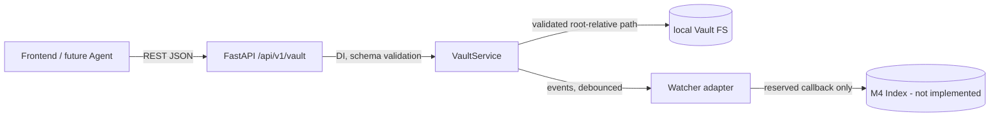

# LocalNote Server M1 计划：Vault 安全读写 / Vault Core

> 阶段：M1（继 M0 / Phase 0 Bootstrap）  
> 性质：供开发 Agent 逐项执行的详细实施计划；本文件是 M1 的唯一实施依据。  
> 本阶段只实现本地 Vault 的安全、保真、可逆优先基础读写与 Watcher，不实现编辑器、索引或 AI 写入。

## 1. 目标、原则与成功标准

### 1.1 总目标

在不改变 Markdown 原文事实源的前提下，提供一个唯一的 `VaultService` 文件系统入口，并通过 FastAPI 暴露受路径校验保护的文件树、读取、创建、原子更新、删除、移动/重命名能力；初始化可删除重建的 `.localnote/` 派生目录，提供基础外部变更 Watcher 和冲突信号，为 M2 编辑器及 M3/M4 索引提供稳定入口。

数据流固定为：



Frontend、LLM、任何其他服务永远不得直接调用 `pathlib`, `open`, `os.rename` 等访问 Vault；所有 FS 访问（包括附件）必须经过 `VaultService`。

### 1.2 可验收成功标准（全部为 M1 完成门槛）

1. `LOCALNOTE_VAULT__ROOT` 未配置时应用照常启动，Vault endpoint 返回明确的 `vault_not_configured`/`VaultNotConfigured`，不扫描或创建目录；health 和既有 AI status 行为不变。
2. 已配置 root 后，所有路径先做词法校验，再 `resolve`，并以 root 的真实路径比较；`../`、绝对路径、NUL、跨平台分隔符绕过、root 外 symlink 文件/目录/父链均被拒绝。测试必须实际证明：
   - `../outside.md` 和绝对路径返回 400 `path_traversal`；
   - 指向 root 外的 symlink 文件、symlink 目录和 symlink 父级返回 400 `symlink_escape`；
   - 任何越界不读、不写、不删、不移动外部文件。
3. root 内普通文件、中文/Emoji/空格/Unicode 名称、嵌套目录和附件均可列出、读取、创建、更新、删除、移动、重命名；内容字节不被 Markdown 解析器改写。
4. 读写使用原始 bytes：UTF-8、换行风格、BOM、未知 Obsidian 语法、HTML、代码块、frontmatter、嵌入、脚注和附件引用逐字保留；M1 不解析、不规范化、不自动追加换行。
5. 创建/更新正文采用同目录临时文件、flush/fsync 后原子 rename；更新必须以客户端提供的预期 hash 与执行前重新读取的 hash 做冲突检测。外部修改、hash 不符和文件在检查后变化均返回 409 `file_conflict`，不得静默覆盖。
6. 删除/移动/重命名也不能越过 root；目标冲突默认拒绝，禁止静默覆盖。源/目标及其父链均重新校验。
7. 打开已配置 Vault 时只初始化 root 下 `.localnote/` 的目录和明确的占位状态文件（不建 SQLite schema）；删除整个 `.localnote/` 后再次打开可重建，正文与附件 hash 不变。
8. Watcher 覆盖 create/modify/delete/move/rename，按配置的短窗口去抖，并在生命周期 shutdown 时停止线程/observer；只发事件，不实现 M4 索引。
9. REST schema、错误枚举和 HTTP 映射稳定；不泄漏绝对 root、完整异常堆栈、文件内容或秘密。
10. 全部新增测试只允许使用 `tests/fixtures/vault/` 及测试临时目录的受控 fixture，不触碰真实用户 Vault；后端原有 pytest、前端原有 Vitest 均通过。
11. 更新 `docs/vault-spec.md`、`docs/development-roadmap.md`、`README.md`，准确标记 M1 已实现和仍未实现的 M2+ 边界；不修改 `PLAN.md`。

## 2. 范围边界

### 2.1 本阶段包含

- `VaultSettings.root` 的配置接入和 Vault 生命周期初始化。
- `VaultService`：唯一 root、路径校验、文件树、bytes 读写、删除、移动/重命名、hash 冲突。
- `server/markdown` 的保真 bytes 边界（不实现 parser/AST）。
- `.localnote/` 派生目录初始化/重建占位。
- Watcher adapter、去抖、生命周期、外部事件到冲突诊断的最小基础。
- `/api/v1/vault/...` REST 路由、Pydantic 请求/响应和安全错误映射。
- Vault-only fixtures、单元/集成/安全/回归测试。
- M1 文档更新和后端 API 的可选前端最小状态/列表清单（不实现编辑器）。

### 2.2 明确不做（范围审计必须确认）

- Editor、Preview、Tabs、Split Pane、Workspace UI（M2）。
- Markdown 解析、frontmatter/Properties、wikilink/backlink、Metadata（M3）。M1 的 `server/markdown` 只保存/返回原始 bytes。
- Search、FTS、SQLite schema、索引扫描/增量索引（M3/M4）；`.localnote/` 只有目录和占位状态。
- Graph、Links runtime、Embedding、Rerank（M3–M6）。
- AI chat/completion、任何 AI 写操作、Agent、Policy、Diff/Undo、History/Recovery、Scheduler（M6–M8）。
- 云/NAS/远程数据库/同步、多副本、备份服务；`.localnote/` 不是正文备份。
- 通过 API 暴露任意 shell 或任意文件系统路径。

## 3. 有序任务清单

任务按依赖顺序实施；每项列出的文件是预计文件，Agent 可在不改变接口的前提下拆分同一职责的文件。

| 编号 | 任务与顺序 | 依赖 | 产出 | 完成定义 | 预计文件 |
|---|---|---|---|---|---|
| M1-01 | 基线与配置 | M0 | 确认现有测试、补 `VaultSettings` 运行时字段（可选 watcher debounce、max file size） | 未配置不阻塞 startup；嵌套/扁平 root env 解析；Phase 0 测试全绿 | `server/config.py`, `tests/backend/test_config.py` |
| M1-02 | 错误与领域协议先行 | M1-01 | 错误 enum、领域异常、路径/hash/树/event DTO | 所有异常可被 API 映射且不含内部绝对路径；Pydantic schema 可导入 | `server/vault/errors.py`, `server/vault/schemas.py`, `packages/protocol/src/index.ts`（若已有协议镜像） |
| M1-03 | root 初始化与路径安全 | M1-02 | `VaultService` 构造、`resolve_relative`、父链 realpath/lstat 检查 | 词法越界、绝对路径、NUL、symlink escape 全拒绝；未配置明确拒绝；不直接暴露 `Path` 给路由 | `server/vault/service.py`, `server/vault/path_safety.py`, `server/vault/__init__.py`, `tests/backend/test_vault_paths.py` |
| M1-04 | 原始 bytes Markdown 边界 | M1-03 | `read_bytes`/`write` 的无解析边界与 hash 工具 | BOM、LF/CRLF、Unicode、未知语法等 `bytes` round-trip；附件使用相同路径入口 | `server/markdown/service.py` 或 `server/markdown/bytes.py`, `server/markdown/__init__.py`, `tests/backend/test_markdown_fidelity.py` |
| M1-05 | 文件树与基础文件操作 | M1-03/M1-04 | list/read/create/delete/move/rename | 仅列 root 内文件/目录；`.localnote` 默认隐藏或由 schema 明确；NotFound/AlreadyExists 正确；不跟随逃逸 symlink | `server/vault/service.py`, `tests/backend/test_vault_files.py` |
| M1-06 | 原子写和冲突检测 | M1-04/M1-05 | 临时文件+fsync+rename；expected hash 时序 | 新建/更新 API；hash 相等才落盘；目标外部修改返回 409；临时文件清理；目标不损坏 | `server/vault/atomic_write.py`, `server/vault/service.py`, `tests/backend/test_atomic_write.py`, `tests/backend/test_conflicts.py` |
| M1-07 | `.localnote/` 初始化 | M1-03 | 目录、版本/状态占位文件；可重建 | 打开时只 mkdir；不 SQLite；删后重开恢复；正文附件 hash 不变 | `server/vault/derived.py`, `tests/backend/test_localnote_init.py` |
| M1-08 | Watcher adapter | M1-03/M1-05 | watchdog observer（或可替换 fake）、事件模型、debounce、生命周期 | create/modify/delete/move/rename 均归一化；短窗内重复事件合并；shutdown 可 join；索引 callback 仅预留 | `server/vault/watcher.py`, `server/vault/events.py`, `tests/backend/test_watcher.py` |
| M1-09 | DI 与 app 生命周期 | M1-01/M1-07/M1-08 | `get_vault_service`、lifespan startup/shutdown wiring | 未配置不建 service；配置后初始化并启动 watcher；启动异常可诊断且 health 不因 AI/Vault 探测而崩溃（按产品决定：配置 root 不存在返回 Vault unavailable，而不自动创建 root） | `server/api/dependencies.py`, `server/api/main.py`, `server/vault/lifecycle.py` |
| M1-10 | Vault REST API | M1-02/M1-05/M1-06/M1-09 | 五组 endpoint、schema、异常 handlers | TestClient 集成覆盖所有状态/错误/路径；API 不访问 FS 旁路 | `server/api/routes/vault.py`, `server/api/main.py`, `server/api/schemas.py`（或 domain schemas） |
| M1-11 | 测试闸门与安全审计 | M1-03–M1-10 | fixture、矩阵、回归结果 | 见第 9 节命令和预期；只使用受控 fixture；Phase 0 tests 全绿 | `tests/fixtures/vault/**`, `tests/backend/conftest.py`, `tests/backend/test_vault_api.py` |
| M1-12 | 文档与交付 | M1-11 | 三份文档更新、curl 示例、偏差报告 | 文档契约与实现一致；README 不再声称 M1 未实现；M2 入口清楚 | `docs/vault-spec.md`, `docs/development-roadmap.md`, `README.md` |

## 4. 技术方案与关键设计决策

### 4.1 配置与服务生命周期

继续使用 `pydantic-settings`：

```python
class VaultSettings(BaseModel):
    root: Path | None = None
    watcher_enabled: bool = True
    watcher_debounce_ms: int = 200
    max_file_bytes: int = 50 * 1024 * 1024

class Settings(BaseSettings):
    # 保留 server/ai/scheduler；增加/扩展 vault，不改变现有 AI 结构
    vault: VaultSettings = VaultSettings()
```

必须支持 `LOCALNOTE_VAULT__ROOT`；已有扁平 `LOCALNOTE_VAULT_ROOT` 兼容保留，嵌套优先。root `None` 或空白视为未配置。配置字段不要在构造阶段扫描 Vault。配置 root 不存在时不得为了初始化而自动创建用户指定的 Vault；应返回 `VaultUnavailable`（或在 lifespan 记录不可用并令 endpoint 503），具体行为需由实现测试固定，推荐“未配置=功能关闭；已配置但不存在=503/`vault_unavailable`”。

FastAPI dependency 从 `app.state` 取得已构造 service，测试用 `app.dependency_overrides` 注入 fixture service。`lifespan` 在 startup：Settings → 若配置则验证 root 为目录、创建 `.localnote/` 派生目录、创建 watcher；shutdown：停止 watcher、flush pending debounce、join 有界超时。Health 路由继续独立，不依赖 Vault。

### 4.2 路径校验（阻断安全项）

`VaultService` 是唯一 FS 入口，公开方法只接受 `str` root-relative path，不接受任意 `Path` 作为用户输入。

校验顺序必须固定：

1. 类型、长度和 NUL 校验；空路径只在代表 root 的明确内部操作允许，文件 API 一律拒绝或按 schema 规则处理。
2. 先用 POSIX `/` 语义分段；拒绝以 `/` 开头、Windows drive/UNC（`C:`, `C:/`, `\\host\share`）和任何 `..` segment。为避免跨平台 API 语义不一致，建议拒绝反斜杠 `\\` 作为路径输入，而不是将其当普通 POSIX 文件名；文档明确该约束。
3. 不先 `resolve` 再放行：先词法拒绝，再拼接 root。root 本身 `Path(root).expanduser().resolve(strict=True)`，要求存在且目录；保存 `root_real`。
4. 对 candidate 使用 `resolve(strict=False)`，再 `candidate_real.relative_to(root_real)`；失败抛 `PathTraversalError`。对存在部分和所有父级逐级 `lstat`，发现 symlink 时取得 realpath 并再次比较；symlink 指向 root 内可允许，但必须明确记录并防止任何指向 root 外的链。更保守的实现可拒绝所有用户可达 symlink；至少必须拒绝逃逸文件、目录、父链。
5. 列目录时使用不跟随逃逸链接的遍历（`os.scandir` + `entry.is_symlink()`/`lstat`）；每个返回条目再次安全验证。不要把 root 外目标的名字返回为合法文件。
6. 写/删除/移动前和实际 syscall 前再次校验；对目标父目录、源、目标分别校验。错误响应只返回相对 path（必要时可返回脱敏 path），不返回 root_real。

TOCTOU 最小防护：在支持的平台使用已打开的 root/父目录 fd，逐级 `openat`/`mkdirat`，目录组件 `O_DIRECTORY|O_NOFOLLOW`，文件读写 `O_NOFOLLOW`，rename 使用同一受控父目录 fd；在纯 Python `Path` fallback 中执行 preflight + immediately-before-operation `lstat/realpath` + postcondition check，并在文档中说明不能消除所有本地同权限攻击者的竞态。任何 post-check 失败不得声称成功；写入失败保留/清理临时文件而不改目标。

### 4.3 Markdown 保真与附件

M1 不引入 Markdown parser。输入内容在 Python 内部统一为 `bytes`，API 的 JSON 使用 base64（推荐）或 UTF-8 字符串+显式编码协议；为避免 JSON 不能表达任意 bytes，推荐请求/响应字段 `content_base64`，并在 convenience 层允许 UTF-8 `content` 但禁止隐式换行转换。响应返回 `content_base64`、`byte_length`、`sha256`、`media_type`。文件扩展名不决定是否可读；附件路径同样只能是 root-relative，附件内容不解析。

未知语法、BOM、LF/CRLF、末尾换行和非 UTF-8 bytes 均应 round-trip。M1 只允许用户明确提交的新 bytes 替换原 bytes，不做自动格式化或标题推断；重复标题是内容问题，不在 M1 去重。

### 4.4 原子写、hash 与竞态时序

hash 算法固定 SHA-256，hash 输入为文件原始 bytes；响应中的 `etag` 直接使用 `sha256:<hex>`（或明确固定一种格式）。更新时序：

```text
validate source path and parent
→ read current bytes + hash (snapshot A)
→ require request.expected_hash == snapshot A hash
→ create unique temp in same parent (0600, inherit safe mode)
→ write all bytes → flush → os.fsync(temp fd)
→ re-lstat/re-read source and compare hash (snapshot B)
→ if B != A: unlink temp; raise FileConflict
→ atomic os.replace/rename(temp, target) (no replace if create)
→ optionally fsync parent directory
→ re-read target/hash and return result
```

请求不带 `expected_hash` 的 update 必须拒绝（400 `expected_hash_required`），而不是提供不安全的 last-write-wins。create 若目标已存在返回 409 `already_exists`；create 可要求 `expected_hash` 为 null。更新只在目标存在时执行；删除和移动也可要求 `expected_hash`（推荐 API 强制要求 source hash），删除/移动前重读并比较，避免误删/误移。目标已存在时 move/rename 不覆盖，返回 `already_exists`。临时文件名不能由用户控制，必须同目录以保证 rename 原子性；异常时清理。

### 4.5 Watcher

推荐 `watchdog` 作为可替换依赖（版本锁定），observer 放在独立 daemon/受控线程；Watcher 不在回调中做重 IO，不直接写索引。事件 handler 将 watchdog 的 created/modified/deleted/moved 映射为：`create`, `modify`, `delete`, `move`，并把 rename 作为 move 的 `old_path/new_path`；若底层只给 rename，事件 kind 仍保留 `move`，文档说明语义。

去抖 key 为 `(kind, path)`，move key 为 `(kind, old_path, new_path)`；在 `debounce_ms` 窗口聚合并只向 callback 发一次，callback 在专用 executor/队列线程执行。忽略 `.localnote/`（否则初始化和未来索引产生自触发），过滤临时文件可只做事件标记而非删除。所有事件路径再次经过安全校验；root 外或 symlink escape 事件丢弃并记录分类日志。生命周期必须有 `start()`, `stop(timeout)`, `flush()`，shutdown 不遗留线程。

Watcher 事件不自动覆盖内存或正文；外部 modify/delete/move 仅通过 callback/diagnostic 提供给上层，后续编辑器使用 hash 冲突返回 409。M4 的 index callback 定义 Protocol/注释即可，不实现索引更新。

### 4.6 异常分层与 HTTP 映射

领域层异常不依赖 FastAPI：`VaultNotConfigured`, `VaultUnavailable`, `PathTraversalError`, `SymlinkEscapeError`, `PathNotFound`, `AlreadyExists`, `FileConflict`, `InvalidOperation`, `FileTooLarge`, `AtomicWriteError`, `WatcherError`。异常带安全 `code`, `message`, `path`（相对路径可选），不带 traceback/root absolute path。

建议错误 enum：

```text
vault_not_configured, vault_unavailable, path_traversal, symlink_escape,
not_found, already_exists, file_conflict, expected_hash_required,
invalid_request, file_too_large, not_a_file, not_a_directory,
atomic_write_failed, watcher_unavailable, internal_error
```

统一错误体：

```json
{"error":{"code":"file_conflict","message":"File changed externally; reload before writing","path":"notes/a.md"}}
```

HTTP 映射：400 = malformed request、path traversal、symlink escape、invalid path/hash/base64；404 = not found；409 = conflict/already exists/file conflict；413 = file too large；503 = vault not configured/unavailable 或 watcher unavailable（推荐 Vault API 未配置统一 503，而不把它伪装成空树）；500 = 未预期/原子失败，固定安全消息。FastAPI validation error 可映射为 422，但不得泄漏内部类型路径。`FileConflict` 必须稳定为 409。

## 5. 公共 REST API 与数据结构

路径前缀 `/api/v1/vault`，所有路由都依赖 `get_vault_service`。

### 5.1 DTO

```python
class VaultFileEntry(BaseModel):
    path: str                 # root-relative POSIX display path
    kind: Literal["file", "directory"]
    size: int | None = None
    sha256: str | None = None  # files only; listing may omit for performance

class VaultFileTreeResponse(BaseModel):
    root: str = "."
    entries: list[VaultFileEntry]
    generated_at: datetime

class FileReadResponse(BaseModel):
    path: str
    content_base64: str
    byte_length: int
    sha256: str
    content_type: str | None = None

class FileCreateRequest(BaseModel):
    path: RelativePath
    content_base64: Base64Bytes = b""

class FileWriteRequest(BaseModel):
    path: RelativePath
    content_base64: Base64Bytes
    expected_sha256: Sha256

class FileDeleteRequest(BaseModel):
    path: RelativePath
    expected_sha256: Sha256

class FileMoveRequest(BaseModel):
    source_path: RelativePath
    destination_path: RelativePath
    expected_sha256: Sha256

class FileMutationResponse(BaseModel):
    path: str
    sha256: str | None
    byte_length: int | None
    operation: Literal["created","updated","deleted","moved"]
```

`RelativePath` 为自定义 Pydantic 类型/field validator：拒绝空、绝对、`..`、NUL、反斜杠、drive/UNC，限制 UTF-8 长度和 segment；它只做输入词法校验，最终安全检查仍必须在 VaultService。`Sha256` 必须是固定 64 位小写十六进制。JSON base64 非法返回 422/400；响应不得把正文重复放在普通字符串字段。

### 5.2 Endpoint

#### 列表

```http
GET /api/v1/vault/files?path=notes&recursive=true&include_hidden=false
```

返回树条目（排序规则固定：按 Unicode code point 的相对 POSIX path 排序）；`recursive=false` 只列一级。`include_hidden` 不允许让 `.localnote/` 内容泄露，派生目录始终由服务过滤。

#### 读取

```http
GET /api/v1/vault/file?path=notes/你好.md
```

成功 200：

```json
{"path":"notes/你好.md","content_base64":"77u/TGluZSAxDQo=","byte_length":13,"sha256":"sha256:...","content_type":"text/markdown"}
```

#### 创建

```http
POST /api/v1/vault/file
Content-Type: application/json
{"path":"notes/new.md","content_base64":"IyBIZWxsbwo="}
```

成功 201，已存在 409。创建不允许覆盖；创建父目录：建议只允许已存在父目录，目录创建不是公开任意操作，若产品需要嵌套创建则由服务安全 `mkdir` 每个 segment（计划默认要求父目录存在，以减小攻击面）。

#### 更新

```http
PATCH /api/v1/vault/file
Content-Type: application/json
{"path":"notes/new.md","content_base64":"IyBVcGRhdGVkDQo=","expected_sha256":"sha256:<current>"}
```

成功 200，外部修改或 hash 不匹配 409 `file_conflict`。服务器永不执行无 expected hash 的覆盖。

#### 删除

```http
DELETE /api/v1/vault/file
Content-Type: application/json
{"path":"notes/new.md","expected_sha256":"sha256:<current>"}
```

成功 200（幂等策略需固定，推荐不存在返回 404），外部修改 409；删除目录必须通过专门受限操作或拒绝，不能递归删除 Vault。

#### 移动/重命名

```http
POST /api/v1/vault/file/move
Content-Type: application/json
{"source_path":"notes/a.md","destination_path":"archive/a.md","expected_sha256":"sha256:<current>"}
```

成功 200，返回 `operation:"moved"` 与 destination path；源不存在 404，源 hash 变化 409，目标存在 409，任何 source/destination symlink/越界 400。移动同一服务内使用原子 `os.replace`/rename；跨设备 rename 失败应报 500/`atomic_write_failed`，禁止偷偷 copy-delete。

### 5.3 curl 验收示例

```bash
export LOCALNOTE_VAULT__ROOT="$PWD/tests/fixtures/vault"
# 服务启动后
curl -fsS 'http://127.0.0.1:3780/api/v1/vault/files?recursive=true'
curl -fsS --get 'http://127.0.0.1:3780/api/v1/vault/file' --data-urlencode 'path=中文/😀 note.md'
curl -fsS -X POST 'http://127.0.0.1:3780/api/v1/vault/file' \
  -H 'content-type: application/json' \
  -d '{"path":"notes/new.md","content_base64":"IyBIZWxsbwo="}'
curl -fsS -X PATCH 'http://127.0.0.1:3780/api/v1/vault/file' \
  -H 'content-type: application/json' \
  -d '{"path":"notes/new.md","content_base64":"IyBVcGRhdGVkCg==","expected_sha256":"sha256:<hash>"}'
```

错误示例：`GET ...?path=../outside.md` → HTTP 400，`error.code=path_traversal`；root 未配置 → HTTP 503，`error.code=vault_not_configured`；hash 过期 → HTTP 409，`error.code=file_conflict`。

## 6. 目录树与文件职责

```text
server/
  api/
    main.py                    # 保留 health/AI；注册 vault router、异常 handlers、lifespan
    dependencies.py            # Settings 和 VaultService DI
    routes/vault.py            # 仅 HTTP 编排，不直接 FS
    schemas.py                 # 可与 domain schema 合并，但保持 API DTO 清晰
  config.py                    # 扩展 VaultSettings，不改变 AI status
  vault/
    __init__.py
    service.py                 # 唯一 FS 门面：tree/read/create/write/delete/move
    path_safety.py             # lexical + resolve/lstat + root containment
    errors.py                  # 领域异常和错误 code
    schemas.py                 # Vault DTO、event DTO、hash types
    atomic_write.py             # 临时文件、fsync、原子 rename、清理
    derived.py                 # .localnote/目录+占位 state 初始化
    watcher.py                 # watchdog adapter、debounce、生命周期
    events.py                   # normalized events / callback Protocol
  markdown/
    __init__.py
    bytes.py                    # 原始 bytes/hash 边界；不得实现 parser
    README.md                   # M1 实现边界，M3 parser 入口
  workspace/README.md           # 仍 placeholder；M2 入口
  index/README.md               # 仍 placeholder；M4 入口
  search/README.md              # 仍 placeholder；M3/M4 入口
  metadata/README.md            # 仍 placeholder；M3 入口
  links/README.md               # 仍 placeholder；M3 入口
  graph/README.md               # 仍 placeholder；M5 入口
  agents/README.md              # 仍 placeholder；M6/M7 入口
  policies/README.md            # 仍 placeholder；M7 入口
  scheduler/README.md           # 仍 placeholder；M8 入口
  history/README.md             # 仍 placeholder；M7 入口
  recovery/README.md            # 仍 placeholder；M7 入口

tests/
  fixtures/vault/
    中文与 Unicode/😀 note.md
    nested/with space.md
    attachments/image.png      # 小型二进制 fixture
    duplicate-title-a.md
    duplicate-title-b.md
    large.md                    # 受控的大文件，非巨型仓库
  backend/
    conftest.py                 # tmp Vault fixture、app settings/DI override
    test_vault_paths.py
    test_vault_files.py
    test_markdown_fidelity.py
    test_atomic_write.py
    test_conflicts.py
    test_localnote_init.py
    test_watcher.py
    test_vault_api.py
```

`.localnote/` 实现仅创建类似 `.localnote/state.json` 的版本/初始化占位（内容固定且不含正文副本）；不得创建 `*.db`、SQLite 表、FTS 文件。若开发所需文件名不同，必须在文档和测试中说明“仅状态占位”。

`packages/markdown`、`packages/workspace` 等前端包仍是 placeholder。M1 前端建议不新增 UI；最多增加一个只读 Vault configured/unavailable 状态或开发用 API client 类型清单。编辑器、文件树交互、保存冲突 UI 一律留至 M2。

## 7. 依赖、风险与降级策略

| 项目 | 风险/影响 | 处理与降级 |
|---|---|---|
| `watchdog` | 平台 backend 差异、依赖安装失败 | 作为 runtime 可选/锁定依赖；无法安装时 Vault 读写仍可用，watcher 状态为 unavailable 并明确记录；不要伪装 watcher 已启用 |
| TOCTOU | 校验后 symlink/rename 被同权限进程替换 | fd/openat + `O_NOFOLLOW` 优先；fallback pre/post lstat/realpath；文档承认残余竞态，冲突保护不能替代 OS 权限 |
| macOS | FSEvents 合并/延迟、大小写不敏感、Unicode NFD | 测试使用实际文件系统可表达的名称；API path 使用 UTF-8、原样显示；不做 Unicode normalization；路径比较用 realpath；记录大小写行为，避免大小写仅差的重命名假设 |
| Linux/Windows/WSL | 分隔符、drive、observer 语义 | M1 API 统一 POSIX 相对路径并拒绝反斜杠/drive；Windows/WSL 只作为后续验证项，CI 至少不引入平台特定假设 |
| Unicode | 中文、Emoji、NFD/NFC 名称不一致 | 不规范化文件名；使用 Python `str`→OS 原生路径；fixture 覆盖；返回 canonical display path 但不改名 |
| 大文件 | 内存占用、JSON base64 膨胀 | M1 设 `max_file_bytes`；读写可采用分块 hash/temp 写，但 API 仍受上限；超过返回 413；不要引入 multipart 复杂协议 |
| 原子 rename | 跨设备临时目录会失去原子性 | 临时文件必须同父目录；跨设备 move 拒绝，不 fallback copy-delete；fsync 失败明确报错 |
| symlink 内部 | 内部 symlink 语义不一致 | 最安全策略是拒绝所有 symlink；若允许 root 内目标，必须每次 realpath containment 并测试；绝不允许外部 escape |
| watcher 风暴 | 高频事件导致回调和日志风暴 | bounded debounce map/queue、过滤 `.localnote`、限制日志；丢失事件时记录并由未来 M4 全量重建弥补 |
| root 权限/不存在 | startup 阻塞或误创建目录 | 不自动创建用户 root；endpoint 报 unavailable；`.localnote` 只在 root 已存在且可写时初始化 |
| 契约漂移 | 前端/后端 hash/base64 不一致 | Python Pydantic 为权威；protocol 类型和 API fixture 示例同步；集成测试验证 JSON |

## 8. 测试矩阵

### 8.1 路径安全

| 场景 | 输入/fixture | 预期 |
|---|---|---|
| 未配置 | `root=None` | 无 FS；API 503 `vault_not_configured` |
| `..` | `../outside.md`, `nested/../../x` | 400 `path_traversal` |
| 绝对 | `/tmp/x`, `C:/x`, UNC | 400 `path_traversal` |
| NUL/反斜杠 | `a\x00.md`, `a\\b.md` | 400 `invalid_request`/`path_traversal` |
| 文件 symlink escape | fixture link→tmp outside | read/list/write/delete 全部 400 `symlink_escape` |
| 目录 symlink escape | `linkdir/x.md` | 同上 |
| 父链 symlink | `nested/linkparent/x.md` | 同上 |
| root 内 symlink | 若允许则 target 仍在 root；若保守策略则统一拒绝 | 行为固定并有文档/测试 |
| race | 在 fake/测试 hook 中替换目标或父链 | 不返回成功覆盖外部；报 conflict/escape |

### 8.2 内容和操作

- 中文、Emoji、空格、Unicode NFD/NFC 文件名可 create/read/list。
- nested 文件和附件相对路径可 read；绝对/越界附件路径无法通过 API。
- LF、CRLF、无末尾换行、UTF-8 BOM、非 UTF-8 bytes、未知 callout/embed/HTML/code block 原始 bytes 完全相等。
- duplicate-title 文件保持两个独立 path/bytes，不做标题去重。
- 受控大文件 hash 和 round-trip 正确；超过限制 413。
- create/read/update/delete 全 happy path；重复 create 409；not found 404。
- move 与 rename（同 endpoint）成功；目标存在/源 hash 旧/越界目标均正确失败；跨设备不 copy-delete。

### 8.3 原子写与冲突

- 写入期间抛异常：原文件 bytes/hash 不变，temp 清理。
- 更新前 expected hash 错：不创建 temp 或不 rename，原文件不变。
- 外部修改发生在 snapshot A 与 rename 前：409 `file_conflict`，外部 bytes 不被覆盖。
- 删除/移动的 expected hash 错：不执行操作。
- 并发两个同 hash writer：最多一个成功，另一个 409；验证最终 bytes 为成功者内容。
- fsync/rename fake failure：安全错误、目标完整性保持。

### 8.4 `.localnote` 与 Watcher

- startup 创建目录及占位状态，不创建 DB/schema；状态内容不含正文。
- 删除 `.localnote` 后 startup 再建；所有 Markdown/附件 bytes/hash 相同。
- watcher fake 事件覆盖 create/modify/delete/move/rename；短窗口重复事件只 callback 一次。
- `.localnote` 事件过滤；root 外事件拒绝/丢弃；stop 后线程终止且 callback 不泄漏。

### 8.5 FastAPI 集成与回归

TestClient/AsyncClient 使用 temporary fixture root 和 dependency override，测试所有 endpoint 的 2xx/4xx/409/413/503；断言响应不含 root absolute path、堆栈和正文（除明确 read response）。运行原有 health、AI status 测试，证明 AI 离线不影响 Vault/health，Vault 未配置不影响 app startup。前端只做现有测试回归；若加状态卡，fetch 全 mock。

## 9. 验收步骤与实际命令

开发 Agent 必须从仓库根执行并记录 stdout/退出码：

```bash
python3 --version                       # >= 3.12
uv sync --dev                            # 或既有 venv 安装路径
pnpm install --frozen-lockfile
python -m pytest -q
pnpm --filter @localnote/protocol typecheck
pnpm --filter @localnote/web typecheck
pnpm --filter @localnote/web test -- --run
pnpm --filter @localnote/web build
python -m compileall server
```

预期：pytest/Vitest 全部通过，typecheck/build/compileall 退出码 0；测试过程中不访问真实 Vault、网络 oMLX 或远程服务。

受控 API smoke test（只使用 fixture Vault）：

```bash
LOCALNOTE_VAULT__ROOT="$PWD/tests/fixtures/vault" \
  python -m uvicorn server.api.main:app --host 127.0.0.1 --port 3780
curl -fsS http://127.0.0.1:3780/api/v1/health
curl -i 'http://127.0.0.1:3780/api/v1/vault/files?recursive=true'
curl -i --get http://127.0.0.1:3780/api/v1/vault/file \
  --data-urlencode 'path=../outside.md'  # 400 path_traversal
```

另开 shell 用 fixture 完成 create→read/hash→patch（正确 hash）→patch（旧 hash 409）→move→delete，比较 fixture 之外的 sentinel 文件 hash，预期 sentinel 从未改变。完成后删除 fixture `.localnote/`，重新启动并确认只重建目录/占位状态。Ctrl-C 后确认 watcher thread/observer 已停止。

范围审计命令/检查：

```bash
git diff -- PLAN-M1.md  # 计划阶段仅允许该文件；开发阶段按交付记录
# 代码审计时搜索并确认 M1 未引入：SQLite schema、FTS、Graph query、Editor UI、AI write、Agent loop、Policy、Scheduler
```

## 10. 文档、未决事项与 M2 入口

### 10.1 文档更新要求

- `docs/vault-spec.md`：把 M1 已实现的 root 配置、路径安全、bytes 保真、atomic/hash、`.localnote` 占位、watcher 契约写成实现状态；保留 TOCTOU 限制、平台差异和“不是备份”声明。
- `docs/development-roadmap.md`：M1 标记完成，列出 API/测试门槛；M2 依赖 M1 的打开/保存能力；不可提前实现清单删去“Vault 真实读写”但保留 Editor/Preview/搜索/SQLite 等。
- `README.md`：从 Phase 0-only 改为 M1 状态；新增 `LOCALNOTE_VAULT__ROOT` 快速开始、REST 示例、测试 fixture 安全说明；明确前端暂不提供编辑器。

### 10.2 明确假设

1. Python 3.12+ 与现有 FastAPI/Pydantic v2 结构继续使用；`watchdog` 可锁定且本地安装可用。
2. API 仅在本机 loopback 默认运行；M1 不增加远程访问或鉴权体系。
3. Vault root 必须事先存在并为目录；LocalNote 不替用户创建 root。
4. 所有 API 路径采用 UTF-8 POSIX 相对形式；反斜杠/drive/UNC 作为非法输入，避免跨平台歧义。
5. hash 为原始 bytes SHA-256；客户端负责保留 read response 的 hash 并在写前提交。
6. `include_hidden` 不等于允许访问 `.localnote`；派生目录由服务保留。
7. watcher 是通知基础设施，不保证跨平台事件一一对应；完整索引一致性留给 M4 全量重建。

### 10.3 未决事项（开发 Agent 不得静默改变）

- watchdog 作为强 runtime 依赖还是 optional extra；若安装失败是否以 watcher disabled 启动（推荐 Vault 核心仍可用、状态可见）。
- 是否拒绝 root 内部 symlink（推荐安全默认拒绝全部 symlink；最低要求是拒绝 escape）。
- `DELETE`/move 是否强制 expected hash（本计划推荐强制，防止误删/误移）。
- bytes API 是否始终 base64，还是另增 multipart 下载（M1 推荐始终 base64+大小上限）。
- macOS FSEvents 对 rename/coalescing 事件的精确语义与 WSL 支持矩阵。
- 父目录自动创建、目录删除、隐藏文件展示规则（默认不暴露 `.localnote`，不开放递归目录删除）。

若这些选择影响安全边界或公共 API，开发 Agent 必须先在交付报告列出偏差，不得悄悄改变；优先采用本计划的推荐值。

### 10.4 M2 入口

M2 只在本计划全部门槛通过后开始：Workspace service 调用本计划的 `GET file`/`PATCH file`，编辑器以 read response 的 bytes/hash 建立编辑会话；保存始终提交 `expected_sha256`，收到 409 展示 reload/diff 入口但不自动覆盖。Preview 仅在 M2 解析/渲染层实现，不能把 M1 bytes service 改成 parser/serializer。M2 可新增前端文件树、编辑器、冲突 UI，但不得绕过 API/VaultService。

## 11. 开发 Agent 交付格式

完成后必须返回：

1. 按 M1-01 至 M1-12 列出完成/未完成任务和实际文件；
2. 关键路径安全实现（包括是否拒绝内部 symlink、TOCTOU 防护等级）；
3. 原子写/hash 冲突时序及并发测试结果；
4. Watcher backend、去抖参数、线程 shutdown 结果；
5. `.localnote` 初始化/删重建结果，并确认无 SQLite schema/正文备份；
6. REST schema、错误状态的实测示例；
7. 完整测试/build 命令、退出码和覆盖摘要；
8. 与本计划偏差、原因、风险和未决项；
9. 明确确认未实现 M2–M8 禁止项，且未修改 `PLAN.md`。

计划完成定义：本文件 UTF-8 写入工作区根目录 `PLAN-M1.md`；规划阶段不得创建实现代码或修改其他文件。
