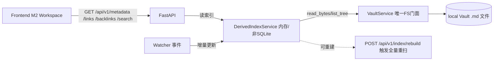

# LocalNote Server M3 计划：Metadata / Properties / Links / 关键词搜索

> 阶段：M3（依赖 M1 Vault Core + M2 Workspace/Editor/Preview；M1、M2 已完成）
> 性质：供开发 Agent 逐项执行、测试 Agent 验收、审计 Agent 复核的详细实施计划。
> 本阶段唯一新增规划文件为 `PLAN-M3.md`；规划阶段不得创建实现代码，不得修改
> `PLAN.md`、`PLAN-M1.md` 或 `PLAN-M2.md`。路由已确定并生效（计划/开发/审计路由由
> 编排者传入阶段 Agent），本文件不重新定义 provider/model。
>
> 一句话定位：在 M1 的原始 bytes 边界与 M2 的只读预览边界之上，增加**纯读取的派生
> 层** —— frontmatter/metadata、wikilink/双链反链、非 FTS 关键词搜索，全部基于一个可
> 重建、非 SQLite 的内存索引。**任何东西都不写回正文**，`server/markdown/bytes.py`
> 绝不改成 parser。

---

## 1. 目标与可验收成功标准

### 1.1 总目标

在不改变 Markdown 文件唯一事实源的前提下，提供三类读取型派生能力：

1. **Metadata/Properties**：解析 YAML frontmatter 为结构化 metadata；未知字段逐字保留；
   `tags` 规范化；单篇解析失败标记为该笔记的诊断错误，不影响其它笔记、不影响正文、
   **不写回**文件。
2. **Links 索引**：解析 `[[WikiLink]]`、`![[Embed]]`、`[[Note#Heading]]`、
   `[[Note^Block]]`、`[[Note|Alias]]`，维护 outgoing / backlinks 派生索引；broken link
   保留标记；单篇失败隔离。
3. **关键词搜索（非 FTS）**：按文件名 + 正文做大小写不敏感的子串匹配，中文友好；
   返回匹配笔记（摘要片段 + 命中词）。异常时降级，不阻塞编辑。

所有能力由**一个可重建、非 SQLite 的内存派生索引**驱动：启动扫描 Vault 构建，运行期
消费 watcher 事件增量更新；提供手动重建端点；删 `.localnote/` 后仍可重建（索引不依赖
`.localnote` 落盘）。索引是**纯读取派生数据**，永远不反向成为事实源，永不写回正文。

数据流固定为：



`VaultService` 仍是唯一 FS 门面；Index/Links/Metadata/Search 服务只通过
`VaultService.read_bytes` / `list_tree` 读取内容，绝不直接调用 `open`/`pathlib`。
前端 Search / Links / Backlinks UI 全部走 REST，不触碰本地文件系统。

### 1.2 可验收成功标准（全部为 M3 完成门槛）

1. 既有门禁不回退：`python -m pytest -q` 中 M1/M2 全部用例保持通过；
   `pnpm --filter @localnote/{protocol,web} typecheck`、web Vitest、web build、
   `python -m compileall server`、`./scripts/check.sh` 均通过；现有 M1 用例（含
   `tests/backend/test_vault_files.py` 的 `vault_fixture_copy` 全量列表断言）不因新增
   fixture 而失败（新增 fixture 只增不减，不破坏既有测试的“包含”断言）。
2. **Frontmatter/Metadata**：
   - 带 frontmatter 的笔记（中文/Emoji/空格字段、未知字段）解析为结构化 metadata，
     未知字段以原值保留（类型不丢失：字符串/数字/布尔/列表/嵌套 dict 都可 JSON 化）。
   - `tags` 规范化：接受 YAML 列表 `[a, b]`、单个字符串 `"a"`、逗号分隔 `"a, b"`、
     带 `#` 前缀 `#a`；统一 trim + 去 `#` + 去空 + 保序去重；保留原大小写用于展示，
     索引键用 casefold。
   - `GET /api/v1/metadata/{note}` 对无 frontmatter 笔记返回 `frontmatter_status:"none"`；
     对 YAML 非法/未闭合 `---`/非 UTF-8 返回 `frontmatter_status:"parse_error"`（或
     `"unreadable"`）且**HTTP 200** + 结构化的 `parse_error`，不影响其它笔记。
   - 所有 metadata 端点对笔记文件不存在返回 404 `not_found`；绝不把解析结果写回文件。
   - `server/markdown/bytes.py` 未被改动为 parser（`git diff` 确认无该文件改动）。
3. **Links/Backlinks**：
   - 五种语法全部解析正确：`[[WikiLink]]`、`![[Embed]]`、`[[Note#Heading]]`、
     `[[Note^Block]]`、`[[Note|Alias]]` 以及组合 `[[Note#Heading|Alias]]`。
   - outgoing 按目标解析为 resolved 与否；无法解析的 target 保留为 broken link
     （`broken:true`）；同名 basename 出现在多个路径时标记 `ambiguous:true`、
     给出 candidates、仍选择一个确定性目标（按路径排序取第一）。
   - `GET /api/v1/links/{note}` 返回该笔记 outgoing（含 broken 标记与计数）。
   - `GET /api/v1/backlinks/{note}` 返回指向该笔记的其它笔记（resolved 目标反向推导），
     含来源标题与可选上下文片段。
   - 单篇解析失败（非 UTF-8 / 无法读取）隔离为该笔记诊断：不影响其它笔记的链接，也不
     使整个索引失效。
   - 每条链接目标可点击打开（前端）；broken/ambiguous 有明显视觉标记。
4. **关键词搜索（非 FTS）**：
   - `GET /api/v1/search?q=...` 对文件名（basename）与正文做大小写不敏感子串匹配；
     中国文/Emoji/空格文件名与正文均可命中；多词查询拆词，每个词都需命中。
   - 返回 `hits`（path/title/snippet/score/matched_terms），snippet 是命中附近窗口
     （去 HTML 的纯文本，React 以文本渲染，禁止当作 HTML 注入）。
   - 空白/仅空格/超长/含控制字符的 `q` 返回 400 `invalid_request`；索引不可用返回 503。
   - 索引运行期遇单篇读取失败时跳过该篇、在响应中递增 `skipped_notes`（降级），
     不让整个搜索失败。
   - 前端提供搜索入口（Ribbon "Search" 启用）+ Results 面板；**不实现** Command
     Palette / Quick Open。
5. **轻量派生索引（可重建、非 SQLite）**：
   - `DerivedIndexService` 只存在于内存；启动扫描所有 `.md`/`.markdown`（经
     `VaultService.list_tree` + `read_bytes`）构建 notes/backlinks/tags/basename 索引。
   - 运行期消费 watcher 的 create/modify/delete/move 事件做增量更新；重建期间与事件
     更新用同一把锁串行。
   - `POST /api/v1/index/rebuild` 触发全量重扫并返回 `{indexed,skipped,failed,duration_ms}`。
   - `.localnote/` 仍只有目录 + `state.json` 占位，**无 SQLite、无 FTS、无正文副本**；
     删除 `.localnote/` 后重扫索引仍正确、正文 hash 不变。
   - 索引故障（Vault 不可用/构建失败）只影响 metadata/links/search 端点（503），
     **不影响** health/AI/Vault 文件读写/M2 编辑器。
6. **测试与安全**：
   - 新增 fixtures 全部位于 `tests/fixtures/vault/`（中文/Emoji/空格/frontmatter 未知字段/
     wikilink/backlink/embed/broken link/同名 basename/解析失败/无 frontmatter/非 UTF-8）。
   - 后端新增 parser + index + search 单测与 FastAPI 集成测试；前端新增 search/backlinks/
     outgoing 组件测试（fetch 全 mock，不接真实 Vault/后端/网络）。
   - 所有测试只触碰 `tests/fixtures/vault` 的临时副本或 `tmp_path` 自建根；绝不触碰真实
     用户 Vault；不访问 oMLX。
   - 错误体保持 M1 稳定契约 `{"error":{code,message,path}}`，不泄漏绝对 root/堆栈/正文。

---

## 2. 范围与边界

### 2.1 Must 实现

**后端：**
- `server/markdown/frontmatter.py`：YAML frontmatter 解析（BOM/CRLF 处理、未知字段保留、
  tags 规范化、失败诊断）。**新增文件，不改 `bytes.py`**。
- `server/markdown/wikilinks.py`：wikilink/embed/heading/block/alias 语法扫描与解析。
- `server/index/`：`errors.py`、`schemas.py`、`service.py`（`DerivedIndexService`，内存、
  可重建、线程安全、消费 watcher 事件）。
- `server/metadata/`：`service.py`、`schemas.py`（metadata 领域服务 + DTO）。
- `server/links/`：`service.py`、`schemas.py`（outgoing/backlinks 领域服务 + DTO）。
- `server/search/`：`service.py`、`schemas.py`（关键词搜索 + 摘要/降级）。
- `server/api/routes/`：`metadata.py`、`links.py`、`search.py`、`index.py`。
- `server/vault/service.py`：新增一个**最小、向后兼容**的方法 `set_event_callback(cb)`
  （用于 watcher→index 接线，不改变任何现有公开签名/契约）。
- `server/vault/lifecycle.py`：在 Vault 初始化后构建 Index、再启动 watcher（保证事件只在
  索引就绪后流入）；shutdown 时停止 index。
- `server/api/dependencies.py`：新增 `get_index_service`（及派生依赖）。
- `server/api/main.py`：注册 4 个新 router；新增 `index_unavailable` 映射（503）。
- `server/config.py`：如需要，加一个 Vault 级或 Index 级配置项（见 §6 决策），最小化。
- `server/vault/errors.py`：新增 `INDEX_UNAVAILABLE = "index_unavailable"` 到
  `VaultErrorCode`（HTTP 503 映射复用现有 handler）；领域错误 `IndexUnavailable`。
- `pyproject.toml`：新增 `PyYAML>=6,<7` 运行时依赖（frontmatter YAML 解析用
  `yaml.safe_load`）。依赖不可用时 metadata 端到端降级为 parse_error/unavailable，
  不阻塞 Vault/编辑。

**前端：**
- `packages/protocol`：新增 Metadata/Link/Search/IndexRebuild DTO 与相关的严格 union 类型。
- `apps/web/src/api/client.ts`：新增 `fetchMetadata`、`fetchLinks`、`fetchBacklinks`、
  `searchNotes`、`rebuildIndex`（严格 base64 无关的纯 JSON 读取；错误解析复用
  `ApiError`，保留 status/code/path）。
- `packages/workspace`：新增 `activeNote` 的 outgoing/backlinks 状态与 `search` 状态/action
  （仅 store 状态与可注入 API 调用；禁止 store 直接访问 FS/后端）。
- `apps/web/src/components/`：`Ribbon.tsx`（启用 Search）、`SearchPanel.tsx`
  （入口+Results 面板）、`NotesLinksPanel.tsx`（outgoing/backlinks，点击可开）、
  `LinkItem.tsx`（broken/ambiguous 标记）。
- 前端接线：Ribbon Search 切换面板；打开笔记时在面板显示 Links；点击 resolved target
  打开对应笔记（复用现有 `openFile`/`activateTab`）。

### 2.2 明确不实现（M3+ / 外边界）

- **Graph 数据/渲染**：`packages/graph` 与 `server/graph/` 保持 placeholder，不进 runtime。
- **SQLite/FTS schema**：`.localnote/` 保持目录 + `state.json` 占位；M3 索引只在内存，
  不落库、不建 FTS、不含中文分词器。M4 才引入 SQLite/FTS/性能基准。
- **AI/embedding/rerank**、Agent、Scheduler、WebSocket、Diff/Undo/History/Recovery/Policy。
- **frontmatter 写回**：M3 只读解析；绝不把解析结果或规范化后的 tags 写回文件。
- **属性编辑**：M3 不提供在 UI 编辑 properties 的能力（见 §9 未决事项）。
- **Command Palette / Quick Open / 全局快捷键系统**（Ribbon Search 只是入口 + 面板）。
- **服务端 Markdown parser / AST**：`server/markdown/bytes.py` 不是 parser；M3 新增的
  `frontmatter.py`/`wikilinks.py` 只做**针对语法的最小扫描**，不产出完整 mdast、不重排正文。
- **服务端 Markdown 改写/格式化换行归一化**、附件上传/编辑、二进制文件编辑。
- **真实 SQLite、PostgreSQL/Redis/Celery/Docker/云同步/远程数据库/Electron/Obsidian 插件**。
- **断链自动修复 / 原文编辑触发链接**（M3 只标记不改写）。

---

## 3. 现状基线与实施前检查

开发 Agent 必须先读取并以当前代码为准（以下文件已存在且为真实实现）：

- `PLAN-M1.md`、`PLAN-M2.md`、`docs/architecture.md`、`docs/development-roadmap.md`、
  `README.md`。
- `server/api/main.py`、`server/api/dependencies.py`、`server/api/routes/vault.py`、
  `server/vault/{service,path_safety,errors,schemas,derived,lifecycle,watcher,events}.py`、
  `server/markdown/bytes.py`、`server/config.py`、`pyproject.toml`。
- `apps/web/src/`（`api/client.ts`、`api/types.ts`、`components/{Ribbon,Sidebar,FileTree,
  TabBar,EditorPane,PreviewPane,ConflictBanner,WorkspaceStatus,WorkspaceShell}.tsx`）、
  `apps/web/package.json`、`packages/{workspace,editor,markdown,protocol,ui}/`。
- `tests/backend/`、`tests/frontend/`、`tests/fixtures/vault/`。

已知基线（已核实）：

- M1 已提供 `VaultService`（唯一 FS 门面）、`.localnote/` 占位（`state.json` 固定内容，
  无 SQLite）、watchdog watcher（create/modify/delete/move + 去抖）、REST
  `/api/v1/vault/{files,file,file/move}`。错误体固定为 `{"error":{code,message,path}}`，
  HTTP 映射 400/404/409/413/503/500。
- `VaultService` 构造参数含 `event_callback`（`VaultEventCallback | None`），
  但**构造后没有公开 setter**；watcher 在 `initialize()` 内创建并 `start()`。
  M3 需要新增一个最小 `set_event_callback` 方法（见 §5.4）。
- watcher 事件是**通知**：`VaultEvent(kind, path | old_path/new_path, is_directory)`；
  `.localnote` 与 root 外/不安全路径已被 watcher 的 `_normalize_os_path` 丢弃。
- 前端 M2 已把 Search/Graph/AI 的 Ribbon 按钮 `disabled`（`i>0`）；`packages/workspace`
  store 有 `openFile`、`sessions`、`save`、`conflict` 处理；预览是 `@localnote/markdown`
  的 read-only sanitize 管线；`api/client.ts` 只有 health/ai/vault 三个方法。
- `tests/fixtures/vault/` 现有文件：`中文与 Unicode/😀 note.md`、`nested/with space.md`、
  `attachments/image.png`、`duplicate-title-a.md`、`duplicate-title-b.md`、`large.md`、
  `bytes/{bom-lf,crlf,no-trailing-newline,non-utf8,unknown-syntax}.md`。已核实在
  `vault_fixture_copy` 上做全量列表的既有测试只断言“包含”某几个路径，**不**断言精确
  数量；因此向 `tests/fixtures/vault/` **新增** M3 fixture 文件不会破坏既有用例
  （新增 `large.md` 之外的 .md 只会增加列表元素，既有 `test_fixture_tree_listed_and_readable`
  等为子集断言）。**不要**新增 symlink 或改动既有文件字节。

实施前先执行基线命令并记录退出码；若基线失败先诊断，不得把失败归因于 M3。

---

## 4. 有序任务清单

按依赖顺序实施；同一任务可拆分文件，但不得改变公共契约而不在开发报告中记录。
预计文件里的 `NEW` 表示新建，`EDIT` 表示在既有文件上做**最小/向后兼容**修改。

| 编号 | 任务 | 依赖 | 产出与完成定义 | 预计关键文件 |
|---|---|---|---|---|
| M3-01 | 基线、YAML 依赖与环境确认 | M1/M2 | 读取现状；记录基线测试退出码；`pyproject.toml` 加入 `PyYAML>=6,<7`；`uv sync --dev` 可复现；确认既不破坏 `tests/fixtures/vault` 既有列表断言 | `pyproject.toml`, `uv.lock`, `tests/backend/test_config.py`（如需） |
| M3-02 | 错误码与领域协议先行 | M3-01 | `VaultErrorCode` 增补 `index_unavailable`；`IndexUnavailable` 领域异常（继承 `VaultError`）；`server/index/schemas.py`/`server/metadata/schemas.py`/`server/links/schemas.py`/`server/search/schemas.py` 的 DTO 定义并可为 `packages/protocol` 镜像；所有新异常无绝对 root/堆栈 | `server/vault/errors.py`（EDIT）, `server/index/errors.py`（NEW）, 各 `schemas.py`（NEW） |
| M3-03 | frontmatter 解析器 | M3-01/M3-02 | `parse_frontmatter(text)`：处理 BOM/CRLF，识别 `---` 顶层分隔、缺失/未闭合、非 YAML、非 UTF-8；`yaml.safe_load` 解析 property dict（未知字段逐字保留、JSON 化）；`tags` 规范化；返回 `{status, properties, tags, parse_error}`；无副作用、不写回 | `server/markdown/frontmatter.py`（NEW）, `tests/backend/test_frontmatter.py` |
| M3-04 | wikilink 解析器 | M3-01 | `parse_wikilinks(text)`：匹配 `[[...]]`/`![[...]]`，解析 `#heading`、`^block`、`|alias`、`://` 外链；跳过围栏代码块与行内代码（确定性状态机）；返回 `LinkRef` 列表；无副作用 | `server/markdown/wikilinks.py`（NEW）, `tests/backend/test_wikilinks.py` |
| M3-05 | Links 领域服务 + 分辨 | M3-04 | `LinksService`：基于索引做 target→path 分辨（basename 大小写不敏感、多候选 ambiguous、零候选 broken）；维护 resolved/ambiguous/broken；提供 `outgoing(path)`、`backlinks(path)` | `server/links/service.py`（NEW）, `server/links/schemas.py`（NEW） |
| M3-06 | Metadata 领域服务 | M3-03 | `MetadataService.get(note)`：经 `VaultService.read_bytes` 读原文 → `parse_frontmatter` → 组装 `NoteMetadataResponse`；文件不存在 404；解析失败/非 UTF-8 以 status + parse_error 呈现（HTTP 200）；读大文件受 `max_file_bytes` 保护 | `server/metadata/service.py`（NEW）, `tests/backend/test_metadata_service.py` |
| M3-07 | DerivedIndexService | M3-05/M3-06 | 内存索引 `_notes/_backlinks/_tags/_basenames`；`rebuild()` 经 `VaultService.list_tree`（recursive）只取 `.md/.markdown`，经 `read_bytes` 读内容；每篇建 entry（title/tags/properties/text/outgoing/resolved_targets/diag）；`_backlinks` 反向推导；`_basenames` 映射；线程安全（RLock）；`build_state` 生命周期；消费 watcher 事件增量更新（create/modify/delete/move）；不写回 | `server/index/service.py`（NEW）, `server/index/schemas.py`（NEW）, `tests/backend/test_index_service.py` |
| M3-08 | Search 服务 | M3-07 | `search(q)`：拆词 → 对文件名+标题+正文做大小写不敏感子串匹配；各词都命中；计算 score（文件名>标题>词数）与 snippet（命中窗口、纯文本）；单篇读取失败跳过并计数（降级）；命中去重、排序固定 | `server/search/service.py`（NEW）, `server/search/schemas.py`（NEW）, `tests/backend/test_search.py` |
| M3-09 | 生命周期/DI/错误映射 | M3-07 | `VaultService.set_event_callback`（最小新增）；`VaultLifecycle` 在 Vault 初始化后再建 Index、最后启动 watcher；`get_index_service`/派生依赖（vault 未配置→503 `vault_not_configured`，索引构建失败→503 `index_unavailable`）；`main.py` 注册 4 个 router 并加 `index_unavailable`→503 映射 | `server/vault/service.py`（EDIT）, `server/vault/lifecycle.py`（EDIT）, `server/api/dependencies.py`（EDIT）, `server/api/main.py`（EDIT） |
| M3-10 | REST 路由 | M3-08/M3-09 | `GET /metadata/{note:path}`、`GET /links/{note:path}`、`GET /backlinks/{note:path}`、`GET /search?q=`、`POST /index/rebuild`；DTO 校验、错误映射、不泄漏 root | `server/api/routes/metadata.py`（NEW）, `.../links.py`（NEW）, `.../search.py`（NEW）, `.../index.py`（NEW）, `tests/backend/test_m3_api.py` |
| M3-11 | fixtures + 后端测试矩阵 | M3-03–M3-10 | 新 fixture 文件；parser/index/search/API 单测与集成；M1/M2 回归保持通过；仅 `tests/fixtures/vault` 与 `tmp_path` | `tests/fixtures/vault/**`（NEW）, `tests/backend/conftest.py`（EDIT）, `tests/backend/test_{frontmatter,wikilinks,index_service,search,metadata_service,m3_api}.py` |
| M3-12 | 前端：protocol + client + store + 组件 | M3-10 | `packages/protocol` 镜像新 DTO；`client.ts` 新增 5 个方法；`workspace` store 增 activeNote links/backlinks 与 search 状态/action；Ribbon 启用 Search；`SearchPanel`/`NotesLinksPanel`/`LinkItem`；点击 resolved 轨道打开笔记；fetch 全 mock 测试 | `packages/protocol/src/index.ts`（EDIT）, `apps/web/src/api/{client,types}.ts`（EDIT）, `packages/workspace/src/{types,store}.ts`（EDIT）, `apps/web/src/components/{Ribbon,SearchPanel,NotesLinksPanel,LinkItem}.tsx`（NEW/EDIT）, `tests/frontend/{Search,NotesLinks,M3Matrix}.{test.tsx,test.ts}` |
| M3-13 | 文档、构建、范围审计 | M3-11/M3-12 | 更新 `README.md`、`docs/architecture.md`、`docs/development-roadmap.md`（M3 状态 + M4 入口）；完整命令通过；搜索确认 M3+ / M4+ 禁止项未实现；报告偏差；确认 `server/markdown/bytes.py`、`PLAN.md`/`PLAN-M1.md`/`PLAN-M2.md` 未被改动 | `README.md`（EDIT）, `docs/architecture.md`（EDIT）, `docs/development-roadmap.md`（EDIT）, `server/graph/README.md`、`packages/graph/README.md`（保持占位） |

---

## 5. 技术方案与关键设计决策

### 5.1 frontmatter 解析（`server/markdown/frontmatter.py`）

**规则（必须固定并测试）：**

1. 输入是已解码的 `str`（UTF-8；调用方先 `bytes`→`str`）。若字节含 UTF-8 BOM，
   先去掉 BOM 再识别分隔符（BOM 不能挡在第一行）。CRLF 先按 `\r?\n` 归一化行分割，
   但只影响**读取**，绝不写回。
2. 只认可**文件首行** `---`（允许前导空行？不允许：Obsidian 的 frontmatter 必须在
   首行；若首行不是 `---` 则判定 `status:"none"`）。第二行起为 YAML，遇下一行
   `---`（可带尾随空白）为结束分隔。
3. 若只有起始 `---` 而无结束分隔 → `status:"parse_error"`，`parse_error:
   {kind:"unterminated", message, line}`，其余正文不再解析。
4. 对 YAML 块用 `yaml.safe_load`（仅安全加载器，禁止 `yaml.load`/自定义 tag 构造）。
   解析成功且结果是 `dict` → `status:"ok"`，`properties` = 该 dict（未知字段逐字保留，
   `safe_load` 已保证 JSON 可序列化类型：str/int/float/bool/None/list/dict）。
   `safe_load` 抛 `YAMLError` 或结果非 dict → `status:"parse_error"`。
5. `tags` 规范化（来自 `properties`，若存在 `tags` 键）：取值可为 `list[str]`、单个
   `str`、或 `None`/缺省（→ 空列表）。`str` 若含逗号则按逗号拆，再按空白聚合拆多词；
   每个 token `strip` + 去掉前导 `#` + 去空；保序去重；保留原大小写用于展示，同时存
   `tags_folded`（casefold 后）用于索引检索。规范化后的 `tags` 写回响应，**但不写回文件**。
6. 无 frontmatter（首行不是 `---`）→ `status:"none"`，`properties={}`，`tags=[]`。
7. 该模块不读文件、不 parse 正文、不写文件。真正的“读文件”交给
   `MetadataService`/`DerivedIndexService` 经 `VaultService`。

返回结构（`server/index/schemas.py` 或 `server/markdown` 附带 dataclass）：

```python
@dataclass(frozen=True)
class FrontmatterResult:
    status: str                    # "none" | "ok" | "parse_error"
    properties: dict[str, Any]     # 仅 status=="ok" 时非空
    tags: list[str]                # 规范化后（展示用）
    tags_folded: list[str]         # casefold 键（索引用）
    parse_error: dict[str, Any] | None  # {kind, message, line?}
```

YAML 依赖说明：`PyYAML>=6,<7` 加入运行时依赖。若运行时 import 失败，`frontmatter.py`
的 `parse_frontmatter` 在顶层 `try` 中捕获并返回
`status:"parse_error", parse_error:{kind:"yaml_unavailable"}`，保证 metadata/index 端到端
降级而不是崩溃；Vault 读写与编辑器完全不受影响。

### 5.2 wikilink 解析（`server/markdown/wikilinks.py`）

**语法与映射：**

| 输入 | kind | 解析结果 |
|---|---|---|
| `[[Note]]` | `wikilink` | `target="Note"` |
| `![[Embed]]` | `embed` | `target="Embed"` |
| `[[Note#Heading]]` | `wikilink` | `target="Note"`, `section="Heading"` |
| `[[Note^Block]]` | `wikilink` | `target="Note"`, `block="Block"` |
| `[[Note\|Alias]]` | `wikilink` | `target="Note"`, `display="Alias"` |
| `[[Note#Heading\|Alias]]` | `wikilink` | `target="Note"`, `section="Heading"`, `display="Alias"` |
| `[[http://x]]` / `[[https://x]]` | `web` | `target` 为 URL，不参与 note 分辨 |
| `[[#Heading]]`（空 target） | `wikilink` | 同篇内标题链接，`target=""`，`section="Heading"` |

**实现要点：**

- 用单个正则（匹配 `!?\[\[...\]\]`，非贪婪到 `]]`）扫描，提取 `!` 前缀、内部内容。
- 内部再按 `|` 一次性拆分 alias（只在最外层第一个 `|` 拆），再按 `#`/`^` 拆 section/block。
- **跳过围栏代码块与行内代码**：在扫描前用一个小状态机把 ``` fenced ``` 之间的范围以及
  `` `inline` `` 里的内容标记为忽略；这也让 `[[...]]` 出现在代码里时不误判（确定性、可测）。
  若想保守，可在开发报告中声明“M3 默认跳过代码块”，测试必须覆盖该行为。
- 不写正文；`target` 只在 `LinksService`/索引里解析成实际路径，解析器本身不触碰 Vault。

`LinkRef`（`server/links/schemas.py`）：

```python
class LinkRef(BaseModel):
    model_config = {"extra": "forbid"}
    target: str                    # 显示目标（如 "Note" 或 "Note#Heading"）
    raw: str                       # 捕获的原文（如 "[[Note|Alias]]"）
    kind: Literal["wikilink", "embed", "web"]
    display: str | None = None     # alias 显示名
    section: str | None = None     # heading 子目标
    block: str | None = None       # block id
    resolved_path: str | None = None
    broken: bool = False
    ambiguous: bool = False
    candidates: list[str] = []
```

### 5.3 索引结构与增量更新（`server/index/service.py`）

**内存结构（非 SQLite、可重建、线程安全）：**

```python
@dataclass
class NoteIndexEntry:
    path: str
    sha256: str                  # 内容 hash（用于变更检测）
    title: str                   # 第一个 H1 去 `#`；否则取文件名无扩展
    text: str                    # 正文纯文本（用于搜索，可设 cap）
    tags: list[str]              # 展示用
    tags_folded: list[str]       # casefold 键
    properties: dict[str, Any]   # frontmatter 全量（未知保留）
    frontmatter_status: Literal["none","ok","parse_error","unreadable"]
    parse_error: dict[str, Any] | None
    outgoing: list[LinkRef]      # 解析后的 outgoing
    resolved_targets: set[str]   # 该篇实际解析到的目标路径集合（供 backlink 维护）
    diagnostic: str | None       # 单篇诊断（非 UTF-8 / 读失败等）

class DerivedIndexService:
    _notes: dict[str, NoteIndexEntry]
    _backlinks: dict[str, set[str]]          # target_path -> set[source_path]
    _tags: dict[str, set[str]]               # folded_tag -> set[path]
    _basenames: dict[str, list[str]]         # casefold(basename 无扩展) -> [paths]
    _lock: threading.RLock
    _build_state: Literal["idle","ready","unavailable"]
```

**构建（`rebuild()`）：**

1. 通过 `VaultService.list_tree("", recursive=True)` 取全部条目，过滤
   `kind=="file"` 且路径以 `.md`/`.markdown` 结尾（大小写不敏感），排除 `.localnote`
   （list_tree 已过滤）。
2. 对每个文件 `VaultService.read_bytes(path)` 读原始 bytes → `bytes.decode("utf-8")`；
   `UnicodeDecodeError` → 该篇 `diagnostic="non_utf8"`、`frontmatter_status="unreadable"`，
   统计入 `failed`，继续其它篇（单篇隔离）。
3. `parse_frontmatter(text)` 得 properties/tags；`parse_wikilinks(text)` 得 outgoing；
   提取 `text`（移出 frontmatter 后剩余正文，用于搜索，渲染 `title`）。
4. 用 `_basenames` 解析每个 outgoing target → `resolved_path`/`broken`/`ambiguous`；
   把 resolved target 加入 `resolved_targets`；`_backlinks[target].add(path)`。
5. 用 `_tags` 建立 tags→paths 反向。
6. `_build_state="ready"`。异常（Vault 不可用/扫描失败）→ `_build_state="unavailable"`，
   记日志；**不影响** Vault/编辑。

**增量更新（watcher 驱动，必须与 rebuild 串行持锁）：**

- `create`/`modify`（文件）：重读该篇 bytes → 重算 entry；**先**从旧的
  `resolved_targets` 里把我从 `_backlinks` 移除，**再**加入新的 `resolved_targets`；
  重建 `_tags` 贡献。
- `delete`：从 `_notes`/`_tags`/`_basenames`/各 target 的 `_backlinks` 移除该篇。
- `move`：按 `old_path` 删除 + `new_path` 重建（复用 delete + create 逻辑）。
- 收到目录事件或非 markdown 事件则忽略；事件路径已由 watcher 安全校验。
- 事件更新期间若 rebuild 已在跑，持同一把 `_lock` 串行化。

**可重建性：** 索引纯内存，不落 `.localnote`。删除 `.localnote/` 对索引无影响；
`POST /index/rebuild` 完全重扫。索引**永不写文件**。`text` 存储设上限（默认
`index_note_text_cap = 1_000_000` 字节，超限只保留前缀并标记，避免大文件拖垮内存）。

**与 watcher 的接线（M3-09）：** `VaultService.initialize()` 目前会创建并 `start()`
watcher。为保证事件只在索引就绪后流入，生命周期改为：`VaultService` 以
`start_watcher=False` 初始化 → 构建 `DerivedIndexService` → 调
`vault.set_event_callback(index.handle_event)` → `vault.start()`（启动 watcher）。
`set_event_callback` 必须同时更新 `_event_callback` 和已存在 watcher 的 `callback`
（若 watcher 已建），否则重启 watcher 时用新回调。这是对 M1 的最小**向后兼容**增补，
不改任何现有公开签名、不破坏 M1 测试。

### 5.4 `VaultService` 最小增补

```python
def set_event_callback(self, callback: VaultEventCallback | None) -> None:
    """Attach or replace the watcher consumer.  Additive; backward-compatible."""
    self._event_callback = callback
    if self.watcher is not None:
        self.watcher.callback = callback
```

（`watcher.callback` 已是公开属性，直接赋值即可。）不新增公开 FS 方法，不改变
`read/write/move/list` 任何语义。

### 5.5 关键词搜索（`server/search/service.py`）

- 查询拆词：`re.split(r"\s+", q.strip())` 得 terms（去掉空 term）。每个 term 做
  `casefold`。任一 term 为空 → 已是空查询处理。term 长度上限（如 64 字符）防滥用。
- 匹配：`searchable = title + " " + filename_basename + " " + text + " " + " ".join(tags)`，
  对每个 term 做 `term in searchable_casefold`；**全部 term 都命中**才计入结果（AND 语义）。
- 文件名权重：basename 命中算高优先；命中越多分越高；命中位置靠前微加分。固定排序：
  先按 `score` 降序，再按 `path` 升序（确定性）。
- `snippet`：在原文找第一个命中词的窗口（默认左侧 40 字符、右侧 80 字符），相邻窗口
  用 `…` 截断；纯文本（不含 HTML/换行已压平）。React 侧按文本渲染并高亮 `matched_terms`，
  **禁止**把 snippet 当 HTML 注入。
- 降级：单篇读取失败（超限/临时读失败）→ 跳过该篇，`skipped_notes += 1`（仍返回其它结果）；
  索引 `_build_state=="unavailable"` → `IndexUnavailable`（503）；`q` 为空白/超长/含控制字符
  → 400 `invalid_request`。
- 搜索是读取，无副作用；不写回、不产生 query 日志正文。

### 5.6 错误隔离与故障边界

- **单篇隔离**：任何一篇读/解/解析失败只产生该篇的 `diagnostic`/`parse_error`，
  绝不抛出让整个索引或端点失败的异常。索引 `rebuild()` 用 per-item `try/except`。
- **索引 vs 核心**：索引只在内存；`DerivedIndexService` 故障只影响
  metadata/links/search 端点。Vault 读写/编辑器由 M1/M2 独立路径保证不受影响。
- **不配置/不可用**：Vault root 未配置 → 这些新端点 503 `vault_not_configured`；
  Vault 已配置但索引构建失败 → 503 `index_unavailable`。两种情况均不阻塞 health/AI/编辑。
- **响应安全**：所有错误体用 M1 契约；`path` 只放 root-relative 字符串；不含绝对 root、
  堆栈、正文（除明确的 metadata/links/search 成功响应与 snippet）。

### 5.7 是否新增端点（决策）

新增（只读 + 一个重建动作），不重命名/不扩展既有 Vault 文件端点语义：

- `GET /api/v1/metadata/{note:path}`
- `GET /api/v1/links/{note:path}`
- `GET /api/v1/backlinks/{note:path}`
- `GET /api/v1/search?q=...`
- `POST /api/v1/index/rebuild`

`{note:path}` 用 FastAPI path converter（捕获 `/`），前端用 `encodeURIComponent` 编码
中文/Emoji/空格。注意：为与 M1 的 `?path=` 风格一致，也可提供 `?path=` 查询形式，
但**以 path-converter 为主**；两种形式映射到同一服务方法。`rebuild` 返回摘要而非空 204，
便于前端确认。

---

## 6. 公共 API、Pydantic/TS DTO、错误枚举、示例

### 6.1 Pydantic DTO（后端权威）

```python
# server/index/schemas.py
class IndexRebuildResponse(BaseModel):
    model_config = {"extra": "forbid"}
    indexed: int
    skipped: int
    failed: int
    duration_ms: float
    ready: bool
    generated_at: datetime

# server/metadata/schemas.py
class MetadataParseError(BaseModel):
    kind: Literal["yaml", "unterminated", "non_dict", "decode", "yaml_unavailable", "other"]
    message: str
    line: int | None = None

class NoteMetadataResponse(BaseModel):
    model_config = {"extra": "forbid"}
    path: str
    title: str
    frontmatter_status: Literal["none", "ok", "parse_error", "unreadable"]
    properties: dict[str, Any]          # 未知字段逐字保留（JSON 化）
    tags: list[str]                      # 规范化（展示）
    parse_error: MetadataParseError | None = None
    available: bool = True

# server/links/schemas.py
class LinkRef(BaseModel): ...            # 见 §5.2
class NoteLinksResponse(BaseModel):
    model_config = {"extra": "forbid"}
    path: str
    outgoing: list[LinkRef]
    broken_count: int
    generated_at: datetime

class BacklinkRef(BaseModel):
    source_path: str
    title: str
    text: str | None = None
class BacklinksResponse(BaseModel):
    model_config = {"extra": "forbid"}
    path: str
    backlinks: list[BacklinkRef]
    count: int
    generated_at: datetime

# server/search/schemas.py
class SearchHit(BaseModel):
    model_config = {"extra": "forbid"}
    path: str
    title: str
    snippet: str
    matched_terms: list[str]
    score: float
class SearchResponse(BaseModel):
    model_config = {"extra": "forbid"}
    query: str
    hits: list[SearchHit]
    total: int
    degraded: bool
    skipped_notes: int
    generated_at: datetime
```

### 6.2 TS 镜像（`packages/protocol/src/index.ts` 追加）

```ts
export type FrontmatterStatus = "none" | "ok" | "parse_error" | "unreadable";
export interface MetadataParseError { kind: "yaml"|"unterminated"|"non_dict"|"decode"|"yaml_unavailable"|"other"; message: string; line: number|null; }
export interface NoteMetadataResponse { path: string; title: string; frontmatter_status: FrontmatterStatus; properties: Record<string, unknown>; tags: string[]; parse_error: MetadataParseError|null; available: boolean; }
export type LinkKind = "wikilink" | "embed" | "web";
export interface LinkRef { target: string; raw: string; kind: LinkKind; display: string|null; section: string|null; block: string|null; resolved_path: string|null; broken: boolean; ambiguous: boolean; candidates: string[]; }
export interface NoteLinksResponse { path: string; outgoing: LinkRef[]; broken_count: number; generated_at: string; }
export interface BacklinkRef { source_path: string; title: string; text: string|null; }
export interface BacklinksResponse { path: string; backlinks: BacklinkRef[]; count: number; generated_at: string; }
export interface SearchHit { path: string; title: string; snippet: string; matched_terms: string[]; score: number; }
export interface SearchResponse { query: string; hits: SearchHit[]; total: number; degraded: boolean; skipped_notes: number; generated_at: string; }
export interface IndexRebuildResponse { indexed: number; skipped: number; failed: number; duration_ms: number; ready: boolean; generated_at: string; }
```

### 6.3 错误枚举（增补）

`server/vault/errors.py` 的 `VaultErrorCode` 增一项：

```text
index_unavailable   # HTTP 503（索引构建失败/不可用）
```

新领域异常（`server/index/errors.py`）：

```python
class IndexUnavailable(VaultError):
    code = VaultErrorCode.INDEX_UNAVAILABLE
    default_message = "Derived index is unavailable"
```

`main.py` 的 `_vault_error_response` 映射表新增 `INDEX_UNAVAILABLE: 503`。
其余新端点复用既有码：`vault_not_configured`(503)、`not_found`(404)、
`invalid_request`(400)、`internal_error`(500)。metadata 解析失败不产生传输级错误（HTTP 200）。

### 6.4 示例 JSON 与 curl

**Metadata**（带未知字段 + tags 规范化）：

```bash
curl -fsS 'http://127.0.0.1:3780/api/v1/metadata/中文%20note.md'
```

```json
{
  "path": "中文 note.md",
  "title": "中文 note",
  "frontmatter_status": "ok",
  "properties": {
    "title": "我的笔记",
    "emoji": "😀",
    "tags": "工作, 重要",
    "custom_unknown": {"nested": [1, 2, "x"]}
  },
  "tags": ["工作", "重要"],
  "parse_error": null,
  "available": true
}
```

**Links**（outgoing + broken）：

```bash
curl -fsS 'http://127.0.0.1:3780/api/v1/links/notes/a.md'
```

```json
{
  "path": "notes/a.md",
  "outgoing": [
    {"target":"Ref A","raw":"[[Ref A]]","kind":"wikilink","display":null,"section":null,"block":null,"resolved_path":"notes/ref-a.md","broken":false,"ambiguous":false,"candidates":[]},
    {"target":"Cfg B","raw":"[[Cfg B]]","kind":"wikilink","display":null,"section":"Intro","block":null,"resolved_path":null,"broken":true,"ambiguous":false,"candidates":[]},
    {"target":"img.png","raw":"![[img.png]]","kind":"embed","display":null,"section":null,"block":null,"resolved_path":"attachments/img.png","broken":false,"ambiguous":false,"candidates":[]}
  ],
  "broken_count": 1,
  "generated_at": "2026-01-01T00:00:00Z"
}
```

**Backlinks**：

```bash
curl -fsS 'http://127.0.0.1:3780/api/v1/backlinks/notes/ref-a.md'
```

```json
{
  "path": "notes/ref-a.md",
  "backlinks": [{"source_path":"notes/a.md","title":"A","text":"see [[Ref A]] above"}],
  "count": 1,
  "generated_at": "2026-01-01T00:00:00Z"
}
```

**Search**（中文命中 + snippet）：

```bash
curl -fsS --get 'http://127.0.0.1:3780/api/v1/search' --data-urlencode 'q=你好 世界'
```

```json
{
  "query": "你好 世界",
  "hits": [{"path":"中文 note.md","title":"中文 note","snippet":"…在@你好@世界@之间…","matched_terms":["你好","世界"],"score":3.2}],
  "total": 1,
  "degraded": false,
  "skipped_notes": 0,
  "generated_at": "2026-01-01T00:00:00Z"
}
```

**Rebuild**：

```bash
curl -fsS -X POST 'http://127.0.0.1:3780/api/v1/index/rebuild'
```

```json
{"indexed":42,"skipped":2,"failed":1,"duration_ms":18.4,"ready":true,"generated_at":"2026-01-01T00:00:00Z"}
```

**错误示例**：

```bash
curl -i 'http://127.0.0.1:3780/api/v1/search?q='                 # 400 invalid_request
curl -i 'http://127.0.0.1:3780/api/v1/metadata/nope.md'          # 404 not_found
curl -i 'http://127.0.0.1:3780/api/v1/metadata/a.md'             # root 未配置时 503 vault_not_configured
```

### 6.5 数据流

```text
启动: lifespan.startup
  -> create VaultService (start_watcher=False)
  -> create DerivedIndexService(vault)
  -> index.rebuild()                      # 全量扫描，单篇隔离
  -> vault.set_event_callback(index.handle_event)
  -> vault.start()                        # 启动 watcher，事件开始流入 index

请求: GET /metadata/{note}
  -> MetadataService.get(note) -> VaultService.read_bytes -> parse_frontmatter -> response

请求: GET /links/{note}      -> LinksService.from_index(note) -> outgoing
请求: GET /backlinks/{note}  -> LinksService.backlinks(note)  -> 由 _backlinks 反向
请求: GET /search?q=        -> SearchService.search(q)       -> 索引搜

写路径: M1/M2 不变 (PATCH file -> VaultService). 触发 watcher modify
  -> index.handle_event -> 单篇更新 entry / backlinks / tags
```

---

## 7. 目录树与文件用途（占位→实现对照）

```text
server/
  markdown/
    bytes.py                       # 保持原始 bytes/hash 边界（绝不改成 parser）
    frontmatter.py                 # [NEW 实现] YAML frontmatter 解析（无副作·用）
    wikilinks.py                   # [NEW 实现] [[...]]/![[...]] 语法扫描
    __init__.py                    # 导出 parser（只读）
  index/
    README.md                      # [保持占位→改写] 标注“已实现内存派生索引，M4 SQLite 入口”
    errors.py                      # [NEW] IndexUnavailable
    schemas.py                     # [NEW] NoteIndexEntry / IndexRebuildResponse
    service.py                     # [NEW] DerivedIndexService（内存可重建/线程安全/事件增量）
  metadata/
    README.md                      # [改] 标注 M3 已实现 frontmatter 读取
    schemas.py                     # [NEW] NoteMetadataResponse / MetadataParseError
    service.py                     # [NEW] MetadataService
  links/
    README.md                      # [改] 标注 M3 已实现 wikilink/backlink
    schemas.py                     # [NEW] LinkRef / NoteLinksResponse / BacklinksResponse
    service.py                     # [NEW] LinksService
  search/
    README.md                      # [改] 标注 M3 已实现关键词搜索（非 FTS）
    schemas.py                     # [NEW] SearchHit / SearchResponse
    service.py                     # [NEW] SearchService
  api/
    main.py                        # [EDIT] 注册 4 router + index_unavailable 映射
    dependencies.py                # [EDIT] get_index_service 及派生依赖
    routes/
      metadata.py                  # [NEW]
      links.py                     # [NEW]
      search.py                    # [NEW]
      index.py                     # [NEW]
  vault/
    service.py                     # [EDIT] 新增 set_event_callback（最小、向后兼容）
    lifecycle.py                   # [EDIT] Vault→Index→Watcher 顺序
    errors.py                      # [EDIT] 增 INDEX_UNAVAILABLE
  graph/  agents/  policies/  scheduler/  history/  recovery/   # 仍 placeholder
  workspace/                       # 仍 placeholder（M2 已完成，仅保留 README）

packages/
  protocol/src/index.ts            # [EDIT] 新 DTO 镜像
  workspace/src/{types,store}.ts   # [EDIT] activeNote links/backlinks + search 状态/action
  graph/                           # [保持 placeholder；M5 入口]
  editor/ markdown/ ui/            # 不改（M3 不触碰编辑器/预览管线）
apps/web/src/
  api/client.ts                    # [EDIT] 新增 5 个方法
  api/types.ts                     # [EDIT] re-export 新类型
  components/
    Ribbon.tsx                     # [EDIT] 启用 Search（保留 Graph/AI 禁用）
    SearchPanel.tsx                # [NEW] 搜索入口 + Results 面板
    NotesLinksPanel.tsx            # [NEW] outgoing/backlinks（点击可开）
    LinkItem.tsx                   # [NEW] broken/ambiguous 标记
tests/
  fixtures/vault/                  # [NEW 增] frontmatter/ links/ basename-dup/ parse-err 等
  backend/                         # [NEW/EDIT] conftest + parser/index/search/API 测试
  frontend/                        # [NEW] Search/NotesLinks/M3Matrix + setup 保持
```

**仍然占位、不实现的目录**：`server/graph/`、`packages/graph/`（M5）、
`server/agents|policies|scheduler|history|recovery`、AI 写路径、SQLite/FTS。

---

## 8. 依赖、风险与降级

| 项目 | 风险/影响 | 处理与降级 |
|---|---|---|
| `PyYAML` | frontmatter 解析核心；版本/安全（不可用则 metadata 失效） | 锁定 `>=6,<7`；只用 `yaml.safe_load`；import 失败时 parser 返回 `parse_error:yaml_unavailable`，Vault/编辑不受影响 |
| `yaml.safe_load` 语义 | 非 dict/非法 YAML/超大/alias | 逐条捕获 `YAMLError`/类型断言；单篇 parse_error；文本大小受 `index_note_text_cap`/`max_file_bytes` 约束 |
| watcher 事件线程 | 增量更新与 rebuild 竞态 | `DerivedIndexService._lock` RLock 统一串行；事件回调内不做重 IO/重抛；`stop/flush` 保证事件不泄漏 |
| `set_event_callback` 兼容 | 可能破坏 M1 watcher 测试 | 只新增方法、不改现有签名；watcher 已公开 `callback` 属性，直接赋值；M1 测试全绿 |
| `{note:path}` 编码 | 中文/Emoji/空格/斜杠路径 | FastAPI `:path` converter + 前端 `encodeURIComponent`；测试覆盖中文+Emoji+空格+嵌套 |
| 内存大小 | 大 Vault / 大文本导致内存膨胀 | `index_note_text_cap`；单篇文本截断 + 标记；M4 转 SQLite/FTS 才是规模化方案 |
| duplicate basename | `[[Foo]]` 指向多个同名文件 | 记为 ambiguous，candidates 列出，取排序第一为目标；文档说明 Obsidian 语义差异 |
| 非 UTF-8 正文 | 无法解析 frontmatter/links | 单篇 `unreadable`/诊断；跳过；不抛全局异常；编辑器依旧按 M2 只读降级 |
| broken link | 目标不存在/拼写 | 保留为 broken:true + 计数；前端标记；不自动删除/改写 |
| 索引故障 | metadata/links/search 不可用 | 503 `index_unavailable`；health/AI/Vault 编辑独立不受影响；`POST /index/rebuild` 可手动恢复 |
| 搜索 XSS | snippet/标题含 HTML | snippet 作为**文本**由 React 渲染（非 dangerouslySetInnerHTML）；不做 HTML 解码；高亮用文本替换 |
| 查询滥用 | 超长/控制字符查询 | 长度上限 + 控制字符拒绝（400 invalid_request）；纯子串匹配不执行正则 |
| 排序/评分 | 结果顺序不确定 | 固定 score→path 排序；评分规则文档化；作为未决事项登记（M4 可换 FTS 权重） |
| 前端 mock | 测试接真实后端 | 新组件/新 store 测试全部 mock fetch（方法+URL+body 路由），不接真实 Vault/oMLX/网络 |

---

## 9. 测试矩阵与验收命令

### 9.1 后端测试矩阵

| 区域 | 场景 | 预期 |
|---|---|---|
| frontmatter | 首行 `---` + 结束 `---` | `ok`，properties 保留未知字段 |
| frontmatter | tags 为 list / 单字符串 / 逗号分隔 / `#` 前缀 / 混合 | 规范化+去重+保序；`tags_folded` 正确 |
| frontmatter | 无 frontmatter（首行非 `---`） | `status:"none"`，properties={}，tags=[] |
| frontmatter | 只有起始 `---` 无结束 | `parse_error:unterminated`，不抛异常 |
| frontmatter | YAML 非法（如 `:` 后缺值/缩进错）/ 非 dict | `parse_error`；其它笔记不受影响 |
| frontmatter | BOM / CRLF / 前导空白首行 | 正确识别；正文 round-trip 不变（仅读取、不写回） |
| wikilink | 五种语法 + combo + `![[embed]]` | LinkRef 各字段正确；raw 保留 |
| wikilink | 围栏代码块 / 行内代码内的 `[[..]]` | 被跳过，不产出链接 |
| wikilink | `[[https://..]]` / `[[#Heading]]` | kind=web / 空 target+section |
| index | rebuild 全量扫描 | `indexed/failed/skipped` 正确；单篇失败计入 failed 且索引仍 ready |
| index | watcher create/modify/delete/move 增量 | entry/backlinks/tags 同步更新；事件后 `_backlinks` 正确 |
| index | duplicate basename | ambiguous + candidates + 确定性目标 |
| index | 删 `.localnote/` 后 rebuild | 索引正确；正文 hash 不变；不产生 SQLite/FTS/正文副本 |
| links | outgoing / backlinks | resolved/broken/ambiguous 正确；backlinks 反向推导正确 |
| search | 文件名+正文命中、中文、Emoji、空格 | 命中与 snippet 正确；AND 语义；score/排序固定 |
| search | 空白 / 超长 / 控制字符 q | 400 invalid_request |
| search | 索引不可用 / 单篇读取失败 | 503 index_unavailable / skipped_notes 计数+degraded |
| API 集成 | 5 个 endpoint 的状态/错误 | 400/404/503 正确；`{note:path}` 中文/Emoji/斜杠可解析；错误体不含 root/堆栈 |
| 回归 | M1/M2 既有用例 | 全数通过；`vault_fixture_copy` 列表断言不破坏 |

### 9.2 前端测试矩阵（fetch 全 mock）

| 区域 | 场景 | 断言 |
|---|---|---|
| protocol/client | 5 个新方法 | URL/query/method/body/类型正确；错误保留 `ApiError.status/code/path` |
| search panel | 输入 q → submit → 渲染结果 | 命中路径/标题/snippet 显示；highlight/文本渲染（无 HTML 注入）；点击结果调用 `openFile` |
| search panel | 空查询 / 错误 / 降级 | 显示空态 / error / degraded 提示；不崩 |
| notes links | 打开笔记 → 拉 outgoing+backlinks | resolved 可点击（点击→openFile）；broken/ambiguous 有标记；backlinks 点击打开源 |
| ribbon | Search 启用、Graph/AI 禁用 | Search 可点击且有 accessibility 属性；Graph/AI 仍 `disabled` |
| store | activeNote links/search 状态 | action 触发对应 API；竞态/请求版本处理；不接 FS |
| 回归 | M2 既有组件/保存/冲突 | 全部通过 |

### 9.3 验收命令（从仓库根执行并记录退出码）

```bash
python3 --version                       # >= 3.12
uv sync --dev                            # 锁定 PyYAML
pnpm install --frozen-lockfile
python -m pytest -q                      # 后端（M1/M2 回归 + M3 新矩阵）
pnpm --filter @localnote/protocol typecheck
pnpm --filter @localnote/workspace typecheck
pnpm --filter @localnote/web typecheck
pnpm --filter @localnote/web test -- --run
pnpm --filter @localnote/web build
python -m compileall server
./scripts/check.sh
```

受控 smoke（只用 `tests/fixtures/vault`）：

```bash
LOCALNOTE_VAULT__ROOT="$PWD/tests/fixtures/vault" \
  python -m uvicorn server.api.main:app --host 127.0.0.1 --port 3780
curl -fsS http://127.0.0.1:3780/api/v1/health
curl -fsS -X POST http://127.0.0.1:3780/api/v1/index/rebuild
curl -fsS --get http://127.0.0.1:3780/api/v1/search --data-urlencode 'q=你好'
curl -fsS http://127.0.0.1:3780/api/v1/metadata/中文%20note.md
curl -fsS http://127.0.0.1:3780/api/v1/links/notes/a.md
curl -fsS http://127.0.0.1:3780/api/v1/backlinks/notes/ref-a.md
# 结束后删除 fixture 下新生成的 .localnote（如被初始化），确认正文 hash 与 builder 前一致
```

范围审计搜索（开发/审计用）：确认 M3 未引入 SQLite/FTS、Graph runtime、AI/Agent、
Scheduler、Policy/Diff/Undo、服务端 Markdown parser（`server/markdown/bytes.py` 未改）、
frontmatter 写回、命令面板。确认 `server/graph`、`packages/graph`、`server/agents|policies|
scheduler|history|recovery` 仍为占位。

---

## 10. 明确假设、未决事项与 M4 入口

### 10.1 明确假设

1. 索引只在内存、可重扫重建，不为超大 Vault 设计（规模化属 M4 SQLite/FTS）。
2. frontmatter 仅识别"首行 `---`"这一种 Obsidian 约定；不识别 `+++`/其它分隔符。
3. wikilink 解析跳过围栏代码块与行内代码；`[[Note]]` 目标为 basename（无扩展）的
   大小写不敏感匹配，而非完整相对路径的精确匹配（与 Obsidian 一致）。
4. HTTP 端点用 `{note:path}` 路径参数，同时保留 `?path=` 查询语义为一致入口；中文/
   Emoji/空格由前端 `encodeURIComponent` 编码。
5. 搜索为**子串**匹配，不做分词、不做相关性重排、不做语义（FTS 与中文分词属 M4、
   语义属 M6）；多词为 AND 语义。
6. 所有 metadata/links/search 为只读；绝不写回正文、绝不改动 `.localnote` 之外任何文件。
7. 单用户、本机回环；M3 不增加鉴权/多用户锁/远程同步/WebSocket。
8. `index_note_text_cap`（建议 1 MB/篇）用于限制单篇正文入索引的内存；超限只保留前缀并标记。

### 10.2 未决事项（开发 Agent 不得静默决定）

- **properties 编辑是否属于 M3**：本计划**明确排除**（M3 只读解析；属性编辑 UI 留待
  未来里程碑，若不引入写回则永久排除）。若产品要求编辑 properties 并在下次保存写回，
  必须单独审批并走 M7 的 diff/policy 边界，M3 不做。
- **frontmatter 写回**：**延后**。M3 只读；写回与一致性/冲突处理并入未来（M7 Diff/Undo/
  Policy）。
- **搜索排序**：默认 score（文件名>标题>词数）→path；是否按 Obsidian/用户习惯调整，
  或未来 FTS 加权，登记为未决、可调，但 M3 行为固定并测试。
- **`[[Note]]` 分辨是否也匹配完整相对路径**：默认 basename；是否额外支持
  `[[folder/Note]]` 这样的相对路径，登记为未决，M3 至少支持"唯一 basename 命中 +
  ambiguous 标记"。
- **`index_note_text_cap` 与内存上限**：默认值与是否随配置暴露待定；需在文档/测试固定。
- **`{note:path}` vs `?path=` 是否两者都提供**：默认以 `{note:path}` 为主；若前端已
  统一走 `encodeURIComponent` 则不必重复 query 形式，需在开发报告确认契约。

### 10.3 M4 入口

M3 完成后，索引数据模型、per-note metadata/links/tags、搜索接口与前端 UI 已就绪。M4 在
M3 之上：把 `DerivedIndexService` 的**内存结构**迁移/持久化到 `.localnote/` SQLite（含
migration/versioning）、引入 FTS（中文分词评估）、10,000+ 笔记基准、增量与全量重建、
并把 `index_note_text_cap`/内存策略替换为按需读取。M3 的 search/links/metadata 端点契约
应作为 M4 的稳定前端契约；M4 不得改动这些 DTO 的语义（只改存储与性能）。

---

## 11. 开发 Agent 交付格式

完成后必须返回：

1. M3-01 至 M3-13 每项完成/未完成、实际文件路径与偏差；
2. frontmatter/wikilink 解析器的规则与测试结果（含 tags 规范化、BOM/CRLF、代码块跳过）；
3. `DerivedIndexService` 的内存结构、rebuild、watcher 增量更新与线程安全说明；
4. metadata/links/backlinks/search 的 JSON 契约（实际响应示例）与错误枚举；
5. 生命周期接线（Vault→Index→Watcher 顺序）与 `set_event_callback` 最小增补；
6. `{note:path}` 中文/Emoji/空格/斜杠的实测结果；
7. 前端 protocol/client/store/组件实现与 mock 测试结果；Ribbon Search 启用、Graph/AI 禁用；
8. 完整命令、退出码、覆盖摘要；M1/M2 回归保持通过；
9. 依赖（PyYAML 版本/uuid 锁）、风险、未决事项；
10. 明确确认未实现 Graph/FTS/SQLite/AI/Agent/Scheduler/Diff/Undo/Policy/frontmatter 写回、
    命令面板，且 `server/markdown/bytes.py`、`PLAN.md`、`PLAN-M1.md`、`PLAN-M2.md` 未被改动。

### 计划完成定义

本文件以 UTF-8 写入工作区根目录 `PLAN-M3.md`，正文包含目标、范围、逐项任务、设计决策、
公共结构、目录职责、依赖/风险/降级、测试矩阵、验收命令、假设、未决事项与 M4 入口；
规划阶段不创建任何实现代码，不修改 `PLAN.md`、`PLAN-M1.md`、`PLAN-M2.md`、`README.md`
或任何源代码。
