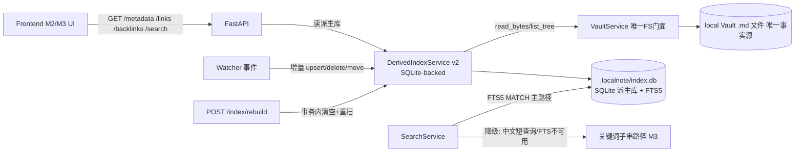

# LocalNote Server M4 计划：SQLite 派生库 / FTS5 全文搜索 / 索引增量与全量重建 / 性能基准

> 阶段：M4（依赖 M1 Vault Core + M2 Workspace + M3 Metadata/Links/内存派生索引；M1/M2/M3 已实现）
> 性质：供开发 Agent 逐项执行、测试 Agent 验收、审计 Agent 复核的详细实施计划。
> 本阶段唯一新增规划文件为 `PLAN-M4.md`；规划阶段不得创建实现代码，不得修改
> `PLAN.md`、`PLAN-M1.md`、`PLAN-M2.md` 或 `PLAN-M3.md`。路由已确定并生效，本文件不重新定义 provider/model。
>
> 一句话定位：把 M3 的**内存派生索引**替换为 **`.localnote/index.db` 的 SQLite 派生库**
> （含 FTS5 全文搜索），保持 M3 全部 REST 契约与 DTO 不变，仅替换底层存储与搜索主路径；
> **SQLite 永远是派生数据，绝不作为正文唯一数据源**——删除 `.localnote/` 后可全量重建，
> 正文零改动。`server/markdown/bytes.py` 仍保持原始 bytes 边界，绝不改成 parser。

---

## 1. 目标与可验收成功标准

### 1.1 总目标

在不改变 Markdown 文件唯一事实源、不改变 M3 REST 契约的前提下，将派生层的存储引擎从
"纯内存 dict"升级为"SQLite 派生库 + FTS5 全文搜索"，并提供性能基准：

1. **SQLite 派生库**：在 `.localnote/index.db` 建立 schema（notes / metadata / tags /
   properties / links / backlinks / FTS 虚表 / 版本表），含 PRAGMA（WAL、synchronous）、
   版本表驱动的 migration/versioning、连接管理与线程安全。库/表为**纯派生数据**。
2. **FTS5 全文搜索**：搜索主路径切换到 FTS5（MATCH），并保留 M3 的关键词子串检索作为
   **降级/辅助路径**（用于中文短查询与 FTS 不可用时兜底）。`GET /api/v1/search?q=` 契约
   与响应 DTO **保持稳定**（复用 M3 DTO），仅底层替换。
3. **索引增量与全量重建**：watcher 事件 → SQLite upsert/delete/move；
   `POST /api/v1/index/rebuild` 在事务内清空 + 重扫；单篇失败隔离；
   `skipped_notes`/`degraded` 语义保留。
4. **性能基准**：10,000 笔记的可复现基准脚本/测试；报告 FTS 查询延迟、索引容量/内存；
   给出优化建议（非 CI 强制阈值，容忍环境波动）。

数据流固定为：



`VaultService` 仍是唯一 FS 门面；Index/Search/Links/Metadata 只通过
`VaultService.read_bytes` / `list_tree` 读取正文，绝不直接 `open`/`pathlib`。
SQLite 只写 `.localnote/index.db`，绝不写正文。前端 Search/Links UI 全部走 REST。

### 1.2 可验收成功标准（全部为 M4 完成门槛）

1. **既有门禁不回退**：
   - 后端 `python -m pytest -q` 全绿：M1/M2/M3 既有 **238 个用例**保持通过（以仓库实际
     收集为准，不减少既有覆盖），新增 M4 用例全部通过。
   - 前端 `vitest run` 全绿：M2/M3 既有 **47 个用例**保持通过，新增 M4 用例通过。
   - `pnpm --filter @localnote/{protocol,workspace,web} typecheck`、web build、
     `python -m compileall server`、`./scripts/check.sh` 均通过。
   - `git diff` 确认 `server/markdown/bytes.py`、`PLAN.md`、`PLAN-M1.md`、`PLAN-M2.md`、
     `PLAN-M3.md` 未被改动。
2. **SQLite 派生库**：
   - 打开 Vault 时在 `.localnote/` 下创建 `index.db`；`state.json` 占位保留。
   - schema 含：`notes`（path/sha256/title/basename/text/frontmatter_status/diagnostic）、
     `tags`（note_path/tag）、`properties`（note_path/key/value_json）、`links`（出边，
     含 target/section/block/kind/resolved_path/broken/ambiguous/context）、
     `backlinks`（target_path→source_path 反向，可由 links 派生或物化）、`notes_fts`
     （FTS5 虚表）、`schema_migrations`（版本表）。表结构见 §5.1。
   - PRAGMA：`journal_mode=WAL`、`synchronous=NORMAL`、`foreign_keys=ON`。
   - 版本表 + migration：启动时读 `schema_migrations.version`，小于当前 `SCHEMA_VERSION`
     则按序执行 migration；不可迁移则删库重建（派生数据允许）。
   - 连接管理：单一写连接 + 线程本地读连接（或单连接 + 锁串行）；watcher 回调线程与
     请求线程共享安全；`clear()`/shutdown 正确关闭连接。
3. **派生数据可删除重建**（核心断言）：
   - 删除整个 `.localnote/`（含 index.db）后调用 `POST /index/rebuild` 或重启，
     索引完整重建，metadata/links/search 结果与删除前一致；
     **正文与附件 hash 不变**（对 fixture 计算前后 SHA-256 全等）。
   - SQLite **绝不**作为正文唯一数据源：全文检索所需正文始终可由 `VaultService`
     重新读取重建；FTS external-content 或冗余 text 列均为派生副本。
4. **FTS5 全文搜索**：
   - 英文/数字/可 tokenize 词走 FTS5 `MATCH` 主路径；中文检索可用（见 §5.4 选型结论）。
   - `GET /api/v1/search?q=` 契约不变：`SearchResponse{query,hits,total,degraded,
     skipped_notes,generated_at}`，`SearchHit{path,title,snippet,matched_terms,score}`。
   - 保留 M3 关键词子串检索作为降级/辅助：FTS 不可用、或查询为短中文（无法被所选
     tokenizer 命中的 token 长度）时回退到子串路径；`degraded`/`skipped_notes` 语义保留。
   - snippet 为命中附近窗口纯文本（React 按文本渲染，禁止 HTML 注入）。
   - 400/503 错误语义与 M3 一致（空白/超长/控制字符 → 400；索引不可用 → 503）。
5. **索引增量与全量重建**：
   - watcher create/modify/delete/move → SQLite upsert/delete/move（move = delete old +
     upsert new），backlinks/tags/properties 同步更新。
   - `POST /index/rebuild` 全量重建：事务内清空派生表 + 重扫全 Vault；返回
     `IndexRebuildResponse{indexed,skipped,failed,duration_ms,ready,generated_at}`（DTO 不变）。
   - 重建期间查询策略固定并文档化（见 §5.6）：采用**串行锁**，重建与增量、重建与查询
     互斥（简单、正确优先；说明取舍）。
   - 单篇失败隔离：非 UTF-8/读取失败 → 该篇 `diagnostic`/`frontmatter_status="unreadable"`
     计入 `failed`，不影响其它篇，不使整个索引失效。
6. **性能基准**：
   - 提供 `tests/backend/perf/`（或 `scripts/bench/`）下的可复现基准：程序化生成
     10,000 篇 Markdown（可控规模，混合中文/英文/tags/links）到 tmp 目录，跑全量
     rebuild + 一组代表性查询，输出 JSON/Markdown 报告。
   - 报告指标：全量 rebuild 耗时、单篇增量 upsert 延迟、FTS 查询延迟（P50/P95）、
     索引库文件大小、峰值内存（`tracemalloc`/`resource`）。
   - 目标（**指导性、非 CI 强制阈值**，容忍环境波动）：单篇打开 <100ms、关键词搜索
     <300ms、保存（增量 upsert）<100ms、WikiLink 补全相关查询 <100ms。基准结果记录于
     开发报告，给出优化建议。
7. **测试**：
   - schema/migration 升级测试（旧版本库 → migration → 新 schema）。
   - FTS 检索覆盖：中文、英文、Emoji、多词 AND、tag、basename 命中。
   - 增量/全量重建测试；watcher 事件 → SQLite 一致性测试。
   - `.localnote` 删重建后正文 hash 不变测试。
   - 性能基准测试以**可选标记**（如 `pytest -m perf` 或环境变量门控）提供，
     默认不进 CI 强制阈值。
   - 仅用 `tests/fixtures/vault` 与 `tmp_path`；不触真实用户 Vault。

---

## 2. 范围与边界

### 2.1 Must 实现

**后端：**
- `server/index/db.py`（NEW）：SQLite 连接管理、PRAGMA、schema DDL、migration runner、
  线程安全封装。仅依赖 Python 标准库 `sqlite3`（**不新增第三方依赖**）。
- `server/index/schema.py`（NEW）：`SCHEMA_VERSION`、DDL 语句、migration 脚本表。
- `server/index/service.py`（EDIT，重构）：`DerivedIndexService` 从内存 dict 迁移为
  SQLite-backed；保持对外方法签名兼容（`rebuild`/`handle_event`/`entry`/`entries`/
  `outgoing_for`/`backlink_sources`/`tags_for`/`assert_ready`/`build_state`/`clear` 等），
  供 Links/Metadata/Search 复用而不改其调用面。
- `server/index/schemas.py`（EDIT）：`NoteIndexEntry` 保留为内存投影（dataclass），
  或改为从 SQLite 行构造；`IndexRebuildResponse` DTO **不变**。
- `server/search/service.py`（EDIT）：主路径 FTS5 MATCH；保留 M3 子串路径作为降级/辅助；
  DTO 不变。
- `server/links/service.py`（EDIT）：outgoing/backlinks 改从 SQLite links/backlinks 表读；
  DTO 不变。
- `server/metadata/service.py`（EDIT，可选最小）：metadata 仍以 `VaultService.read_bytes`
  实时解析为准（保持 M3 语义）；**不强制**改为读 SQLite，避免引入一致性问题。
- `server/vault/derived.py`（EDIT，最小）：初始化 `.localnote/` 时创建/打开 `index.db`
  并跑 migration；仍为派生、可删重建。
- `server/vault/lifecycle.py`（EDIT，最小）：startup 顺序保持
  Vault 初始化 → 打开/迁移 index.db → 构建/重建 → watcher；shutdown 关闭 DB 连接。
- `server/config.py`（EDIT，最小）：`IndexSettings` 增加 SQLite 相关开关（见 §5.7），
  如 `db_filename`（默认 `index.db`）、`fts_tokenizer`（默认见 §5.4）、
  `journal_mode`/`synchronous`（默认 WAL/NORMAL）。保持向后兼容默认值。
- 性能基准：`tests/backend/perf/` 或 `scripts/bench/`（NEW）+ 生成器 + 报告。

**前端：**
- **原则上零改动**：M4 只替换后端存储与搜索实现，REST 契约/DTO/错误体不变，
  `packages/protocol`、`apps/web/src/api/client.ts`、Search/Links 组件均不修改。
- 仅在协议需要新增**可选**诊断字段时才 additive 修改（见 §10.3 未决事项），且必须
  向后兼容（新增可选字段，TS 端 optional）。

### 2.2 明确不实现（M4 边界）

- **Graph 数据/渲染**：`server/graph/`、`packages/graph/` 保持 placeholder（M5）。
- **AI/embedding/rerank**、Agent、Scheduler、WebSocket、oMLX 请求（M6+）。
- **Properties 编辑写回 / frontmatter 写回**：M4 仍只读，绝不写回正文。
- **Diff/Undo/History/Recovery/Policy**（M7）。
- **真实用户 Vault 操作**（测试 fixture/tmp 之外）、云/远程数据库/PostgreSQL/Redis。
- **WikiLink 自动补全服务端新端点**：补全数据源复用现有 links/搜索能力；**不新增**
  专门补全端点（性能目标中"WikiLink 补全"指支撑该能力的 basename/搜索查询延迟）。
- **不把 SQLite 作为正文唯一数据源**：正文始终可由 Vault 重读重建。
- **不实现语义搜索/向量索引**（属 M6）。
- **不改动 M2 编辑器、M1 Vault 读写、health/AI 端点**的任何契约。

---

## 3. 现状基线与实施前检查

开发 Agent 必须先读取并以当前代码为准：

- `PLAN-M1.md`、`PLAN-M2.md`、`PLAN-M3.md`、`docs/architecture.md`、
  `docs/development-roadmap.md`、`README.md`。
- `server/index/{service,schemas,errors,README}.py/md`、`server/{metadata,links,search}/service.py`、
  `server/vault/{service,lifecycle,derived,watcher,events,path_safety,errors}.py`、
  `server/markdown/{bytes,frontmatter,wikilinks}.py`、`server/api/{main,dependencies}.py`、
  `server/api/routes/{metadata,links,search,index}.py`、`server/config.py`、`pyproject.toml`。
- `apps/web/src/api/{client,types}.ts`、`packages/{protocol,workspace}/src/`、
  `apps/web/src/components/{SearchPanel,NotesLinksPanel,LinkItem,Ribbon}.tsx`。
- `tests/backend/`（含 `test_index_service.py`/`test_search.py`/`test_m3_api.py`）、
  `tests/frontend/`、`tests/fixtures/vault/`。

**已核实基线**：
- 后端 pytest：**238 passed**（M1/M2/M3 全绿）。
- 前端 vitest：**47 passed**（7 个测试文件全绿）。
- 运行环境 SQLite：**3.53.4**，**FTS5 可用**（`CREATE VIRTUAL TABLE ... USING fts5` 成功）。
- M3 `DerivedIndexService` 为纯内存（`_notes/_backlinks/_tags/_basenames_*`），RLock 串行，
  `rebuild()`/`handle_event()` 已实现；`IndexRebuildResponse` DTO 稳定。
- `.localnote/` 仅目录 + `state.json` 占位（`STATE_PAYLOAD={"format":"localnote-m1",...}`），
  无 SQLite/FTS/正文副本。
- `VaultService.set_event_callback` 已存在；lifecycle 顺序已是 Vault→Index→Watcher。

**FTS5 tokenizer 实测结论（已在本机 sqlite 3.53.4 验证，作为 §5.4 选型依据）**：
- `unicode61`：**不拆分中文**——"你好"/"世界"/"机器"（2 字）查询命中 0；
  仅完整词/英文 token 可命中。
- `trigram`：**最小 token 长度为 3**——"你好"（2 字）命中 0，"你好世"（3 字）命中；
  英文 "hello" 可命中。
- 含义：单纯依赖 FTS5 的 unicode61/trigram **无法可靠支持 2 字中文查询**。

实施前先执行基线命令并记录退出码；若基线失败先诊断，不得把失败归因于 M4。

---

## 4. 有序任务清单

按依赖顺序实施；同一任务可拆分文件，但不得改变公共契约而不在开发报告中记录。
`NEW` 表示新建，`EDIT` 表示在既有文件上做最小/向后兼容修改。

| 编号 | 任务 | 依赖 | 产出与完成定义 | 预计关键文件 |
|---|---|---|---|---|
| M4-01 | 基线确认与选型定稿 | M3 | 记录后端 238 / 前端 47 基线；确认 sqlite3/FTS5 可用；把 §5.4 中文分词选型结论写入开发报告；确认不新增第三方依赖（仅 stdlib `sqlite3`） | `pyproject.toml`（仅核对，无新依赖）, `tests/backend/test_config.py`（如需） |
| M4-02 | SQLite schema 与版本/migration 设计 | M4-01 | 定义 `SCHEMA_VERSION`、全部 DDL（notes/tags/properties/links/backlinks/notes_fts/schema_migrations）、PRAGMA；migration runner 规则（升序、不可迁移则删库重建）；单测覆盖空库建表与版本写入 | `server/index/schema.py`(NEW), `tests/backend/test_index_schema.py`(NEW) |
| M4-03 | 连接管理与线程安全 | M4-02 | `IndexDatabase`：单写连接 + 线程本地读连接（或单连接 + RLock），PRAGMA 应用，事务上下文管理器，`close()`；watcher 线程与请求线程并发安全测试 | `server/index/db.py`(NEW), `tests/backend/test_index_db.py`(NEW) |
| M4-04 | derived 集成：.localnote/index.db 初始化 | M4-03 | `derived.py` 增加打开/创建 `index.db` + 跑 migration；`state.json` 保留；**不**在 M1 路径外新增正文写入；删 `.localnote` 后可重建 | `server/vault/derived.py`(EDIT), `tests/backend/test_localnote_init.py`(EDIT) |
| M4-05 | NoteIndexEntry→SQLite 投影与写入路径 | M4-03/M4-04 | 把 M3 `_entry_from_text`/`_read_and_build_entry` 产物落库：notes 行 + tags + properties + links 出边 + FTS 行；单篇失败隔离（diagnostic/unreadable）；保留 basename 解析逻辑（ambiguous/broken） | `server/index/service.py`(EDIT), `server/index/schemas.py`(EDIT) |
| M4-06 | rebuild()：事务内全量重建 | M4-05 | `rebuild()` 在单事务内 DELETE 派生表 → 重扫 `list_tree`/`read_bytes` → 批量 upsert；返回 DTO 不变；失败回滚不留半状态；`build_state` 语义不变 | `server/index/service.py`(EDIT), `tests/backend/test_index_rebuild.py`(NEW) |
| M4-07 | 增量：watcher → SQLite upsert/delete/move | M4-05 | `handle_event` 落库：create/modify→upsert（含 FTS/tags/links/properties 同步）、delete→删除、move→delete+upsert；与 rebuild 用同一锁串行；backlinks 反向维护 | `server/index/service.py`(EDIT), `tests/backend/test_index_incremental.py`(NEW) |
| M4-08 | 查询适配：entry/entries/links/backlinks/tags | M4-05/M4-06 | `entry`/`entries`/`outgoing_for`/`backlink_sources`/`tags_for` 改从 SQLite 读；保持返回类型与 M3 兼容（Links/Metadata 服务调用面不变）；404/503 语义不变 | `server/index/service.py`(EDIT), `server/links/service.py`(EDIT), `tests/backend/test_index_query.py`(NEW) |
| M4-09 | FTS5 搜索主路径 + 子串降级 | M4-06/M4-08 | `SearchService.search`：先 FTS5 MATCH（英文/可 tokenize/可命中），短中文/FTS 不可命中/FTS 异常 → 回退 M3 子串；合并去重、固定排序（score desc→path）；snippet 命中窗口；`degraded`/`skipped_notes` 保留；DTO 不变 | `server/search/service.py`(EDIT), `tests/backend/test_search_fts.py`(NEW) |
| M4-10 | lifecycle / DI / 错误映射接线 | M4-04/M4-06 | lifecycle startup：Vault→打开/迁移 index.db→rebuild→watcher；shutdown 关闭 DB；DI `get_index_service` 提供 SQLite-backed 服务；`index_unavailable`(503) 映射保留 | `server/vault/lifecycle.py`(EDIT), `server/api/dependencies.py`(EDIT), `server/api/main.py`(EDIT，仅如需要) |
| M4-11 | config：IndexSettings SQLite 开关 | M4-02 | `IndexSettings` 增 `db_filename`(默认 `index.db`)、`fts_tokenizer`(默认见 §5.4)、`journal_mode`(`WAL`)、`synchronous`(`NORMAL`)；嵌套 env `LOCALNOTE_INDEX__*`；默认值向后兼容 | `server/config.py`(EDIT), `tests/backend/test_config.py`(EDIT) |
| M4-12 | 派生可删除重建 + 正文 hash 不变 | M4-06 | 测试：删 `.localnote/` → rebuild → metadata/links/search 一致；fixture 正文/附件 SHA-256 前后全等；断言 index.db 不含正文唯一数据源（可由 Vault 重建） | `tests/backend/test_derived_rebuild.py`(NEW) |
| M4-13 | schema/migration 升级测试 | M4-02/M4-03 | 构造旧版本库 → migration → 校验新 schema/数据保留或按规则重建；不可迁移路径（版本缺口/损坏）→ 删库重建 | `tests/backend/test_index_migration.py`(NEW) |
| M4-14 | 性能基准（10,000 笔记） | M4-06–M4-09 | 生成器（可控规模，中/英/tags/links 混合）→ tmp Vault；全量 rebuild + 代表查询；输出 P50/P95 延迟、库大小、峰值内存；可选标记 `pytest -m perf` 或 env 门控，默认不进 CI 阈值 | `tests/backend/perf/`(NEW) 或 `scripts/bench/`(NEW), `tests/backend/test_perf_benchmark.py`(NEW, 可选标记) |
| M4-15 | 契约回归 + 范围审计 + 文档 | M4-06–M4-14 | M1/M2/M3 全量回归通过；`git diff` 确认 bytes.py/PLAN*.md 未改；搜索确认未实现 M5+/M6+ 禁止项、未写回正文、未把 SQLite 当正文源；更新 `README.md`/`docs/architecture.md`/`docs/development-roadmap.md`（M4 状态 + M5 入口）；更新 `server/index/README.md` | `README.md`(EDIT), `docs/architecture.md`(EDIT), `docs/development-roadmap.md`(EDIT), `server/index/README.md`(EDIT) |

---

## 5. 技术方案与关键设计决策

### 5.1 SQLite schema 设计（`server/index/schema.py`）

派生库文件：`.localnote/index.db`（默认，可配置 `db_filename`）。

```sql
-- 版本表：migration/versioning 的单一事实
CREATE TABLE IF NOT EXISTS schema_migrations (
  version     INTEGER PRIMARY KEY,
  applied_at  TEXT NOT NULL DEFAULT (strftime('%Y-%m-%dT%H:%M:%fZ','now'))
);

-- 笔记主行（每篇 markdown 一行；text 为派生副本，可由 Vault 重读重建）
CREATE TABLE IF NOT EXISTS notes (
  path               TEXT PRIMARY KEY,        -- root-relative POSIX
  sha256             TEXT NOT NULL,           -- 内容 hash（变更检测）
  title              TEXT NOT NULL,
  basename           TEXT NOT NULL,           -- 无扩展文件名（链接解析）
  text               TEXT NOT NULL DEFAULT '',-- 去 frontmatter 正文（派生）
  text_truncated     INTEGER NOT NULL DEFAULT 0,
  frontmatter_status TEXT NOT NULL DEFAULT 'none', -- none|ok|parse_error|unreadable
  diagnostic         TEXT,                    -- 单篇失败诊断（如 non_utf8）
  parse_error_json   TEXT                     -- 结构化 parse_error JSON
);

-- tags（规范化 tag；folded 用于检索）
CREATE TABLE IF NOT EXISTS tags (
  note_path   TEXT NOT NULL REFERENCES notes(path) ON DELETE CASCADE,
  tag         TEXT NOT NULL,                  -- 展示（原大小写）
  tag_folded  TEXT NOT NULL,                  -- casefold 索引键
  PRIMARY KEY (note_path, tag_folded)
);
CREATE INDEX IF NOT EXISTS idx_tags_folded ON tags(tag_folded);

-- properties（frontmatter 未知字段逐字保留，value 存 JSON）
CREATE TABLE IF NOT EXISTS properties (
  note_path   TEXT NOT NULL REFERENCES notes(path) ON DELETE CASCADE,
  key         TEXT NOT NULL,
  value_json  TEXT NOT NULL,
  PRIMARY KEY (note_path, key)
);

-- links 出边（wikilink/embed/web；resolved/broken/ambiguous）
CREATE TABLE IF NOT EXISTS links (
  source_path   TEXT NOT NULL REFERENCES notes(path) ON DELETE CASCADE,
  target        TEXT NOT NULL,                -- 显示目标
  raw           TEXT NOT NULL,                -- 原文 [[...]]
  kind          TEXT NOT NULL,                -- wikilink|embed|web
  display       TEXT,                         -- alias
  section       TEXT,                         -- #heading
  block         TEXT,                         -- ^block
  resolved_path TEXT,                         -- 解析后的 note path
  broken        INTEGER NOT NULL DEFAULT 0,
  ambiguous     INTEGER NOT NULL DEFAULT 0,
  context       TEXT                          -- 上下文片段（backlink 展示）
);
CREATE INDEX IF NOT EXISTS idx_links_source ON links(source_path);
CREATE INDEX IF NOT EXISTS idx_links_resolved ON links(resolved_path);

-- backlinks 反向（物化以加速查询；亦可由 links.resolved_path 派生）
CREATE TABLE IF NOT EXISTS backlinks (
  target_path  TEXT NOT NULL,
  source_path  TEXT NOT NULL REFERENCES notes(path) ON DELETE CASCADE,
  context      TEXT,
  PRIMARY KEY (target_path, source_path)
);
CREATE INDEX IF NOT EXISTS idx_backlinks_target ON backlinks(target_path);

-- FTS5 全文虚表（见 §5.4 选型；contentless 或 external content）
CREATE VIRTUAL TABLE IF NOT EXISTS notes_fts USING fts5(
  path UNINDEXED,       -- 主键回查
  title,                -- 标题加权
  basename,             -- 文件名加权
  tags,                 -- tag 文本
  body,                 -- 正文
  tokenize = 'unicode61'  -- 默认；中文短查询走子串降级（§5.4）
);
```

**设计要点**：
- `notes.path` 为 PK；`tags`/`properties`/`links`/`backlinks` 用 `ON DELETE CASCADE`
  跟随 `notes` 删除（需 `PRAGMA foreign_keys=ON`）。
- `text`/`body` 是**派生副本**：可删库重建，正文唯一事实源仍是 Vault 文件。
- `backlinks` 选择**物化**（而非每次 JOIN 派生）：backlinks 查询是热路径
  （UI 面板），物化后 O(1) 索引查找；写入端在 upsert/delete 时同步维护。

### 5.2 migration / versioning 策略

- `SCHEMA_VERSION = 1`（M4 首版）。`schema_migrations` 记录已应用版本。
- 启动流程：打开 index.db → `PRAGMA user_version`/读 `schema_migrations` 最大 version：
  - 等于当前 → 直接使用。
  - 小于当前 → 按序执行 `MIGRATIONS[v]`（每个是从 v→v+1 的 SQL 列表），逐版本事务提交。
  - 大于当前（库由更新版本创建）或表损坏/不可迁移 → **删除 index.db 重建**
    （派生数据允许，正文不受影响），并记日志。
- migration 脚本必须是**幂等、可重入**的；每步在事务内。
- 测试覆盖：空库建到最新；v1→（模拟）v2 迁移；损坏/未来版本 → 重建。

### 5.3 PRAGMA 与连接管理（`server/index/db.py`）

```text
PRAGMA journal_mode = WAL;        -- 读写并发，崩溃安全
PRAGMA synchronous = NORMAL;      -- WAL 下足够安全且更快（非 FULL）
PRAGMA foreign_keys = ON;         -- 级联删除 tags/properties/links/backlinks
PRAGMA busy_timeout = 5000;       -- 写锁等待，避免瞬时 SQLITE_BUSY
```

连接管理（线程安全，watcher 线程 + FastAPI 请求线程并发）：
- **方案选择**：单写连接 + 读用线程本地连接；或**单连接 + 进程内 RLock 串行**。
- **推荐（M4 取简单正确优先）**：单一 `sqlite3.Connection`（`check_same_thread=False`）
  + 一把 `threading.RLock` 串行所有读写。理由：Vault 是单用户本地场景，写入（增量/
  重建）远少于读取，串行锁实现最简单且与 M3 语义一致（M3 本就是 RLock 串行）。
  WAL 主要价值在**崩溃恢复**与后续多连接扩展，而非当前并发吞吐。
- 提供上下文管理器 `transaction()`（`BEGIN IMMEDIATE`/`COMMIT`/`ROLLBACK`）保证
  rebuild 与批量 upsert 的原子性。
- `close()` 在 lifecycle shutdown 调用；`clear()` 关闭并删除 db 文件句柄引用。

### 5.4 FTS 建模与中文分词选型（关键决策）

**问题**：FTS5 内置 tokenizer 对中文支持有限（已在 sqlite 3.53.4 实测）：
- `unicode61`：按 Unicode 词边界分词，**不拆分连续中文**（中文无空格），2 字中文
  查询无法命中。
- `trigram`：生成 3 字符滑动窗口，**最小查询 token 为 3 字**，"你好"（2 字）无法命中。
- `porter`：仅英文词干，不适用中文。

**约束**：M4 **仅用 stdlib `sqlite3`**，不引入 `jieba` 等第三方分词库（避免新依赖与
打包/审计面），也不实现 C 扩展自定义 tokenizer。

**选型结论（双路径混合，务实）**：

1. **FTS5 主路径**：`notes_fts` 用 `unicode61`（默认）。
   - 覆盖：英文、数字、含空格的混合文本、tag、basename、标题；以及**可被 unicode61
     命中的较长中文串**（如完整短语）。FTS 提供排序相关性与高性能 MATCH。
   - `bm25(notes_fts)` 用于 score（列权重：title > basename > tags > body）。
2. **中文/短查询降级路径**：保留 M3 的关键词子串检索。
   - 触发条件（满足其一即回退）：查询含 CJK 且 FTS 对该查询无法产生有效 token 命中
     （尤其 2 字中文）；或 FTS 查询抛错/不可用。
   - 实现：对每个 term 做 `instr(lower(body), term)` 子串匹配（SQL `INSTR`/`LIKE`，
     或在 Python 侧对候选集做 `in`），中文子串天然友好。
3. **融合**：同一查询若两路都有结果，**合并去重**（path 为键），score 以 FTS bm25
   为主、子串命中加权（basename/title/tag 加分），固定排序 `score DESC, path ASC`。

**取舍说明（写入开发报告与未决事项）**：
- 优点：零新依赖、中文 2 字可查、英文高性能、契约不变、降级安全。
- 代价：中文长文相关性的排序质量弱于专业分词 FTS；子串路径在大库上为 O(n) 候选扫描
  （用 FTS 先缩小候选集，或对纯中文查询接受全表 `INSTR` 扫描——10k 规模可接受，
  见 §5.8 基准）。
- 未来 M5+/M6 可引入 `jieba`/icu tokenizer 或向量检索进一步提升中文质量。

**FTS 内容模型**：采用 **contentless-delete / external content** 权衡：
- 选 **`notes_fts` 存冗余 body/title/basename/tags 列**（非 contentless）：实现最简单，
  snippet 可直接从 `notes.text` 取（同一库内），代价是库体积约为正文文本的一份派生
  副本（可接受，派生数据）。contentless 可省空间但 snippet/highlight 需回查，复杂度高，
  M4 不取。

### 5.5 索引增量与全量重建

**全量重建（`rebuild()`）**：
1. 获取 RLock（与增量、查询互斥——见 §5.6）。
2. `list_tree("", recursive=True)` 过滤 `.md/.markdown`；失败 → `build_state="unavailable"`。
3. 单事务 `BEGIN IMMEDIATE`：`DELETE FROM backlinks/links/tags/properties/notes; DELETE FROM notes_fts;`
4. 逐篇 `read_bytes` → decode → `parse_frontmatter`/`parse_wikilinks`/basename 解析 →
   upsert notes/tags/properties/links/notes_fts；单篇失败记 `failed` + diagnostic，继续。
5. 由 links 物化 backlinks；`COMMIT`。异常 → `ROLLBACK`，不留半状态。
6. 返回 `IndexRebuildResponse`（DTO 不变）。

**增量（`handle_event`）**：
- create/modify：`read_bytes` → 与旧 `sha256` 比较，相同则跳过；不同则单事务
  `DELETE` 该 path 的 tags/properties/links/backlinks/fts 行 + `INSERT` 新行（upsert）。
- delete：`DELETE FROM notes WHERE path=?`（CASCADE 清理子表）+ 删 fts 行 + 删
  backlinks 中该源/目标行。
- move：按 `old_path` delete + `new_path` upsert。
- 目录事件、非 markdown 事件忽略；事件路径已由 watcher 安全校验。

### 5.6 重建期间查询可用性策略（取舍）

**决策：串行锁（重建与查询互斥）**。
- 实现：`rebuild()` 与所有查询、所有增量共用同一把 `RLock`。重建期间查询**阻塞等待**
  （而非返回陈旧或报错）。
- 取舍说明：
  - **优点**：实现最简单、绝对一致（不会读到重建中途的半状态）、无 WAL 读写快照管理
    复杂度；重建是低频操作（手动/启动），阻塞可接受。
  - **代价**：大 Vault 重建期间搜索/links 短暂不可用（表现为延迟而非错误）。
  - **备选（未取）**：重建到临时库 + 原子切换（`index.db.new` → rename），查询不阻塞。
    记录在 §10.3 未决事项，作为大库场景的后续优化；M4 取简单正确。

### 5.7 与现有 VaultService/index 服务整合

- `VaultService` **不改**：仍唯一 FS 门面；Index 只经 `read_bytes`/`list_tree` 读。
- lifecycle startup：`Vault 初始化 → 打开/迁移 index.db（derived.initialize_derived +
  IndexDatabase.connect/migrate）→ DerivedIndexService.rebuild() → set_event_callback →
  watcher.start()`。shutdown：`watcher.stop → IndexDatabase.close()`。
- DI：`get_index_service` 返回 SQLite-backed `DerivedIndexService`；`get_search_service`/
  `get_links_service`/`get_metadata_service` 构造不变（调用面兼容）。
- 错误边界：index.db 打开/迁移失败 → `build_state="unavailable"`，metadata/links/search
  503 `index_unavailable`；**不影响** health/AI/Vault 读写/M2 编辑器。
- config：`IndexSettings` 增 `db_filename="index.db"`、`fts_tokenizer="unicode61"`、
  `journal_mode="WAL"`、`synchronous="NORMAL"`，全部可经 `LOCALNOTE_INDEX__*` 覆盖，
  默认值向后兼容。

### 5.8 性能基准方法

- **生成器**：`tests/backend/perf/generate.py`（或 `scripts/bench/generate_vault.py`）
  在 `tmp_path` 程序化生成 N=10,000 篇 markdown：混合中文/英文标题与正文、随机 tags、
  随机 `[[wikilink]]`（含部分 broken）、frontmatter properties。规模/种子可控（`--seed`
  复现）。
- **测量**：
  - 全量 `rebuild()` 总耗时、单篇均摊。
  - 单篇增量 upsert 延迟（模拟 watcher modify）。
  - 代表查询 P50/P95：英文 FTS 查询、中文 2 字查询（降级路径）、tag 查询、
    basename/补全类查询、backlinks 查询。
  - 索引库文件大小（`.localnote/index.db` bytes）、峰值内存（`tracemalloc`）。
- **输出**：JSON + Markdown 报告（写入 `tmp` 或 stdout），开发报告附实测数字。
- **目标（指导性，非 CI 强制阈值）**：单篇打开 <100ms、关键词搜索 <300ms、
  保存（增量 upsert）<100ms、WikiLink 补全类查询 <100ms。基准用
  `@pytest.mark.perf`（或 `LOCALNOTE_RUN_PERF=1` 门控）标记，**默认不进 CI**，
  容忍环境波动；仅作回归参考与优化依据。
- **优化建议**（写入报告）：WAL 下批量事务提交、FTS `INSERT` 批量、对子串降级先以
  FTS 缩候选、`optimize` 定期执行、大库可改"临时库 + rename"无阻塞重建。

---

## 6. 公共 API / DTO / 错误枚举 / 数据流

### 6.1 REST 契约（**全部复用 M3，不变**）

| 方法/路径 | 说明 | 变化 |
|---|---|---|
| `GET /api/v1/metadata/{note}` | frontmatter 解析（仍以 Vault 实时读为准） | 无 |
| `GET /api/v1/links/{note}` | outgoing（改从 SQLite links 读） | 仅底层 |
| `GET /api/v1/backlinks/{note}` | 反链（改从 SQLite backlinks 读） | 仅底层 |
| `GET /api/v1/search?q=` | 搜索（FTS 主路径 + 子串降级） | 仅底层 |
| `POST /api/v1/index/rebuild` | 全量重建（SQLite 事务内清空+重扫） | 仅底层 |

**DTO 不变**（Python 权威 + TS 镜像均已存在，M4 不改字段）：
`NoteMetadataResponse`/`NoteLinksResponse`/`LinkRef`/`BacklinkRef`/`BacklinksResponse`/
`SearchHit`/`SearchResponse`/`IndexRebuildResponse`。

**错误枚举**：沿用 M1/M3；`index_unavailable`(503) 复用。**不新增**传输级错误码。
若新增 DB 相关领域错误，仅作为 `IndexUnavailable` 的内部原因，不暴露新 code。

### 6.2 示例（契约不变，仅示意底层已切换）

```bash
# 搜索：英文走 FTS5，中文 2 字走子串降级；响应 DTO 与 M3 完全一致
curl -fsS --get 'http://127.0.0.1:3780/api/v1/search' --data-urlencode 'q=你好 世界'
curl -fsS --get 'http://127.0.0.1:3780/api/v1/search' --data-urlencode 'q=hello fts'

# 重建：删除 .localnote/ 后调用，索引完整重建，正文 hash 不变
curl -fsS -X POST 'http://127.0.0.1:3780/api/v1/index/rebuild'
# {"indexed":10000,"skipped":3,"failed":1,"duration_ms":5120.7,"ready":true,"generated_at":"..."}
```

### 6.3 数据流（File → Crawl → SQLite Derived → API → UI）

```text
File (.md, 唯一事实源)
  └─ VaultService.read_bytes/list_tree  (唯一 FS 门面)
       └─ Crawl/parse: parse_frontmatter + parse_wikilinks + basename 解析
            └─ SQLite Derived (.localnote/index.db):
               notes/tags/properties/links/backlinks/notes_fts  (派生, 可删重建)
                 ├─ SearchService  → FTS5 MATCH (主) + 子串 (降级) → SearchResponse
                 ├─ LinksService   → links/backlinks 表          → Links/BacklinksResponse
                 └─ MetadataService→ Vault 实时解析 (M3 语义)     → MetadataResponse
                      └─ FastAPI routes → Frontend M2/M3 UI (REST, 不变)

Watcher event ─→ handle_event ─→ SQLite upsert/delete/move (与 rebuild 同锁串行)
POST /index/rebuild ─→ 事务内清空 + 重扫 (与查询互斥, §5.6)
```

---

## 7. 目录树与文件用途

```text
server/
  index/
    README.md            # [EDIT] 标注 M4 已实现 SQLite/FTS 派生库；M5 Graph 入口
    errors.py            # 保持 IndexUnavailable（不新增传输级 code）
    schemas.py           # [EDIT] NoteIndexEntry（内存投影）/ IndexRebuildResponse（不变）
    schema.py            # [NEW] SCHEMA_VERSION、DDL、MIGRATIONS
    db.py                # [NEW] IndexDatabase：连接/PRAGMA/事务/线程安全/close
    service.py           # [EDIT] DerivedIndexService：SQLite-backed rebuild/增量/查询
  markdown/
    bytes.py             # 不改（bytes 边界）
    frontmatter.py       # 不改（M3 解析器复用）
    wikilinks.py         # 不改（M3 解析器复用）
  metadata/service.py    # [EDIT 可选最小] 保持 Vault 实时解析（M3 语义）
  links/service.py       # [EDIT] 从 SQLite links/backlinks 读
  search/service.py      # [EDIT] FTS5 主路径 + 子串降级
  vault/
    derived.py           # [EDIT] 初始化时打开/迁移 index.db
    lifecycle.py         # [EDIT] startup 打开/迁移 DB + shutdown close
    service.py           # 不改（唯一 FS 门面）
  api/
    dependencies.py      # [EDIT] DI 提供 SQLite-backed 服务
    main.py              # [EDIT 仅如需要] 无新 router，无新错误码
  config.py              # [EDIT] IndexSettings 增 SQLite 开关
  graph/ agents/ policies/ scheduler/ history/ recovery/   # 仍 placeholder
tests/
  backend/
    test_index_schema.py       # [NEW] 建表/版本写入
    test_index_db.py           # [NEW] 连接/PRAGMA/线程安全/事务
    test_index_rebuild.py      # [NEW] 全量重建/事务原子/单篇隔离
    test_index_incremental.py  # [NEW] watcher→SQLite 一致性
    test_index_query.py        # [NEW] links/backlinks/tags 查询
    test_index_migration.py    # [NEW] 旧库迁移/损坏重建
    test_search_fts.py         # [NEW] 中文/英文/Emoji/多词 AND/降级
    test_derived_rebuild.py    # [NEW] 删 .localnote 重建 + 正文 hash 不变
    test_perf_benchmark.py     # [NEW, 可选标记] 10k 基准
    perf/                      # [NEW] 生成器/报告（或 scripts/bench/）
    （M1/M2/M3 既有用例保持通过，不改）
  frontend/                    # 不改（契约不变）
  fixtures/vault/              # 复用；性能基准用 tmp 生成，不污染 fixture
packages/protocol/             # 不改（DTO 不变）
apps/web/ packages/workspace/  # 不改（契约不变）
```

**仍占位、不实现**：`server/graph/`、`packages/graph/`（M5）、`server/agents|policies|
scheduler|history|recovery`、AI、语义/向量检索。

---

## 8. 依赖、风险与降级

| 项目 | 风险/影响 | 处理与降级 |
|---|---|---|
| `sqlite3`（stdlib） | 平台编译是否含 FTS5 | 启动时探测 `CREATE VIRTUAL TABLE ... USING fts5`；不可用则 FTS 路径整体降级为 M3 子串搜索（功能可用、性能降）；记日志 |
| FTS 中文分词 | unicode61 不拆中文、trigram 最小 3 字（已实测） | 双路径：FTS 主 + 子串降级（§5.4）；2 字中文走子串；记录为未决事项，M5+/M6 可引 jieba/icu |
| 子串降级性能 | 大库 O(n) 扫描 | 先用 FTS 缩候选；10k 规模基准验证；必要时加 `instr` 索引/物化 folded 列 |
| migration | 旧库版本缺口/损坏 | 不可迁移 → 删库重建（派生数据）；migration 幂等 + 逐版本事务；测试覆盖 |
| 并发（watcher vs 请求） | 写锁/SQLITE_BUSY | 单连接 + RLock 串行；`busy_timeout`；WAL；重建与查询互斥（§5.6） |
| 崩溃一致性 | 写一半断电 | WAL + 事务原子；synchronous=NORMAL 在 WAL 下安全；重建失败回滚不留半状态 |
| 库体积 | FTS 冗余 body 副本 | 接受派生副本（可删重建）；报告库大小；后续可 contentless |
| 内存 | 大 Vault 查询 | 查询分页/LIMIT；entries() 投影按需；基准报告峰值内存 |
| 跨平台 | macOS/Linux/Windows SQLite 行为 | stdlib sqlite3 跨平台一致；路径用 POSIX 相对；测试覆盖中文/Emoji/空格 |
| 契约漂移 | 底层切换影响 DTO/错误 | 路由/DTO/错误体零改动；M3 集成测试全量回归 |
| 把 SQLite 当正文源 | 违反事实源原则 | 正文始终可经 Vault 重读重建；测试断言删库后正文 hash 不变、索引可重建 |
| secret | 无 | 不引入任何凭据/key |

---

## 9. 测试矩阵与验收命令

### 9.1 后端测试矩阵

| 区域 | 场景 | 预期 |
|---|---|---|
| schema | 空库建表 | 全部表/索引/FTS 虚表存在；`schema_migrations` 写入当前版本 |
| migration | v_old → 当前 | 按序迁移成功；数据保留或按规则处理；版本号更新 |
| migration | 未来版本/损坏库 | 删库重建；不崩；正文不受影响 |
| db | 并发读写（watcher 线程 + 请求线程） | 无 SQLITE_BUSY/竞争；串行正确 |
| rebuild | 全量重扫 | indexed/skipped/failed 正确；单事务原子（中途失败回滚）；DTO 不变 |
| 增量 | create/modify/delete/move | notes/tags/properties/links/backlinks/fts 同步一致；sha256 相同跳过 |
| 查询 | outgoing/backlinks/tags | 与 M3 内存版结果一致；404/503 语义不变 |
| search FTS | 英文/数字/多词 AND | FTS MATCH 命中；bm25 排序；snippet 正确 |
| search 中文 | 2 字/多字中文、Emoji | 子串降级命中；DTO 不变；degraded/skipped 语义保留 |
| search 降级 | FTS 异常/不可用 | 回退子串；不 5xx；契约不变 |
| search 校验 | 空白/超长/控制字符 q | 400 invalid_request |
| 派生重建 | 删 `.localnote/` → rebuild | 索引完整重建；metadata/links/search 一致；**正文/附件 hash 不变** |
| 隔离 | 非 UTF-8/读失败单篇 | diagnostic/unreadable；计入 failed；不影响其它篇 |
| 回归 | M1/M2/M3 既有 238 用例 | 全数通过 |

### 9.2 性能基准（可选标记，非 CI 阈值）

| 指标 | 目标（指导） | 测量 |
|---|---|---|
| 全量 rebuild（10k） | 报告实测 | 总耗时/单篇均摊 |
| 单篇增量 upsert | <100ms | 模拟 watcher modify |
| 英文 FTS 查询 | <300ms | P50/P95 |
| 中文 2 字查询（降级） | <300ms | P50/P95 |
| WikiLink 补全类/basename 查询 | <100ms | P50/P95 |
| 单篇打开 | <100ms | entry 查询 |
| 索引库大小 | 报告实测 | index.db bytes |
| 峰值内存 | 报告实测 | tracemalloc |

### 9.3 前端

契约不变，前端**零改动**；既有 **47 用例**全量回归通过即可。如确需 additive 可选诊断
字段（§10.3），则补 protocol 镜像 + client 测试（fetch 全 mock）。

### 9.4 验收命令（从仓库根执行并记录退出码）

```bash
python3 --version                                  # >= 3.12
uv sync --dev                                      # 无新增第三方依赖（仅 stdlib sqlite3）
pnpm install --frozen-lockfile
python -m pytest -q                                # 后端：238 回归 + M4 新矩阵
python -m pytest -q -m perf                        # 可选：性能基准（非强制阈值）
pnpm --filter @localnote/protocol typecheck
pnpm --filter @localnote/workspace typecheck
pnpm --filter @localnote/web typecheck
pnpm --filter @localnote/web test -- --run         # 前端 47 回归
pnpm --filter @localnote/web build
python -m compileall server
./scripts/check.sh
```

受控 smoke（仅 `tests/fixtures/vault` 临时副本）：

```bash
LOCALNOTE_VAULT__ROOT="$PWD/tests/fixtures/vault" \
  python -m uvicorn server.api.main:app --host 127.0.0.1 --port 3780
curl -fsS http://127.0.0.1:3780/api/v1/health
curl -fsS -X POST http://127.0.0.1:3780/api/v1/index/rebuild
curl -fsS --get http://127.0.0.1:3780/api/v1/search --data-urlencode 'q=你好'
curl -fsS --get http://127.0.0.1:3780/api/v1/search --data-urlencode 'q=hello'
curl -fsS http://127.0.0.1:3780/api/v1/links/notes/a.md
# 删除 .localnote/（含 index.db）→ 重 rebuild → 结果一致；比对 fixture 正文 hash 前后不变
```

范围审计搜索：确认 M4 未引入 Graph runtime、AI/Agent/Scheduler、Properties 写回、
语义/向量检索、第三方分词依赖、正文唯一数据源改用 SQLite；确认
`server/markdown/bytes.py`、`PLAN.md`、`PLAN-M1.md`、`PLAN-M2.md`、`PLAN-M3.md` 未改动；
确认 `server/graph`、`packages/graph` 仍占位。

---

## 10. 明确假设、未决事项与 M5 入口

### 10.1 明确假设

1. Python 3.12+ 与 FastAPI/Pydantic v2 结构继续；**M4 仅用 stdlib `sqlite3`**，
   不新增第三方运行时依赖（分词库、ORM 均不引）。
2. 运行环境 SQLite 编译含 FTS5（已实测 3.53.4 可用）；不可用时整体降级子串搜索。
3. 正文唯一事实源始终是 Markdown 文件；SQLite/FTS 是可删重建的派生数据。
4. M3 REST 契约/DTO/错误体完全保留，前端零改动；M4 仅替换底层存储与搜索实现。
5. 单用户本机场景；单连接 + RLock 串行足够；重建是低频操作，串行锁阻塞可接受。
6. 性能目标为指导性基准（非 CI 强制阈值），容忍环境波动；10k 规模由 tmp 生成器产生。
7. metadata 仍以 `VaultService.read_bytes` 实时解析为准（M3 语义），不强制改读 SQLite，
   避免一致性问题。

### 10.2 未决事项（开发 Agent 不得静默决定；采用本计划推荐值并记录偏差）

- **中文分词最终方案**：本计划选"FTS unicode61 主 + 子串降级"（§5.4）。若开发中验证
  trigram（≥3 字）或自建 bigram 表更优，必须在开发报告记录取舍与实测对比，不得静默换。
- **重建期间可用性**：本计划选串行锁（§5.6）。"临时库 + 原子 rename 无阻塞重建"作为
  大库后续优化，M4 不实现。
- **FTS 内容模型**：选冗余列（非 contentless）；contentless 省空间但 snippet 复杂，留待评估。
- **FTS 不可用探测**：启动探测失败是降级子串还是 503——本计划推荐**降级子串**（功能
  可用），记日志；若选 503 需在报告说明。
- **子串降级性能**：纯中文大库全表 `INSTR` 扫描的阈值与优化（folded 物化列/FTS 缩候选）。
- **additive 诊断字段**：是否在 `IndexRebuildResponse`/`SearchResponse` 增加**可选**
  诊断（如 `fts_available`、`tokenizer`）——如增加必须向后兼容（可选字段 + TS optional），
  不破坏既有断言。

### 10.3 M5 入口

M5（Graph 派生与可视化）在 M4 门槛通过后开始：直接复用 M4 SQLite 的
`links`/`backlinks`/`tags` 表作为图节点/边的派生数据源（图数据同样可删重建、不反写
正文）；`server/graph/`、`packages/graph/` 从 placeholder 转为实现。M5 不得要求 M4
改变 links/backlinks 表结构之外的契约；如需图专用物化视图，作为 M5 自身 migration
新增，不影响 M4 已有表。

---

## 11. 开发 Agent 交付格式

完成后必须返回：

1. M4-01 至 M4-15 每项完成/未完成、实际文件路径与偏差；
2. SQLite schema DDL、`SCHEMA_VERSION` 与 migration 策略实测结果；
3. 连接管理与线程安全方案（单连接+RLock / WAL / busy_timeout）及并发测试结果；
4. FTS5 中文分词选型最终结论与实测对比（unicode61/trigram/子串降级）；
5. rebuild 事务原子性、增量一致性、单篇隔离测试结果；
6. 删 `.localnote/` 重建 + 正文 hash 不变的断言证据；
7. 性能基准实测数字（rebuild/查询 P50/P95/库大小/峰值内存）与优化建议；
8. 完整测试/build 命令、退出码、覆盖摘要（后端 238 回归 + M4 新增、前端 47 回归）；
9. 与本计划偏差、原因、风险与未决项；
10. 明确确认：未实现 Graph runtime/AI/Agent/Scheduler/Properties 写回/语义检索，
    未把 SQLite 当正文唯一数据源，未新增第三方依赖，未修改
    `server/markdown/bytes.py`、`PLAN.md`、`PLAN-M1.md`、`PLAN-M2.md`、`PLAN-M3.md`。

---

## 12. 计划完成定义

本规划任务的完成定义：本文件以 UTF-8 写入 `/Users/ningyedong/Documents/LocalBook/PLAN-M4.md`，
正文包含目标与可验收成功标准、范围拆分与逐项任务清单（带顺序/依赖/产出/完成定义/文件）、
技术方案与关键设计决策（SQLite schema、migration、连接管理、FTS 建模与中文分词选型、
索引增量与重建、性能基准方法、锁/事务、与现有 VaultService/index 整合）、公共 API/DTO/
错误枚举/数据流、目录树、依赖与风险及降级、测试矩阵与验收命令、明确假设、未决事项与
M5 入口、明确 M4 不做项。规划阶段不创建任何实现代码，不修改 `PLAN.md`/`PLAN-M1.md`/
`PLAN-M2.md`/`PLAN-M3.md`。
