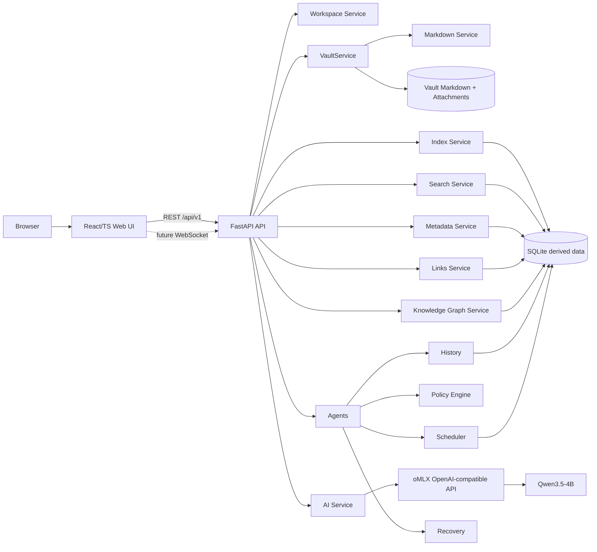

# LocalNote Server Phase 0 计划

> **阶段：** Phase 0 — Repository Bootstrap & Architecture  
> **项目状态：** 从零开始  
> **计划性质：** 供开发 Agent 逐项执行的实施计划；本阶段只建立可运行骨架、架构契约、文档和测试，不提前实现 M1+ 功能。

## 1. 目标与成功标准

### 1.1 总目标

建立 LocalNote Server 的正式 Monorepo 和最小可验证运行闭环：

```text
Browser
  → React + TypeScript + Vite Web
  → REST (Phase 0) / WebSocket (架构预留)
  → FastAPI API
  → 独立 Health 与 AI Status
  → 配置、协议、文档、测试、开发脚本
```

Markdown 文件是长期唯一事实源；SQLite、FTS、Embedding、Knowledge Graph、缓存、索引、AI history 等只作为未来可删除重建的派生数据。Phase 0 只建立这个边界，不实现文件读写、索引、搜索、图谱或 AI 写操作。

### 1.2 可验收成功标准

完成定义必须全部满足：

1. 工作区具有正式 Monorepo 目录和根文件，目录职责与本文及架构文档一致。
2. `pnpm install`（Node/pnpm 版本满足约束）和 Python 依赖安装可以在干净环境完成；如果工具缺失，脚本给出可读错误并退出，不静默使用错误工具。
3. `python -m pytest` 运行后端测试通过，至少覆盖：
   - `/api/v1/health` 返回 HTTP 200、`{"status":"ok"}`；
   - AI 未配置（`not_configured`）；
   - oMLX 不可达/超时（`offline`）；
   - oMLX 返回模型列表并发现 Qwen3.5-4B（`connected`，含模型 ID 和能力）。
4. `pnpm test` 或等价命令可执行，至少有前端首页冒烟测试；不得依赖真实 oMLX 或真实用户 Vault。
5. `uvicorn` 可启动 FastAPI；默认绑定 `127.0.0.1:3780`；健康路由不调用 AI，AI 故障不阻塞服务启动。
6. `pnpm dev`（或文档明确的前端命令）可启动 Vite，默认使用 `127.0.0.1:5173`；Vite proxy 将 `/api` 转发到 `http://127.0.0.1:3780`。
7. `./scripts/dev.sh` 检查依赖、启动前后端、转发 SIGINT/SIGTERM、优雅清理子进程、报告端口冲突；不能启动第二个服务替代现有服务。
8. 首页通过 API 读取并显示：
   - `LocalNote Server`
   - `Server: Connected`
   - `Vault: Not configured`
   - `AI: Qwen3.5-4B / Offline / Not configured`
9. `GET /api/v1/ai/status` 在合法/非法/超时响应下安全降级，不因缺少 chat 以外 optional capability 而整体不可用。
10. 删除未来的 `.localnote/` 不影响 Markdown、附件、正文（本阶段仅在文档/契约中明确，不创建或写入真实 Vault）。
11. Phase 0 不包含 Vault 文件读写、Watcher、Editor、Preview、Tabs、Split Pane、Search、Graph、Agent、Scheduler 执行、AI 写操作、事务、Undo、真实 SQLite/FTS/Embedding、远程服务或外部云 AI。

## 2. 范围边界

### 2.1 本阶段包含

- 根级工程、版本约束、包管理和最小 CI/本地检查建议。
- `apps/web` React + TypeScript + Vite 首页。
- `server/api` FastAPI 最小 API、配置和错误处理。
- AI status 只读探测：oMLX `/v1/models` 动态发现模型及能力。
- Python/TypeScript 协议契约的最小实现/类型声明。
- 目录骨架、架构文档、Vault 兼容性规范、AI 架构、M0-M8 路线图。
- 后端和前端测试框架、测试 fixture。
- `scripts/dev.sh` 及必要的开发辅助脚本。

### 2.2 明确不做

- 不访问、扫描或修改用户 Vault；不创建真实 `.localnote/`。
- 不实现 Markdown parser、文件保存、原子写、Watcher、路径解析实现；只记录未来契约和边界。
- 不实现编辑器、预览、Tabs、Split Pane、Workspace UI。
- 不实现 Search/FTS、Metadata/Properties 索引、Links 解析、Graph 存储或渲染。
- 不实现 AI chat/completion、embedding、rerank、Agent loop、AI 写入、Policy 执行、Scheduler 任务执行、History/Recovery 事务。
- 不引入 PostgreSQL、Redis、RabbitMQ、Kafka、Celery、Qdrant、Docker、Kubernetes、NAS、云同步、远程数据库、Electron、多人协同、Obsidian Plugin API、外部云 AI。
- 不硬编码某个完整 Qwen 模型 ID；只实现可配置的匹配规则。

## 3. 总体架构与职责边界

### 3.1 长期逻辑架构



### 3.2 各模块职责、依赖和故障隔离

| 模块 | 职责 | 允许依赖 | 故障隔离 |
|---|---|---|---|
| Frontend | 展示状态、未来编辑和工作区交互；只能调用 API | `packages/protocol`、UI/Editor/Markdown/Workspace/Graph 包 | API 不可用显示连接错误；不直接访问文件系统或 LLM |
| Backend/API | HTTP 生命周期、路由、依赖注入、错误映射 | 配置、AI status service；未来调用各领域服务 | API 启动不依赖 AI、Vault 或数据库；健康路由独立 |
| VaultService | 未来所有 Vault 根目录、相对路径、安全访问的唯一入口 | 配置、Markdown service | 路径越界/symlink 错误只能拒绝；不可绕过服务访问 FS |
| Markdown | 未来解析/序列化，未知语法原样保留 | VaultService | 解析失败不能覆盖原文；原文事实源 |
| Index | 未来建立可重建索引 | VaultService/Markdown、SQLite | 索引损坏可删除重建，不影响正文 |
| Search | 未来 FTS/关键词/语义查询 | Index、SQLite、可选 Embedding | 索引不可用时核心编辑仍可用 |
| Metadata | 未来 frontmatter/Properties 读取和派生 | Markdown、Index | 未知字段保留；索引故障不损坏正文 |
| Links | 未来双链/反向链接解析 | Markdown、Index | 单篇解析失败隔离为诊断，不中断全库 |
| Knowledge Graph | 未来从 links/metadata 派生图 | Links、Metadata、SQLite | 图库可删除重建；不反写正文 |
| AI Service | 配置和能力发现、未来受控推理适配 | httpx、Pydantic schemas、adapters | oMLX offline 不影响 API；能力按 chat/embedding/rerank 拆分 |
| Qwen3.5-4B | 本地模型，默认由 oMLX 暴露 | 仅通过 OpenAI-compatible HTTP | 模型加载失败仅影响 AI 状态/AI 功能 |
| Agents | 未来有限、可审计的任务编排 | AI、Policy、History、Recovery、Tools | 不允许无限自主循环；每次有预算/超时/审批 |
| Policies | 未来动作白名单、Schema、diff/风险规则 | protocol、History | 未通过策略的写操作拒绝 |
| Scheduler | 未来本地定时维护任务 | Policies、History、Recovery | scheduler 停止不影响手动核心功能 |
| History | 未来 AI/任务事件记录 | SQLite（派生） | 记录失败不应覆盖正文；敏感内容按策略处理 |
| Recovery | 未来备份/回滚/崩溃恢复编排 | History、Vault、Policies | 恢复必须显式、可审计，不能默默重写 |

### 3.3 Phase 0 数据流

1. 浏览器请求 `GET /api/v1/health`；API 直接返回固定健康响应，不创建 AI client。
2. 浏览器请求 `GET /api/v1/ai/status`；API 从 Settings 取得 oMLX base URL、超时和匹配规则。
3. AI status service 校验 URL/配置；未配置则返回 `not_configured`，不发请求。
4. 已配置时，httpx 异步客户端请求 `<base_url>/models`（默认完整地址为 `http://127.0.0.1:8000/v1/models`），限制连接/读取超时。
5. 解析 OpenAI 风格 `{ "data": [{"id": "..."}] }`；非法响应、HTTP 错误、超时归类为 `offline` 或安全错误信息，不泄漏堆栈/密钥。
6. 根据模型 ID 匹配策略标记 Qwen3.5-4B；返回发现的模型和按模型/服务可推断的 capability。chat 是核心；embedding/rerank 缺失只标 optional unavailable。
7. Web 首页并行/依次读取 health 和 AI status，显示明确降级状态；Vault 通过当前配置是否存在显示 `Not configured`，不得探测真实路径。

## 4. 开放决策与技术选择

### 4.1 Node、workspace 和包管理

**选择：pnpm workspaces，Node.js 22 LTS，pnpm 9.x（建议 `packageManager: pnpm@9.15.0`，实际以开发时最新团队锁定补丁版本为准）。**

理由：pnpm 的 workspace 协议、严格依赖隔离、速度和磁盘效率适合 `apps/*` 与 `packages/*`；Node 22 LTS 提供稳定的 Vite/Vitest 运行环境。npm workspaces 可作为替代，但 lockfile/执行命令和 workspace 依赖解析应保持一致，不能混用。

验收影响：根目录 `package.json` 声明 `engines.node >=22 <23`、`packageManager`；提交 `pnpm-lock.yaml`；开发者运行 `corepack enable` 后使用 pnpm。无 pnpm 时 `dev.sh` 必须报错并提示安装/启用 Corepack，不自动执行 npm。

`packages/*` 的 Phase 0 方案：创建**最小可识别 package 骨架**（各自 `package.json`、`README.md`、入口类型/占位导出，必要时 `tsconfig` 继承根配置），不发布、不实现业务逻辑；仅 `protocol` 放可复用的最小 DTO 类型，其他包明确“延后实现”。若空包会造成安装复杂度，应保留 `package.json` + README + `.gitkeep`，避免虚假 API。

### 4.2 Python 依赖管理

**选择：uv + 项目级 `pyproject.toml`，并兼容标准 venv。**

理由：uv 可快速解析和锁定 Python 3.12+ 依赖，单一 `pyproject.toml` 便于开发和 CI；不引入 Poetry。`uv.lock` 应提交，保证可重复安装。替代方案是 `venv + pip`，可作为没有 uv 时的手动开发路径，但不作为默认脚本路径。

依赖分层：

- runtime：`fastapi`、`uvicorn[standard]`、`pydantic>=2`、`pydantic-settings>=2`、`httpx`。
- dev：`pytest`、`pytest-asyncio`、`httpx` 测试支持、必要的 lint/type 工具（如项目选定 Ruff/pyright，可在实现阶段固定版本）。
- Phase 0 不安装 SQLite ORM、LLM SDK、向量库或文件监听库。

`dev.sh` 行为：

1. 检查 `python3` 版本 >=3.12、Node >=22、`pnpm`；缺失则打印安装/启用提示并返回非零。
2. 若存在 `uv`，执行可重复的 `uv sync --dev`（仅在显式允许安装依赖时）；若不存在，默认不联网安装，提示执行 `python3 -m venv .venv && .venv/bin/pip install -e '.[dev]'` 后退出。
3. 依赖已存在时不重复安装；提供 `LOCALNOTE_SKIP_INSTALL=1` 跳过检查安装。
4. 不因 Vault、oMLX 或 AI 配置缺失退出。

### 4.3 端口、代理、CORS 和启动命令

- 后端默认：`127.0.0.1:3780`。
- 前端默认：`127.0.0.1:5173`。
- Vite proxy：`/api` → `http://127.0.0.1:3780`，开发时避免浏览器 CORS；proxy target 由 `VITE_API_PROXY_TARGET` 覆盖。
- 后端 CORS：默认允许 `http://127.0.0.1:5173` 和 `http://localhost:5173`，可由逗号分隔的 `LOCALNOTE_CORS_ORIGINS` 覆盖；不得默认 `*` 配合 credentials。
- 后端命令：`uv run uvicorn server.api.main:app --host ${LOCALNOTE_HOST:-127.0.0.1} --port ${LOCALNOTE_PORT:-3780} --reload`（开发模式）；生产/检查模式关闭 reload。
- 前端命令：`pnpm --filter @localnote/web dev --host 127.0.0.1 --port 5173`。
- `./scripts/dev.sh`：启动后端和前端，记录 PID，捕获 SIGINT/SIGTERM，先终止进程组、等待子进程退出，必要时超时后清理；启动前检查端口可绑定并在冲突时报告占用端口和可覆盖变量。
- 局域网访问不默认开启：用户必须显式设置 `LOCALNOTE_HOST=0.0.0.0`，并同步配置 CORS/防火墙；计划和 README 要警告暴露风险。

### 4.4 配置模型

**选择：pydantic-settings。**

建议结构：

```python
class ServerSettings(BaseModel):
    host: str = "127.0.0.1"
    port: int = 3780
    cors_origins: list[str] = ["http://127.0.0.1:5173", "http://localhost:5173"]

class VaultSettings(BaseModel):
    root: Path | None = None

class AISettings(BaseModel):
    base_url: AnyHttpUrl | None = "http://127.0.0.1:8000/v1"
    request_timeout_seconds: float = 2.0
    connect_timeout_seconds: float = 0.5
    qwen_match_pattern: str = "qwen3\\.?5[-_ ]?4b"

class SchedulerSettings(BaseModel):
    enabled: bool = False

class Settings(BaseSettings):
    server: ServerSettings = ServerSettings()
    vault: VaultSettings = VaultSettings()
    ai: AISettings = AISettings()
    scheduler: SchedulerSettings = SchedulerSettings()
    model_config = SettingsConfigDict(env_prefix="LOCALNOTE_", env_nested_delimiter="__", extra="ignore")
```

实现时可将 URL 保留为字符串再经 Pydantic URL 类型验证，以便安全地拼接 `/models`。环境变量规则：

- `LOCALNOTE_SERVER__HOST`、`LOCALNOTE_SERVER__PORT`、`LOCALNOTE_VAULT__ROOT`、`LOCALNOTE_AI__BASE_URL`、`LOCALNOTE_AI__REQUEST_TIMEOUT_SECONDS`、`LOCALNOTE_AI__CONNECT_TIMEOUT_SECONDS`、`LOCALNOTE_SCHEDULER__ENABLED`。
- 为方便 shell 使用，可额外支持明确文档化的扁平别名（如 `LOCALNOTE_HOST`、`LOCALNOTE_PORT`、`LOCALNOTE_OMLX_BASE_URL`），但冲突时嵌套变量优先。
- 缺失 Vault root 只表示未配置，不影响启动。
- AI URL 为 `None` 才是 `not_configured`；默认 URL 表示尝试本地 oMLX，若不可达返回 `offline`。
- Settings 初始化失败只针对非法用户配置返回清晰 500/启动错误；不能因文件不存在、oMLX 离线、scheduler 未启用而失败。

Phase 0 只表达 server/vault/ai/scheduler；未来再加入 index/search/graph/history/recovery 等配置，不提前制造假运行时。

### 4.5 AI status API 与匹配策略

#### 状态枚举

```text
not_configured  # AI endpoint 显式未配置
offline         # 已配置但不可达、超时、HTTP 错误或响应非法
connected       # endpoint 可达且响应合法，至少发现服务/模型信息
```

`connected` 不要求 Qwen 已加载；若 endpoint 可达但没有匹配 Qwen，仍返回 connected，并以 `qwen_model: null` 和诊断信息表达“未发现目标模型”。UI 可显示通用连接或 `Qwen3.5-4B / Not detected`。用户要求的默认无配置/离线文本必须可表达。

#### Pydantic response schema

```python
class AIStatus(str, Enum):
    NOT_CONFIGURED = "not_configured"
    OFFLINE = "offline"
    CONNECTED = "connected"

class AICapabilities(BaseModel):
    chat: bool = False
    embedding: bool = False
    rerank: bool = False

class DiscoveredModel(BaseModel):
    id: str
    owned_by: str | None = None
    capabilities: AICapabilities = Field(default_factory=AICapabilities)

class AIStatusResponse(BaseModel):
    status: AIStatus
    provider: Literal["omlx"] = "omlx"
    endpoint: str | None = None       # 可返回规范化地址，不返回凭据/query secret
    qwen_model: str | None = None
    models: list[DiscoveredModel] = Field(default_factory=list)
    capabilities: AICapabilities = Field(default_factory=AICapabilities)
    error_code: Literal[
        "not_configured", "connection_refused", "timeout", "http_error",
        "invalid_response", "no_matching_model", "unknown"
    ] | None = None
    message: str | None = None
    checked_at: datetime | None = None
```

对于 `connected` 服务，`chat` 是核心能力：若发现目标 Qwen，至少将 `chat=true`；对于模型列表中带有显式能力元数据则按安全白名单读取，否则 chat 默认由可用模型/服务推断，embedding/rerank 默认为 false。缺失 optional capability 不把 status 改成 offline。若服务可达但无法确认 chat，保持 connected，`chat=false` 并给出诊断，不虚构能力。

#### Qwen3.5-4B 匹配

- 对模型 ID 做 Unicode 安全的大小写折叠（`casefold()`），将连续空格、`_`、`-`、`.` 视为可比的分隔符。
- 接受 `qwen3.5-4b`、`Qwen3.5-4B-Instruct`、`qwen-3.5-4b` 等版本/量化/后缀；定义规则为必须包含 qwen + 3.5（允许 `qwen35` 的兼容形式）+ `4b`，后缀可为 `-instruct`、量化标签、供应商后缀。
- 不接受只有 `qwen`、`qwen2.5`、`qwen3.5-8b` 等近似名称。
- 匹配规则通过配置/纯函数测试覆盖；不硬编码具体完整模型 ID。

#### 错误、超时和安全

- httpx 使用显式 connect/read/overall timeout，默认连接 0.5 秒、总请求 2 秒。
- 限制响应体大小；只解析 JSON object 和 `data` list 中合法字符串 id。
- 处理 DNS/连接拒绝、超时、非 2xx、JSON 解码失败、schema 不符，映射为上述 error code。
- 不重试或最多一次短重试（建议 Phase 0 不重试，确保 status 快速）；不阻塞 startup。
- response 中不返回 Authorization、Cookie、环境变量、完整异常堆栈；日志仅记录 endpoint host、错误分类和耗时。
- `GET /api/v1/ai/status` 每次按请求探测；缓存/后台 watcher 延后 M1+，避免 Phase 0 引入复杂状态。

示例：

```json
{
  "status": "connected",
  "provider": "omlx",
  "endpoint": "http://127.0.0.1:8000/v1",
  "qwen_model": "Qwen3.5-4B-Instruct-4bit",
  "models": [
    {
      "id": "Qwen3.5-4B-Instruct-4bit",
      "owned_by": "omlx",
      "capabilities": {"chat": true, "embedding": false, "rerank": false}
    }
  ],
  "capabilities": {"chat": true, "embedding": false, "rerank": false},
  "error_code": null,
  "message": null
}
```

### 4.6 HTTP client 抽象与 mock

抽象位置：`server/ai/adapters/omlx_client.py`，由 `server/ai/status.py`（或 `service.py`）依赖一个小型 `ModelDiscoveryClient` Protocol，而不是让路由直接调用 httpx。`httpx.AsyncClient` 只存在于 adapter；客户端通过构造注入 `base_url`, `timeout`, transport/client factory。

测试使用 `httpx.MockTransport` 或注入 fake client，严禁真实 oMLX 网络调用。API 测试通过 FastAPI dependency override 替换 AI service/client，分别返回 not configured、TimeoutException、非法响应、模型列表 fixture。

### 4.7 后端占位目录和避免假实现

可创建 `__init__.py` 的 Python package：`server`、`server/api`、`server/ai`、`server/ai/adapters`、`server/ai/prompts`、`server/ai/schemas`、`server/ai/profiles`，以及未来领域包（`vault`、`markdown`、`index`、`search`、`metadata`、`links`、`graph`、`workspace`、`agents`、`policies`、`scheduler`、`history`、`recovery`）如测试/导入需要。空目录可用 `.gitkeep`，但不要生成假的 service class 或返回“成功”的实现。

每个未来后端目录 README 应标注：`Phase 0 placeholder — no runtime behavior`、允许依赖和 M1 入口。只有 API、config、AI discovery 为真实逻辑；其他目录不得声称支持文件、SQLite、graph 或 agent。

### 4.8 测试框架、fixtures、锁文件和 CI

- Backend：pytest + pytest-asyncio + FastAPI TestClient/AsyncClient；测试在 `tests/backend/`，共享 fixture 在 `tests/fixtures/`。
- Frontend：Vitest + React Testing Library + jsdom；至少测试首页初始 loading/成功状态，并 mock `fetch` 返回 health/AI status。若实现 Agent 认为 RTL 引入过重，至少保留可执行 Vitest DOM 冒烟，不得只放未执行脚本。
- `tests/e2e/` Phase 0 只预留 README/fixture 说明，不启动真实 Vault；可选 Playwright 依赖不得阻塞默认测试。
- `tests/agent/` 只写未来测试边界说明，不实现 agent。
- `tests/backend`、`tests/frontend`、`tests/e2e`、`tests/agent` 目录可按独立 config 组织，但默认命令必须可发现并执行当前测试。
- 锁文件：提交 `pnpm-lock.yaml` 和 `uv.lock`；不要手写或提交临时 venv/node_modules。
- CI 建议：Node 22 + Python 3.12 矩阵；运行 lockfile frozen install、Python tests、TS typecheck、frontend test、脚本静态检查；Phase 0 可先提供 workflow 计划/文件，不引入云运行时依赖。

### 4.9 文档章节结构和路线

`README.md`：项目定位、原则、Phase 0 能力、快速开始、命令、端口、环境变量、AI 可选性、目录概览、测试、局域网安全警告、路线图、贡献/许可证占位。

`docs/architecture.md`：目标架构图、模块职责/依赖、请求和数据流、故障隔离、Markdown-first/派生数据原则、边界约束、Phase 0 与 M1+ 分界。

`docs/vault-spec.md`：Vault 根目录和相对路径规则、Obsidian 兼容要求、未知语法保留、`.localnote/` 派生目录约定、symlink/path traversal 规则、未来原子保存/恢复原则；强调 Phase 0 不实现读写。

`docs/ai-architecture.md`：oMLX/OpenAI-compatible 假设、Qwen 匹配策略、status schema、能力模型、超时/错误、安全、Small Model + Strong Tools/Schema/Rules、未来受控 Agent 边界；强调本阶段无写操作。

`docs/development-roadmap.md`：M0-M8 入口、每阶段目标和依赖、验收门槛、不可提前实现列表。建议路线：

- M0：Bootstrap（本 Phase 0）。
- M1：Vault 安全读写、Markdown 保真、Watcher 基础。
- M2：Workspace/Editor/Preview/Tabs/Split Pane。
- M3：Metadata/Properties/Links/关键词搜索。
- M4：SQLite FTS、索引重建、性能优化。
- M5：Graph 派生和可视化。
- M6：AI chat/embedding/rerank（均可选）与结构化协议。
- M7：Policy、Diff、History、Recovery、受控 Agent。
- M8：Scheduler、性能/可靠性强化和局域网部署选项。

架构图优先 Mermaid，避免引入图像生成工具。

## 5. 目录树与关键文件

开发 Agent 应创建或修改如下文件；若技术工具生成额外锁文件，只允许是包管理锁文件：

```text
.
├── README.md
├── PLAN.md                         # 本计划；开发阶段只读，不重写
├── package.json                    # pnpm workspace scripts/engines
├── pnpm-workspace.yaml
├── pnpm-lock.yaml
├── tsconfig.json
├── vite.config.ts                  # 或 apps/web/vite.config.ts，保持唯一入口
├── pyproject.toml
├── uv.lock
├── .gitignore
├── .python-version                 # 3.12
├── apps/
│   └── web/
│       ├── package.json
│       ├── index.html
│       ├── src/
│       │   ├── main.tsx
│       │   ├── App.tsx
│       │   ├── api/client.ts
│       │   ├── api/types.ts
│       │   ├── components/StatusCard.tsx
│       │   ├── styles.css
│       │   └── test/setup.ts
│       └── vite.config.ts           # 若根配置不统一
├── packages/
│   ├── ui/README.md
│   ├── editor/README.md
│   ├── markdown/README.md
│   ├── workspace/README.md
│   ├── graph/README.md
│   └── protocol/
│       ├── package.json
│       ├── README.md
│       └── src/index.ts             # 最小 API DTO 类型
├── server/
│   ├── __init__.py
│   ├── api/
│   │   ├── __init__.py
│   │   ├── main.py                  # FastAPI app、middleware、路由注册
│   │   ├── dependencies.py
│   │   └── routes/
│   │       ├── __init__.py
│   │       ├── health.py
│   │       └── ai.py
│   ├── config.py                    # pydantic-settings
│   ├── ai/
│   │   ├── __init__.py
│   │   ├── service.py
│   │   ├── schemas.py
│   │   ├── matching.py
│   │   ├── adapters/__init__.py
│   │   ├── adapters/omlx_client.py
│   │   ├── prompts/README.md
│   │   └── profiles/README.md
│   ├── vault/README.md
│   ├── markdown/README.md
│   ├── index/README.md
│   ├── search/README.md
│   ├── metadata/README.md
│   ├── links/README.md
│   ├── graph/README.md
│   ├── workspace/README.md
│   ├── agents/README.md
│   ├── policies/README.md
│   ├── scheduler/README.md
│   ├── history/README.md
│   └── recovery/README.md
├── tests/
│   ├── fixtures/
│   │   ├── ai_models_connected.json
│   │   └── README.md
│   ├── backend/
│   │   ├── conftest.py
│   │   ├── test_health.py
│   │   ├── test_ai_status.py
│   │   └── test_ai_matching.py
│   ├── frontend/
│   │   ├── setup.ts
│   │   └── App.test.tsx
│   ├── agent/README.md
│   └── e2e/README.md
├── scripts/
│   ├── dev.sh
│   └── check.sh                   # 可选：不做实现外的运行时逻辑
└── docs/
    ├── architecture.md
    ├── vault-spec.md
    ├── ai-architecture.md
    └── development-roadmap.md
```

关键文件约束：

- `server/api/main.py` 只能注册 health/ai status 和通用错误/CORS；不能包含 Vault/LLM 业务实现。
- `server/api/routes/health.py` 固定输出 `{ "status": "ok" }`。
- `server/ai/schemas.py` 是 Python 公共契约源；前端 `apps/web/src/api/types.ts` 应保持字段兼容。
- `server/ai/adapters/omlx_client.py` 封装唯一 HTTP 调用位置。
- `apps/web/src/App.tsx` 只做首页状态编排，不能直接导入 Python/文件系统。
- `packages/protocol` 只放协议类型，不把前端组件或后端运行时混入其中。
- `PLAN.md` 由计划阶段创建，开发 Agent 不得篡改计划正文；偏差应写在开发报告而非擅自重写。

## 6. 公共 API、配置和命令契约

### 6.1 Health

```http
GET /api/v1/health
```

响应：

```http
HTTP/1.1 200 OK
Content-Type: application/json

{"status":"ok"}
```

不检查 Vault、不检查 AI、不访问 SQLite。

### 6.2 AI status

```http
GET /api/v1/ai/status
```

可能响应：

```json
{
  "status": "not_configured",
  "provider": "omlx",
  "endpoint": null,
  "qwen_model": null,
  "models": [],
  "capabilities": {"chat": false, "embedding": false, "rerank": false},
  "error_code": "not_configured",
  "message": "AI endpoint is not configured"
}
```

```json
{
  "status": "offline",
  "provider": "omlx",
  "endpoint": "http://127.0.0.1:8000/v1",
  "qwen_model": null,
  "models": [],
  "capabilities": {"chat": false, "embedding": false, "rerank": false},
  "error_code": "timeout",
  "message": "oMLX endpoint did not respond before timeout"
}
```

HTTP status建议：status 探测本身是可报告的业务状态，`not_configured`、`offline`、`connected` 均返回 HTTP 200；只有 API 内部不可恢复错误才用 5xx，并使用安全错误体。这样前端无需将“离线”误认为 API 崩溃。

### 6.3 前端显示映射

- health 成功：`Server: Connected`；请求失败：`Server: Disconnected`。
- Vault root 为空：`Vault: Not configured`；Phase 0 不尝试读路径。
- AI `not_configured`：`AI: Qwen3.5-4B / Not configured`。
- AI `offline`：`AI: Qwen3.5-4B / Offline`。
- AI `connected` + `qwen_model`：`AI: Qwen3.5-4B / Connected`（可附发现 ID）。
- AI connected 但无 Qwen：`AI: Qwen3.5-4B / Not detected`，保留服务 connected 信息。

### 6.4 开发脚本接口

```bash
./scripts/dev.sh
LOCALNOTE_PORT=3790 VITE_PORT=5174 ./scripts/dev.sh
LOCALNOTE_HOST=0.0.0.0 ./scripts/dev.sh  # 显式局域网场景，文档警告
LOCALNOTE_SKIP_INSTALL=1 ./scripts/dev.sh
```

实现时统一环境变量名（前端可用 `VITE_PORT`、`VITE_API_PROXY_TARGET`；后端使用 `LOCALNOTE_*`），脚本传递环境而不硬编码用户机器路径。

## 7. 有序实施任务清单

### 阶段 A：根目录与契约（先做）

1. 确认空工作区和 Python/Node 版本假设；创建 `.gitignore`、`.python-version`、根 `package.json`、`pnpm-workspace.yaml`、`tsconfig.json`、`pyproject.toml`。
   - 依赖：无。
   - 产出：可解析的 workspace 和 Python 项目元数据。
   - 完成定义：包管理/项目配置通过解析，版本约束明确。
2. 创建 `packages/*` 与后端占位目录 README/`__init__.py`，创建 `packages/protocol` 最小类型骨架。
   - 依赖：任务 1。
   - 产出：正式目录树，无虚假运行时。
   - 完成定义：每个占位目录标注 Phase 0 不提供行为。
3. 定义 Python AI schemas、matching 纯函数和前端等价 types（可先写契约，再实现服务）。
   - 依赖：任务 1。
   - 产出：状态枚举、能力、模型、错误字段契约。
   - 完成定义：示例 JSON 可通过 Pydantic 及 TypeScript 类型检查。

### 阶段 B：后端/API/AI

4. 实现配置模型和安全默认值。
   - 依赖：A1。
   - 产出：server/vault/ai/scheduler 配置、嵌套环境变量覆盖。
   - 完成定义：无 Vault/oMLX 时 app 可构造；非法配置有清晰错误。
5. 实现 OMLX `ModelDiscoveryClient` adapter 和可注入 service。
   - 依赖：A3、B4。
   - 产出：httpx 请求、超时、响应解析、错误分类、匹配。
   - 完成定义：不访问真实 oMLX 的单元测试覆盖所有分支。
6. 实现 FastAPI app、health、ai/status、CORS、统一安全错误处理。
   - 依赖：B4、B5。
   - 产出：最小可运行 API。
   - 完成定义：启动命令有效；health 独立；AI status 返回契约。
7. 运行后端格式/类型/pytest 检查，修复仅限 Phase 0 范围的问题。
   - 依赖：B6。
   - 产出：测试结果。
   - 完成定义：后端测试全绿，覆盖 not_configured/offline/connected+discovery。

### 阶段 C：前端

8. 创建 `apps/web` React + TypeScript + Vite 配置、入口和最小样式。
   - 依赖：A1。
   - 产出：首页骨架。
   - 完成定义：Vite dev/build 可运行。
9. 实现 API client、首页状态卡和 loading/error/degraded 状态。
   - 依赖：B6、C8。
   - 产出：显示四项要求文本并读取 API。
   - 完成定义：mock fetch 下前端冒烟测试通过；不访问 FS。
10. 配置 Vitest/RTL（或等价最小 DOM 测试），并运行 build/typecheck/test。
    - 依赖：C9。
    - 产出：可执行前端测试。
    - 完成定义：默认命令可运行，不依赖真实后端/AI。

### 阶段 D：脚本、文档、测试与验收

11. 实现 `scripts/dev.sh` 依赖检查、端口检查、子进程生命周期和可配置端口。
    - 依赖：B6、C8。
    - 产出：一条命令启动前后端。
    - 完成定义：正常启动、Ctrl-C 清理、端口冲突和缺依赖均有可读行为。
12. 写 README 和四份架构/规范/路线文档。
    - 依赖：A-C 的实际结果；架构内容可并行先写，最终校对。
    - 产出：文档集，Mermaid 图和明确边界。
    - 完成定义：新开发者无需重新设计即可按 README 启动和测试。
13. 创建 fixtures、后端/前端测试和检查脚本；执行完整验收矩阵。
    - 依赖：B7、C10、D11、D12。
    - 产出：锁文件、测试结果、偏差记录。
    - 完成定义：所有本计划第 9 节命令和场景可复现。
14. 形成开发报告：完成任务、变更文件、命令输出、与计划偏差；不得实施 M1+。
    - 依赖：D13。
    - 产出：供审计 Agent 使用的交付摘要。

## 8. 测试矩阵与验收步骤

### 8.1 后端测试矩阵

| 测试 | 输入/模拟 | 预期 |
|---|---|---|
| health happy path | TestClient，不注入 AI | 200，精确 JSON `{"status":"ok"}` |
| health AI isolation | AI client 抛异常/不可用 | health 仍 200 |
| AI not configured | `AI.base_url=None` | 200，status `not_configured`，不发 HTTP |
| AI connection refused | MockTransport/ConnectError | 200，status `offline`，error `connection_refused` |
| AI timeout | 抛 `httpx.TimeoutException` | 200，status `offline`，error `timeout` |
| AI HTTP error | 500/401 等 | 200，status `offline`，不泄漏响应敏感内容 |
| AI invalid JSON/schema | 非 JSON、缺 data、非法 id | 200，status `offline`，error `invalid_response` |
| AI connected | fixture 含模型列表 | 200，status `connected`，models 数量和 IDs 正确 |
| Qwen matching | 多种大小写/分隔符/版本后缀 | 正确匹配 3.5-4B，不匹配 2.5/8B |
| optional capability | 无 embedding/rerank | chat 状态可用，optional 为 false，不整体 offline |
| config defaults | 空环境变量 | 127.0.0.1:3780、默认 oMLX URL、Vault None |
| config overrides | 嵌套环境变量 | 覆盖 server/ai/vault/scheduler |

### 8.2 前端测试矩阵

| 测试 | mock | 预期 |
|---|---|---|
| 首页成功 | health ok + AI not_configured | 四项标题/状态文本出现 |
| AI offline | AI status offline | 显示 Offline，不把 server 标为 disconnected |
| AI connected | connected + qwen id | 显示 Connected/发现信息 |
| backend down | health fetch reject | 显示 Server Disconnected，页面不崩溃 |
| no Vault | 配置状态默认为 null | `Vault: Not configured` |

### 8.3 实际验收命令

开发 Agent 应在工作区执行并记录结果（命令按最终配置微调，但不得删除必需覆盖）：

```bash
python3 --version                         # >= 3.12
node --version                            # >= 22 < 23
pnpm --version                            # 9.x
uv --version                              # 若可用
pnpm install --frozen-lockfile
uv sync --dev
python -m pytest -q
pnpm --filter @localnote/web typecheck
pnpm --filter @localnote/web test -- --run
pnpm --filter @localnote/web build
python -m uvicorn server.api.main:app --host 127.0.0.1 --port 3780
curl -fsS http://127.0.0.1:3780/api/v1/health
curl -fsS http://127.0.0.1:3780/api/v1/ai/status
./scripts/dev.sh
```

预期 health 输出：

```json
{"status":"ok"}
```

启动服务期间检查：

- 未配置 Vault 不报错。
- oMLX 未运行时 API 仍启动，AI status 返回 `offline`。
- Ctrl-C 后前后端子进程均退出，没有孤儿进程。
- 端口占用时脚本非零退出并指出端口/覆盖变量。
- 前端默认 `http://127.0.0.1:5173` 可打开首页，并通过 proxy 调用 API。

### 8.4 范围审计

执行以下检查并记录为“未实现”：

- 搜索新增代码不得出现真实 Vault 遍历、文件写入、Watcher、SQLite schema、FTS 查询、Editor/Preview、Graph query、Agent loop、Scheduler loop、AI chat completion 或写操作。
- 不产生 Docker/Kubernetes/云连接/远程数据库配置。
- 测试 fixture 不指向用户真实 Vault；所有 AI HTTP 都是 mock。

## 9. 安全、可观测性和错误处理

### 9.1 安全原则

- 所有未来文件路径必须由 VaultService resolve 后验证位于 Vault root；拒绝 `../`、绝对路径注入和 symlink escape。Phase 0 只写规范，不实现访问。
- Frontend 和 LLM 永远不能直接访问 filesystem；所有未来写操作必须经过 API → VaultService。
- 不打印 API key、Authorization、Cookie、绝对 Vault 私密路径或完整请求体。
- 默认 loopback；局域网绑定必须显式设置并在 README 告警。
- oMLX 默认是本机 HTTP，不引入远程 AI；未来如支持自定义 URL，必须明确其属于用户主动配置并限制日志泄漏。
- 未知 Markdown/Obsidian 语法未来必须原样保留；任何转换先 diff/备份，不能在 Phase 0 假装实现。

### 9.2 日志与可观测性

Phase 0 使用 Python `logging` 标准库，结构化、单行、无秘密；至少记录 request method/path/status/duration 和 AI status 的错误分类，不记录全文 prompt/response。健康路由日志可简化。未来扩展点：request ID、OpenTelemetry（不在 Phase 0 引入）、指标和审计事件。

### 9.3 错误处理

- 业务可降级状态用 200 + 明确 schema（AI offline）；API 内部故障使用安全 5xx。
- Pydantic 输入/环境配置错误给出字段级错误，不把 Python traceback 返回客户端。
- 前端对网络失败、未知 status、部分字段缺失采用保守 fallback，不能白屏。
- AI status 探测是只读、有限时长、无启动依赖；AI 失败不影响 health、首页基础显示或未来编辑核心路径。

## 10. 依赖、风险与降级策略

| 风险/依赖 | 影响 | 处理 |
|---|---|---|
| Node/pnpm/uv 未安装 | 无法开发/启动 | `dev.sh` 明确检测并提示，非零退出；不偷偷切换包管理器 |
| Node 版本不符 | Vite/Vitest 不稳定 | engines + `.nvmrc`/文档约束 Node 22 |
| 依赖网络不可用 | 安装失败 | 提前提交 lock；报告依赖安装失败，不改用未审查依赖 |
| oMLX 未运行 | AI status offline | 不阻塞 FastAPI；mock 测试完全独立 |
| oMLX `/models` schema 变化 | 状态误判 | 严格安全解析，invalid_response，文档记录适配器边界 |
| Qwen ID 命名变化 | 未发现模型 | 可配置匹配规则和覆盖测试；不硬编码完整 ID |
| CORS 配置错误 | 浏览器请求失败 | Vite proxy + 显式默认 origins；文档化环境变量 |
| 端口被占用 | dev.sh 启动失败 | 预检、清晰提示、支持显式覆盖，不杀非本项目进程 |
| 前端/后端契约漂移 | 首页状态错误 | 共用协议类型/示例 JSON、API 测试、前端 mock 测试 |
| 未来误把 SQLite 当事实源 | 数据损坏风险 | 文档和目录 README 明确 derived-only；架构审计门槛 |
| symlink/path traversal | Vault 安全风险 | Phase 0 记录为 M1 阻断验收项，不实现伪安全访问 |
| 小模型输出不受控 | AI 风险 | Strong Schema/Policy/Diff/Undo 原则；Phase 0 不开放写操作 |

## 11. 明确假设、未决事项和 M1 入口

### 11.1 假设

1. 开发机器为 macOS Mac mini，Python 3.12+、Node 22 LTS 可用或可由用户安装。
2. oMLX 提供 OpenAI-compatible `GET /v1/models`；默认监听 `127.0.0.1:8000`。
3. OpenAI models 响应至少包含 `data` 数组和字符串 `id`；额外 capability 字段不保证存在。
4. Phase 0 没有现有 Vault 需要迁移；测试不得触碰用户 Vault。
5. API 与 Web 为同一本地项目，生产打包方式延后，不在本阶段配置静态部署服务器。
6. 前端状态刷新以首次加载为主，周期探测/WebSocket 延后；不引入复杂缓存。

### 11.2 未决事项（不阻塞 Phase 0，但必须记录）

- M1 的 Markdown parser 选型及如何最大限度保留未知 Obsidian 语法。
- VaultService 的原子写、symlink race 防护、文件锁和跨平台路径细节。
- `.localnote/` 的具体 schema、SQLite migration/versioning 和索引重建策略。
- FTS 中文分词与 10,000+ 笔记性能基准方案。
- Embedding/rerank provider 的本地模型和资源预算。
- Graph 数据模型（节点、边、标签、块级链接）及增量更新策略。
- WebSocket 事件协议、前端状态管理和大文档编辑器选型。
- Agent 工具白名单、Policy 风险等级、diff/undo 用户确认和恢复边界。
- CI 托管平台和是否允许缓存依赖；不影响本地验证。

### 11.3 M1 入口条件

只有 Phase 0 的目录、API、文档、测试、脚本和范围审计全部通过后，才能开始 M1。M1 必须先补充并审核详细计划，至少覆盖：

1. Vault root 配置和 resolve-after-validation；拒绝 traversal、绝对路径和 symlink escape。
2. Markdown 原文保真读写、未知语法保留、附件路径规则。
3. `.localnote/` 派生目录初始化、可删除重建、不成为正文备份唯一来源。
4. Watcher 事件去抖、外部变更冲突与索引更新策略。
5. 不引入 Graph/Search/Agent 等超出 M1 的功能。

## 12. 开发 Agent 交付格式

开发完成后必须返回：

1. 按本计划编号列出的完成/未完成任务。
2. 关键新增/修改文件及用途。
3. 实际运行的安装、测试、构建、启动命令和结果。
4. health 与 ai/status 的示例实测响应。
5. 与本计划的任何偏差、偏差原因和风险。
6. 明确确认未实现 M1+ 禁止项。

若计划与工程现实冲突，开发 Agent 不得静默改设计：先记录偏差及理由；只有不改变本阶段目标和安全边界的最小调整才可实施，并在交付报告中列出。