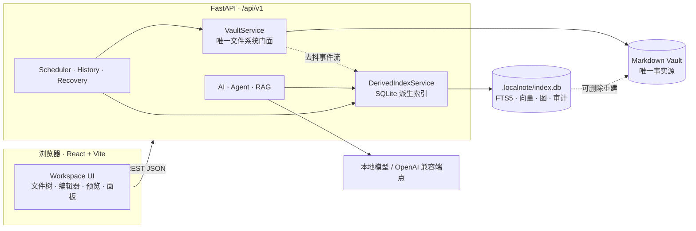

# LocalNote

> **本地优先的 Markdown 笔记工作台 —— 文件即数据，服务只是门面。**

[](./CHANGELOG.md)
[](https://www.python.org/)
[](https://nodejs.org/)
[](#测试与门禁)
[](#许可)

LocalNote（仓库名 **LocalBook**）是一套**跑在你自己机器上**的 Markdown 笔记服务：
一个 FastAPI 后端 + 一个 React/Vite 前端，直接读写你本地磁盘上的 Markdown 目录
（Vault）。它可以指向一个**已经存在的** Obsidian 库或任何 Markdown 文件夹——
目录结构就是层级、`.md` 文件就是数据，不需要导入、导出或迁移。

它不做账号、不做云端、不做遥测，也不把笔记塞进私有数据库。SQLite、全文索引、
向量库、知识图谱、AI 历史全都只是**可以随时删掉重建的派生数据**，随时
`rm -rf .localnote/` 都不会掉一个字。

---

## 目录

- [为什么是 LocalNote](#为什么是-localnote)
- [核心特性](#核心特性)
- [界面](#界面)
- [架构](#架构)
- [技术栈](#技术栈)
- [快速开始](#快速开始)
- [配置](#配置)
- [测试与门禁](#测试与门禁)
- [常驻运行与部署](#常驻运行与部署)
- [项目结构](#项目结构)
- [版本与路线图](#版本与路线图)
- [文档](#文档)
- [已知限制](#已知限制)
- [许可](#许可)

## 为什么是 LocalNote

大多数笔记产品把数据放进自己的数据库和格式里，你要么接受它的锁，要么永远
留在导出/导入的中间态。LocalNote 反过来：**你的文件夹就是产品**。

| 原则 | 具体含义 |
|---|---|
| **文件是唯一事实源** | 正文永远是 Vault 里的原始 `.md` / 附件文件。服务不持有正文副本，不写 frontmatter 之外的结构标记。 |
| **派生数据可删除重建** | 索引、FTS5、向量、图谱、缓存、审计全部在 `.localnote/`，删掉后由 Markdown 完整重建，正文 hash 不变。 |
| **字节保真** | Markdown 按**原始 bytes**读写，不做「解析 → 重新序列化」。BOM、CRLF、非 UTF-8、未知 Obsidian 语法逐字节保留。 |
| **不静默覆盖** | 更新/删除/移动必须携带客户端读到的 `expected_sha256`；文件被别的程序改过就是 `409 file_conflict`，绝不会覆盖你的改动。 |
| **本地优先** | 默认只监听 `127.0.0.1`。AI 可以完全本地（oMLX / 兼容 OpenAI 的本地端点），没有任何数据离开机器。 |
| **不锁死** | 目录即结构。Obsidian、VS Code、文件管理器看到的就是普通文件夹和普通 Markdown。 |

## 核心特性

### 📝 编辑与阅读

- **三种视图**：源码编辑（CodeMirror 6）、**实时预览**（同一个编辑器内渲染标题/
  粗斜体/行内代码/链接/wikilink/图片 widget/列表/引用，**光标所在行保留原始语法**
  以便就地编辑）、安全只读预览。
- **分屏**编辑 + 预览，支持**同步滚动**（按相对位置双向联动，不抖动，可关闭）。
- **多标签页**、树形文件导航、800ms 防抖自动保存与冲突处理（重新加载 / 保留本地）。
- **可点击任务清单**：`- [ ]` / `- [x]` 在预览与实时模式渲染为复选框，点一下改写源码。
- **标题快捷键**：`⌘/Ctrl+1…6` 设为对应级别，`⌘/Ctrl+0` 取消，同级再按切回正文。
- **字体与字号**：四套本地字体栈（无衬线/衬线/等宽/圆体，含中文回退，不联网加载）、
  作用范围（整个界面 / 仅正文）、**80%–160% 整体缩放**（预设 + 滑块 + `⌘/Ctrl±0`
  + `Ctrl+滚轮`），缩放作用于侧栏到编辑器全部元素。

### 🗂 知识组织

- **frontmatter / Properties** 只读解析：未知字段逐字保留、tags 规范化、失败给出结构化诊断。
- **wikilink / embed**：heading / block / alias 全支持，outgoing 链接与 **backlinks**
  都可点击跳转，区分 `resolved` / `broken` / `ambiguous`。
- **失效 wikilink 一键建笔记**：先按全库 basename 解析，未命中则落在源笔记目录，
  `[[子目录/名]]` 自动逐级建目录。
- **搜索**：FTS5 MATCH 主路径（bm25 排序）+ 中文/Emoji/FTS 不可用时的关键词子串降级，
  中文任意长度可查。
- **知识图谱**：`/graph`、`/graph/local/{note}`、`/graph/tag/{tag}` 只读查询 +
  Graphology/Sigma 可视化（WebGL 缺失时自动降级）。
- **嵌套文档**：任意界面右键「新建子文档」，`Notes/A.md` 的子文档落进同级的
  `Notes/A/`——**纯文件夹约定**，不写标记、不复制存储；文件树按文档分级渲染，
  折叠一层会连同其内部子文档一起收起。
- **回收站**：文件与文件夹整体软删除，默认保留 **30 天**；列出原路径、删除时间与
  「剩余 N 天」，可单项恢复、彻底删除或清空。

### 🤖 AI（本地优先）

- **六个只读 workflow**：`chat` / `summarize` / `tags` / `related` / `extract_todos` /
  `classify`。版本化 Prompt Registry、强 schema 校验（`extra="forbid"`）、
  候选经程序化收窄 + allow-list；**只给建议，不改正文**。
- **多供应商档案**：像桌面 AI 客户端一样保存多组端点（oMLX / OpenAI / DeepSeek /
  Moonshot / 自定义），一键切换，密钥只写入不回显。
- **本地优先 RAG（V1.1）**：Markdown 感知分块 → 独立 embedding provider →
  SQLite 向量索引 → **FTS5 + 向量混合检索（RRF 融合）** → 可选重排 →
  EvidencePack 证据包 → 复用已有 AI Provider 生成 → **引用校验**（伪造引用被删除
  并记录）。返回可点击的真实来源；没有足够证据时如实回答「没有找到足够证据」。
- **受控 Agent**：写入默认只生成 **Level 1 preview**，必须显式 `accept` 才落盘；
  纯程序 PolicyEngine + Journal/Undo + 事务逆序回滚。

### 🔐 数据安全与可靠性

- **路径安全**：词法校验 → resolve containment → 逐级 `lstat`；拒绝 `..`、绝对路径、
  NUL、反斜杠、盘符/UNC 与**一切 symlink**（逃逸文件/目录/父链均拒绝）。
- **原子写**：同目录临时文件 + `fsync` + 原子替换。
- **冲突检测**：update / delete / move 一律要求 `expected_sha256`。
- **附件直传（M9）**：JSON ≤10 MiB 与 multipart 流式两条通道，四个入口
  （工具栏 / 拖拽 / 粘贴 / 目录右键），同名自动 `-2`/`-3` 去重，禁止覆盖。
- **调度与恢复**：APScheduler（asyncio 降级）驱动三个稳定任务，run 全量审计、
  超时/幂等/清理、启动扫描标记 `recovery_required`、显式 hash-guard 恢复。
- **错误契约**：统一 `{"error":{"code","message","path"}}`，不泄漏绝对路径、
  堆栈或正文内容。

## 界面

```text
┌──────────────────────────────────────────────────────────────────────┐
│  侧栏 (Ribbon)   │  📑 标签栏                                        │
│  ─────────────   ├──────────────────────────────────────────────────┤
│  📄 文件树        │  编辑区 / 实时预览 / 只读预览 / 分屏（同步滚动）  │
│  (嵌套文档分级)   │  文档工具栏：上层面包屑 · 视图切换 · 附件 · 缩放  │
│  🔍 搜索          ├──────────────────────────────────────────────────┤
│  🕸 图谱          │  右侧面板：AI · 知识库检索(RAG) · 关系 · 回收站   │
│  🗑 回收站        │                                                  │
│  ⚙️ 设置          ├──────────────────────────────────────────────────┤
│                  │  状态栏：保存状态 · 供应商 · 字号 − 100% +        │
└──────────────────────────────────────────────────────────────────────┘
```

## 架构



关键点：**只有 `VaultService` 能碰文件系统**，其余模块都经由它做受校验的读写；
派生库 `.localnote/index.db` 里的任何东西都能从 Markdown 文件重建。

## 技术栈

| 层 | 技术 |
|---|---|
| 后端 | Python 3.12 · FastAPI · Uvicorn · Pydantic v2 / pydantic-settings |
| 派生数据 | SQLite（WAL）· FTS5 · 纯 Python / 可选 numpy 向量扫描 · APScheduler |
| 文件监听 | watchdog（去抖 + 增量索引，缺失时读写照常） |
| 前端 | React 18 · TypeScript · Vite 5 · Zustand |
| 编辑器 | CodeMirror 6（自研实时预览装饰层） |
| 预览渲染 | remark / rehype + `rehype-raw` → `rehype-sanitize` 严格清洗 |
| 图谱 | Graphology 0.26 · Sigma 3 · ForceAtlas2（WebGL 降级） |
| 测试 | pytest（后端 / RAG）· Vitest + Testing Library（前端） |
| 工程 | pnpm workspace · uv（Python 依赖）· ruff |

## 快速开始

### 前置要求

- **Python ≥ 3.12**
- **Node ≥ 22 且 < 23**（`.nvmrc` 已固定）
- **pnpm 9.x**（`corepack enable`；项目 `packageManager: pnpm@9.15.0`）
- 推荐安装 [`uv`](https://docs.astral.sh/uv/)（不是必需）

### 一键启动

```bash
git clone https://github.com/ningyd98/LocalBook.git
cd LocalBook

# 指向一个已存在的 Markdown 目录作为 Vault（LocalNote 不会替你创建）
export LOCALNOTE_VAULT__ROOT="$HOME/Notes"

./scripts/dev.sh     # 后端 :3780 + 前端 :5173，Ctrl-C 清理
```

打开 <http://127.0.0.1:5173> 即可。`dev.sh` 会做依赖/版本/端口检查，转发信号并
优雅清理；目标端口被占用时会直接报错并给出覆盖变量，**从不杀掉别人的进程**。

### 手动启动

```bash
# 后端
uv sync --dev                                   # 或 python3 -m venv .venv && .venv/bin/pip install -e '.[dev]'
LOCALNOTE_VAULT__ROOT="$HOME/Notes" \
  .venv/bin/python -m uvicorn server.api.main:app --host 127.0.0.1 --port 3780

# 前端（另开一个终端）
pnpm install --frozen-lockfile
pnpm --filter @localnote/web dev
```

### 接入 AI（可选）

LocalNote 默认不连任何模型，AI 功能显示「未配置」是正常状态。要启用：

1. 在**设置 → AI 配置**里新增档案（内置 oMLX / OpenAI / DeepSeek / Moonshot /
   自定义模板），填入 `base_url`、模型名与 API Key（只写入，界面只回显「已设置」）；
2. 点「测试」探活，再「启用」；
3. 「知识库检索」面板里可配置 RAG 的 embedding 与重排端点。

任何供应商不可用时，AI 相关端点返回稳定错误码（503 / `capability_unavailable`），
**不会影响编辑、搜索、图谱等核心功能**。

## 配置

全部配置通过环境变量（嵌套变量优先于扁平别名），也可以直接在界面「设置」里改
并持久化到实例配置（0600）。最常用的几个：

| 变量 | 默认 | 说明 |
|---|---|---|
| `LOCALNOTE_VAULT__ROOT` | 空 | **必填**。Vault 根目录，必须已存在 |
| `LOCALNOTE_HOST` / `LOCALNOTE_PORT` | `127.0.0.1` / `3780` | 后端监听地址与端口 |
| `LOCALNOTE_AI__BASE_URL` | `http://127.0.0.1:8000/v1` | OpenAI 兼容端点 |
| `LOCALNOTE_SERVER__SETTINGS_TRUSTED_HOSTS` | `[]` | 经反向代理访问 `/api/v1/settings` 时需要的额外 Host 白名单 |
| `LOCALNOTE_VAULT__TRASH_RETENTION_DAYS` | `30` | 回收站保留天数 |
| `VITE_API_PROXY_TARGET` | `http://127.0.0.1:3780` | 前端 `/api` 代理目标 |

完整环境变量表、所有端点与稳定错误码见 **[`docs/api-reference.md`](./docs/api-reference.md)**。

## 测试与门禁

```bash
./scripts/check.sh          # 一键本地门禁：后端 pytest + typecheck + Vitest + 生产构建
```

或分开跑：

```bash
uv sync --dev
.venv/bin/python -m pytest -q          # 后端（tests/backend）
.venv/bin/python -m pytest tests/rag -q # 本地 RAG
./scripts/rag-eval.sh                   # RAG 全量 + Golden Dataset 评估（带门槛校验）

pnpm typecheck                          # 全部 workspace 包
pnpm --filter @localnote/web test       # 前端 Vitest
pnpm --filter @localnote/web build      # 生产构建
```

V1.1.0 当前基线（2026-09-12）：

| 门禁 | 结果 |
|---|---|
| 后端 `tests/backend` | **928 passed, 3 skipped** |
| 本地 RAG `tests/rag` | **272 passed, 2 skipped** |
| 前端 Vitest | **362 passed, 3 skipped**（43 个文件） |
| TypeScript typecheck | 全部 workspace 包通过 |
| Vite 生产构建 | 通过 |

**测试安全规则**：测试只使用 `tests/fixtures/vault/` 的受控副本与 `tmp_path`，
**绝不触碰真实 Vault**；`tests/backend/conftest.py` 的 autouse fixture 会清空
`LOCALNOTE_*` 环境并屏蔽真实实例配置——**手写临时脚本调 Vault API 时必须显式设置
`LOCALNOTE_SETTINGS_FILE`（指向隔离文件）**，否则可能命中真实笔记库。

## 常驻运行与部署

LocalNote 本身**不实现账号、认证或 HTTPS**，它的安全模型是「默认只监听回环」。
要长期常驻或在局域网/公网使用，请按下面两种方式之一处理。

### macOS：launchd 常驻

```xml
<!-- ~/Library/LaunchAgents/com.example.localnote-backend.plist -->
<key>ProgramArguments</key>
<array>
  <string>/path/to/LocalBook/.venv/bin/python</string>
  <string>-m</string><string>uvicorn</string>
  <string>server.api.main:app</string>
  <string>--host</string><string>127.0.0.1</string>
  <string>--port</string><string>3780</string>
</array>
<key>EnvironmentVariables</key>
<dict>
  <key>LOCALNOTE_VAULT_ROOT</key>
  <string>/Users/you/Notes</string>
  <key>LOCALNOTE_SERVER__SETTINGS_TRUSTED_HOSTS</key>
  <string>["note.example.com"]</string>
</dict>
<key>KeepAlive</key><true/>
```

> ⚠️ **重启请用 `launchctl kickstart -k gui/$(id -u)/com.example.localnote-backend`。**
> 不要手工 `kill` 后再手动跑 `uvicorn`：手工实例不带 plist 里的环境变量，
> 经反向代理访问 `/api/v1/settings` 会被 `settings_local_only` 拒绝（界面显示
> 「无法读取服务配置」）；而且手工实例会占住 3780/5173，让 launchd 的服务反复
> 启动失败（`launchctl print` 里 `last exit code` 非 0、`runs` 持续增长）。

### 局域网 / 公网暴露

一旦监听非回环地址（`0.0.0.0`、`::`、`192.168.x`、具体主机名等任意一种），
**同一网络中的任何设备都能调用写 API**。正确做法是后端仍绑回环，前面放
Caddy / nginx 做 TLS 与 Basic Auth：

```bash
LOCALNOTE_HOST=127.0.0.1 \
LOCALNOTE_SERVER__SETTINGS_TRUSTED_HOSTS='["note.example.com"]' \
LOCALNOTE_SERVER__CORS_ORIGINS='["https://note.example.com"]' \
./scripts/dev.sh
```

加固后端的处理是**仅告警、不阻断启动**：host 非回环时启动日志与
`GET /api/v1/scheduler/status` 都会置 `network_exposure_warning=true`；当 CORS
白名单为空、含 `*` 或只含回环来源时，status 还会追加 `network_exposure_advice`
提示你显式配置来源。**不要把该端口直接暴露到公网**——请用防火墙限制来源，
并自行承担暴露风险。

## 项目结构

```text
apps/web/              React + TS + Vite 前端（工作台、面板、设置）
packages/protocol/     前后端共享 API DTO 类型（types only）
packages/ui/           UI 基元组件
packages/editor/       CodeMirror 6 编辑器 + 实时预览装饰层
packages/markdown/     安全只读预览渲染管线（remark/rehype + sanitize）
packages/workspace/    Zustand 会话 store（树/标签/保存/冲突/关系/图/AI）
packages/graph/        Graphology + Sigma 图谱可视化（WebGL 降级）
server/
  api/                 路由、DI、lifespan、安全错误映射
  vault/               Vault Core：路径安全、原子写、事件、回收站、生命周期
  markdown/            原始 bytes/hash 边界 + 最小只读扫描器
  index/               SQLite 派生索引（schema/迁移/FTS5/查询面）
  graph/ metadata/ links/ search/   领域服务与只读 DTO
  ai/                  探测、适配器、只读 workflow、候选收窄
  rag/                 分块、embedding、向量索引、混合检索、重排、EvidencePack
  agents/ policies/ history/ recovery/ scheduler/   受控写入与可靠性
tests/
  backend/             pytest：Vault/AI/Policy/History/Scheduler/回收站…
  rag/                 RAG 单元 + 端到端 + Golden Dataset 评估
  frontend/            Vitest + Testing Library
  fixtures/            受控 Vault 副本
scripts/dev.sh         一键开发启动
scripts/check.sh       本地验证门禁
scripts/rag-eval.sh    RAG 全量 + 评估门槛
docs/                  架构、Vault 规格、AI、RAG、路线图、API 参考
```

## 版本与路线图

当前版本 **V1.1.0**。完整变更见 **[`CHANGELOG.md`](./CHANGELOG.md)**。

- **V1.0.0（M0–M13）**：Vault 安全读写与字节保真、Workspace/编辑器/预览、
  Metadata/Links/搜索、SQLite 派生索引、Graph、只读 AI、受控 Agent/Policy/
  History/Recovery、Scheduler、附件直传、文件重命名、wikilink 建笔记、
  单栏实时预览、任务清单。
- **V1.1.0（M14）**：**本地优先 RAG** 全链路（分块 → embedding → 向量索引 →
  混合检索 → 证据包 → 生成 → 引用校验）、可选 HTTP 重排、多供应商 AI 档案、
  文件夹软删除与回收站、嵌套文档与分级收缩、字体/字号体系、分屏同步滚动。

路线图与每个里程碑的验收记录见
[`docs/development-roadmap.md`](./docs/development-roadmap.md)。

> **关于 RAG 的 Link/Graph 第三路（诚实结论）**：链路、配置面与界面已完整落地，
> 但在现有 Golden Dataset 上**实测中性、零增益**（`hybrid_link` 与纯 `hybrid` 的
> recall@5/@10/MRR 逐位相同），因此**保持默认关闭**。这是关于该语料的结论，
> 不是「图扩展普遍无用」的判断。完整调参记录见
> [`CHANGELOG.md`](./CHANGELOG.md) 的 M14 小节。

## 文档

| 文档 | 内容 |
|---|---|
| [`docs/api-reference.md`](./docs/api-reference.md) | **端点一览、错误契约、环境变量全表** |
| [`docs/architecture.md`](./docs/architecture.md) | 整体架构与模块边界 |
| [`docs/vault-spec.md`](./docs/vault-spec.md) | Vault 读写契约、路径安全、附件与回收站 |
| [`docs/ai-architecture.md`](./docs/ai-architecture.md) | AI 适配层、workflow、候选与 Prompt 版本 |
| [`docs/rag-architecture.md`](./docs/rag-architecture.md) | RAG 分块/索引/检索/证据包/引用校验 |
| [`docs/development-roadmap.md`](./docs/development-roadmap.md) | 里程碑与验收记录 |
| [`CHANGELOG.md`](./CHANGELOG.md) | 逐版本变更 |

## 已知限制

- **无账号 / 认证 / HTTPS**：局域网或公网暴露需自行用防火墙与反向代理保护。
- 目录重命名/移动、附件拖动移动、附件全文索引、批量上传、断点续传。
- **AI 不写正文**：所有 AI 输出都是建议，落盘必须经过受控 Agent 的显式 accept。
- Agent 递归 loop、自动修复 broken/ambiguous 链接。
- 云同步、多进程调度、分布式锁。
- 实时预览是「源码 + 装饰层」，**不引入 AST 写路径**，因此没有真正的富文本编辑。

## 许可

**UNLICENSED** —— 尚未开放贡献流程与许可选择，保留所有权利。

> 开发者在动手前请先阅读 `docs/architecture.md`、`docs/development-roadmap.md`
> 与 `docs/vault-spec.md`。
