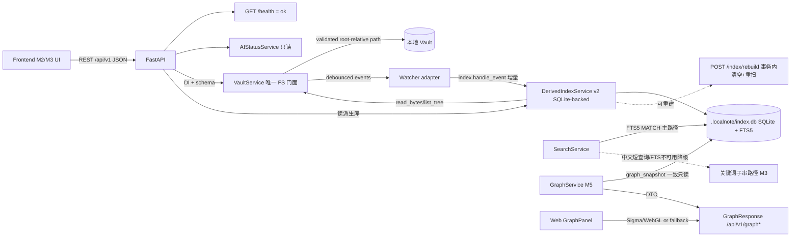

# LocalNote Server

Markdown-first 本地笔记服务端。Markdown/附件文件是长期唯一事实源
（source of truth）；SQLite、FTS、Embedding、Knowledge Graph、缓存、索引、
AI history 等未来只作为**可删除重建的派生数据**。

> **当前阶段：M8 已实现（Scheduler / 可靠性强化 / 部署选项），完成本地产品
> MVP 闭环**。M8 在 M1–M7 基线上新增一个**可停止、单进程、本地优先**
> Scheduler：APScheduler 3.11（首选，缺失时降级 asyncio 回环），静态注册
> `daily_organizer`（默认每天 23:00）与 `weekly_review`（默认周日 20:00），
> 可选只读 `index_consistency`；定时/手动触发走同一条受控 M7 链
> （`AgentJobService.plan` → Policy → Diff → History），默认只生成 Level 1
> preview（`awaiting_confirmation`），仅显式配置且命中 tag-only 白名单 +
> Policy `allow` 才自动执行。每次触发记录可审计 run 行；启动扫描把中断的
> job/run 标为 `recovery_required`（只诊断、不自动写/回滚），显式恢复带
> hash guard；History retention（默认 30 天 / run ≤1000）只清派生终态、不触
> Vault。局域网访问仍默认关闭（`127.0.0.1`），host 为非回环地址时
> 状态/日志明确告警并提示显式 CORS 白名单，不实现认证/HTTPS（见“局域网暴露警告”）。
> 详细边界见 [`PLAN-M8.md`](./PLAN-M8.md)、[`PLAN-M7.md`](./PLAN-M7.md)、
> [`PLAN-M6.md`](./PLAN-M6.md)、[`PLAN-M5.md`](./PLAN-M5.md)、
> [`PLAN-M4.md`](./PLAN-M4.md)、[`PLAN-M3.md`](./PLAN-M3.md)、
> [`PLAN-M1.md`](./PLAN-M1.md)
> 与 [`docs/development-roadmap.md`](./docs/development-roadmap.md)。

## 已实现能力

- **后端 API（FastAPI）**：
  - `GET /api/v1/health` → 固定 `{"status":"ok"}`，独立于 AI/Vault/SQLite。
  - `GET /api/v1/ai/status` → 只读探测本地 oMLX，动态发现 Qwen3.5-4B 与
    能力（Phase 0，未变）。
  - **M6 只读 AI workflow**（`server/ai/workflows.py`）：六个 POST 端点
    （chat/summarize/tags/related/extract_todos/classify），全部只读；版本化
    Prompt Registry 真实正文进入模型请求并回显 `prompt_version`；强 schema
    （`extra="forbid"`）+ 本地严格 JSON 校验；related 先经 FTS/substring +
    links/graph 程序缩小候选并做 allow-list；embedding/rerank 缺失只报
    `capability_unavailable` 不伪装。
  - **M7 受控 Agent/History**：`POST/GET /api/v1/jobs`、
    `POST /api/v1/jobs/{id}/accept|reject`、`GET /api/v1/history`、
    `GET /api/v1/history/{id}`、`POST /api/v1/history/{id}/undo`。默认
    preview 不落盘；错误统一为 `{"error":{"code","message","path"},
    "meta":{}}`；Daily Organizer / Weekly Review 各最多一次模型调用。
  - **M8 Scheduler（本阶段）**：`GET /api/v1/scheduler/status`、
    `POST /api/v1/scheduler/run/{task}`（仅三个稳定任务）、
    `GET /api/v1/scheduler/runs`、`POST /api/v1/scheduler/recovery/{run_id}`
    （默认 `diagnose`；`rollback_if_safe` 带 hash guard；`retry_preview`
    绕过 recovery 门禁新建 preview run，原 `recovery_required` 标记不变）。
    run 记录含 trigger/status/error/started/finished；定时与手动共用同一
    受控 handler；手动请求 `confirm=false`（或缺省）永远只生成 Level 1
    preview —— 即使服务端开启 Level 2 也不自动执行（`confirm` 真实参与
    决策，写入仍只经 `POST /api/v1/jobs/{id}/accept`）。**调度错过语义**：
    本地进程不提供关机期间唤醒保证；`coalesce=true` 时错过窗口最多补跑
    一次、超出 misfire grace 的槽位直接跳过，不写入 `missed` 运行行
    （run 枚举无 `missed`，也没有该历史状态）。`idempotency_key` 是
    确定性的 `task:scheduled_for` 审计标签（非唯一键；同槽重复触发会追加
    新 run 行，重入防护由 active-run 门禁 + 每任务锁完成）。scheduler
    disabled/stopped 只返回稳定错误码，不影响任何核心 API。
  - **Vault Core（M1）**：`/api/v1/vault/files`（列表）、`/api/v1/vault/file`
    （读/建/原子更新/删，JSON base64 + SHA-256）、`/api/v1/vault/file/move`
    （移动/重命名）。
- **安全**：路径词法校验 → resolve + containment；拒绝 `../`、绝对路径、
  NUL、反斜杠、drive/UNC 与**一切 symlink**（逃逸文件/目录/父链均拒绝）；
  错误体 `{"error":{"code","message","path"}}`，不泄漏绝对 root/堆栈/正文。
- **保真**：Markdown/附件以原始 bytes 读写（无 parser），BOM/LF/CRLF/
  非 UTF-8/未知 Obsidian 语法逐字节保留；hash = 原始 bytes SHA-256。
- **原子写 + 冲突**：同目录临时文件 + fsync + 原子替换；update/delete/move
  一律要求客户端提交 `expected_sha256`，外部修改/hash 过期 → 409
  `file_conflict`，绝不静默覆盖。
- **`.localnote/`（M1 占位 + M4 派生库）**：Vault 初始化只建目录 +
  `state.json` 占位；M4 索引层在 `.localnote/index.db` 建立 SQLite 派生库
  （WAL、版本表 migration、FTS5）。整个 `.localnote/` 可删除后由索引层
  从 Markdown 文件完整重建，正文/附件 hash 不变；SQLite 从不作为正文
  唯一数据源。
- **Watcher（M1）**：watchdog 锁定依赖；create/modify/delete/move 归一化 +
  去抖；事件流入 SQLite 索引增量（upsert/delete/move，与 rebuild 同锁串行）。
  watchdog 缺失/启动失败时读写照常，状态记录 `unavailable`。
- **前端（React + TypeScript + Vite）** M2 Workspace：文件树、Markdown 源码编辑、
  安全只读预览、多标签、split pane 与冲突处理；M5 GraphPanel 与 M6 最小
  AIPanel（Ask/Summarize/Tags/Related，仅建议、不写）已启用。
  预览管线使用 `rehype-raw` 在 `rehype-sanitize` 之前解析 Markdown 内嵌 HTML，随后严格清洗脚本、事件属性和危险 URL；这样保留标准 Markdown HTML 展示能力，同时确保仅安全 HTML 进入 DOM。
- **M3 只读派生层 + M4 SQLite 派生库**（后端 + 前端）：
  - frontmatter/Properties 只读解析（BOM/CRLF、未知字段逐字保留、tags 规范化、
    失败诊断）→ `GET /api/v1/metadata/{note}`（仍以 Vault 实时读为准）；
  - wikilink/embed/heading/block/alias 解析与 outgoing/backlinks（改从 SQLite
    `links`/`backlinks` 表读）→ `GET /api/v1/links/{note}`、
    `GET /api/v1/backlinks/{note}`（resolved 可点击、broken/ambiguous 标记）；
  - 搜索主路径 FTS5 MATCH（英文/数字/tag/basename，bm25 排序；中文/Emoji/
    FTS 不可用时降级到关键词子串路径，中文任意长度可查）→
    `GET /api/v1/search?q=`（DTO 不变）；
  - SQLite 派生索引（`DerivedIndexService`：单连接 + RLock、版本表 migration、
    watcher 事件增量、单事务全量重建）与 `POST /api/v1/index/rebuild`；启动顺序
    Vault 初始化 → 打开/迁移 index.db → 全量扫描 → watcher 事件流入
    （`set_event_callback`）。
  - 索引故障只影响 metadata/links/search（503 `index_unavailable`），
    不影响 health/AI/Vault 读写/M2 编辑器；单篇失败隔离为诊断，不写回正文。
  - 前端：Ribbon Search 启用 + SearchPanel + NotesLinksPanel（outgoing/backlinks
    点击打开）；不做 Command Palette/Quick Open。
- **`./scripts/dev.sh`** 一键启动前后端：依赖/版本/端口检查、信号转发与
  优雅清理。

## 架构图（M1–M5 数据流）



## 快速开始

前置要求：Python **3.12+**、Node **>=22 <23**、`pnpm` 9.x（`corepack enable`，
项目 `packageManager: pnpm@9.15.0`）、推荐 `uv`。

```bash
./scripts/dev.sh            # 一键启动（后端 :3780 + 前端 :5173，Ctrl-C 清理）
```

无 uv 的手动路径：`python3 -m venv .venv && .venv/bin/pip install -e '.[dev]'`
（依赖含 watchdog，锁于 `uv.lock`）。

### Vault 快速开始（M1）

1. 准备或指向一个已存在的目录作为 Vault root（LocalNote **不会替你创建**）：
   ```bash
   export LOCALNOTE_VAULT__ROOT="$PWD/tests/fixtures/vault"   # 演示用受控 fixture
   python -m uvicorn server.api.main:app --host 127.0.0.1 --port 3780
   ```
2. 列表 / 读取 / 创建 / 原子更新：
   ```bash
   curl -fsS 'http://127.0.0.1:3780/api/v1/vault/files?recursive=true'
   curl -fsS --get 'http://127.0.0.1:3780/api/v1/vault/file' \
     --data-urlencode 'path=中文/😀 note.md'
   curl -fsS -X POST 'http://127.0.0.1:3780/api/v1/vault/file' \
     -H 'content-type: application/json' \
     -d '{"path":"notes/new.md","content_base64":"IyBIZWxsbwo="}'
   # 用上一步读到的 sha256 做原子更新：
   curl -fsS -X PATCH 'http://127.0.0.1:3780/api/v1/vault/file' \
     -H 'content-type: application/json' \
     -d '{"path":"notes/new.md","content_base64":"IyBVcGRhdGVkCg==","expected_sha256":"sha256:<hash>"}'
   ```
3. 错误示例：`GET ...?path=../outside.md` → HTTP 400 `path_traversal`；
   root 未配置 → HTTP 503 `vault_not_configured`；hash 过期 → 409
   `file_conflict`。

## 测试与构建

```bash
uv sync --dev                       # 或 .venv/bin/pip install -e '.[dev]'
python -m pytest -q                 # 后端（health/AI 回归 + M1 Vault 矩阵）
pnpm install --frozen-lockfile      # 前端（无改动时仅回归）
pnpm --filter @localnote/protocol typecheck
pnpm --filter @localnote/graph typecheck
pnpm --filter @localnote/web typecheck
pnpm --filter @localnote/web test   # Vitest run
pnpm --filter @localnote/web build  # Vite 生产构建
python -m compileall server
./scripts/check.sh                  # 一键本地门禁
```

测试安全规则：

- Vault 测试只使用 `tests/fixtures/vault/` 的受控副本（复制进 pytest
  `tmp_path`）或临时目录内自建 fixture；**绝不触碰真实用户 Vault**；
- symlink 逃逸矩阵在 tmp 目录中构造；AI 探测全部 mock；
- 更新必须携带读取到的 hash 做冲突检测，服务器永不静默覆盖。

## 端口与环境变量

| 变量 | 默认 | 说明 |
|---|---|---|
| `LOCALNOTE_HOST` / `LOCALNOTE_SERVER__HOST` | `127.0.0.1` | 后端监听地址（默认仅回环） |
| `LOCALNOTE_PORT` / `LOCALNOTE_SERVER__PORT` | `3780` | 后端端口 |
| `LOCALNOTE_SERVER__CORS_ORIGINS` | `["http://127.0.0.1:5173","http://localhost:5173"]` | JSON 数组显式白名单 |
| `LOCALNOTE_VAULT__ROOT` / `LOCALNOTE_VAULT_ROOT` | 空 | Vault 根目录（必须已存在）。未配置 ⇒ `Not configured`，Vault API 503 |
| `LOCALNOTE_VAULT__WATCHER_ENABLED` / `..._VAULT_WATCHER_ENABLED` | `true` | 是否启动 watcher（`false` ⇒ `disabled`） |
| `LOCALNOTE_VAULT__WATCHER_DEBOUNCE_MS` | `200` | watcher 事件去抖窗口（ms） |
| `LOCALNOTE_VAULT__MAX_FILE_BYTES` | `52428800` | 单文件读写上限（超出 ⇒ 413 `file_too_large`） |
| `LOCALNOTE_AI__BASE_URL` / `LOCALNOTE_OMLX_BASE_URL` | `http://127.0.0.1:8000/v1` | oMLX OpenAI 兼容地址；置空 ⇒ `not_configured` |
| `LOCALNOTE_AI__CONNECT_TIMEOUT_SECONDS` / `LOCALNOTE_AI__REQUEST_TIMEOUT_SECONDS` | `0.5` / `2.0` | AI 探测超时 |
| `LOCALNOTE_SCHEDULER__ENABLED` | `true` | Scheduler 总开关（默认开启、可停止；关闭后 status 可见、run 返回 409 `scheduler_disabled`） |
| `LOCALNOTE_SCHEDULER__TIMEZONE` | `UTC` | 任务时区（IANA 名称，如 `Asia/Shanghai`；非法即配置错误） |
| `LOCALNOTE_SCHEDULER__DAILY_CRON` / `WEEKLY_CRON` | `0 23 * * *` / `0 20 * * 0` | Daily/Weekly cron（严格 5 字段 int/`*`/`*/step`） |
| `LOCALNOTE_SCHEDULER__INDEX_CHECK_ENABLED` | `false` | 可选只读 index consistency 周期任务（interval） |
| `LOCALNOTE_SCHEDULER__INDEX_CHECK_INTERVAL_HOURS` | `24` | index 校验间隔（小时） |
| `LOCALNOTE_SCHEDULER__LEVEL2_AUTO_ENABLED` / `LEVEL2_AUTO_ACTIONS` | `false` / `[]` | Level 2 tag-only 自动执行开关/白名单（只能 `add_tags`/`remove_tags`；开启必须有非空白名单） |
| `LOCALNOTE_SCHEDULER__JOB_TIMEOUT_SECONDS` | `300` | 单次 run 超时（超时标记 `timed_out`/`recovery_required`，不杀写线程） |
| `LOCALNOTE_SCHEDULER__STALE_RUN_AFTER_SECONDS` | `3600` | 孤儿 running run 阈值 |
| `LOCALNOTE_HISTORY__RETENTION_DAYS` | `30` | History/run retention（只删终态过期派生行） |
| `LOCALNOTE_HISTORY__CLEANUP_ENABLED` / `CLEANUP_INTERVAL_HOURS` | `true` / `24` | retention 清理开关/间隔 |
| `LOCALNOTE_HISTORY__MAX_SCHEDULER_RUNS` | `1000` | scheduler_runs 保留上限 |
| `LOCALNOTE_INDEX__AUTO_REBUILD` | `false` | index consistency 发现不一致时允许 rebuild（只写派生库） |
| `LOCALNOTE_INDEX__NOTE_TEXT_CAP` | `1000000` | 索引单篇正文保留上限（字符） |
| `LOCALNOTE_INDEX__DB_FILENAME` | `index.db` | `.localnote/` 内派生库文件名（M4） |
| `LOCALNOTE_INDEX__FTS_TOKENIZER` | `unicode61` | FTS5 tokenizer（M4；中文短查询走子串降级） |
| `LOCALNOTE_INDEX__JOURNAL_MODE` | `WAL` | SQLite journal_mode（M4） |
| `LOCALNOTE_INDEX__SYNCHRONOUS` | `NORMAL` | SQLite synchronous（M4） |
| `LOCALNOTE_INDEX__BUSY_TIMEOUT_MS` | `5000` | SQLite busy_timeout（M4） |
| `LOCALNOTE_GRAPH__DEFAULT_LIMIT` / `MAX_LIMIT` | `500` / `2000` | Graph 节点页默认/上限（M5） |
| `LOCALNOTE_GRAPH__DEFAULT_DEPTH` / `MAX_DEPTH` | `1` / `3` | local BFS 默认/最大深度（M5） |
| `LOCALNOTE_GRAPH__DEFAULT_INCLUDE_BROKEN` | `true` | 是否默认输出 dangling broken/ambiguous 边（M5） |
| `LOCALNOTE_GRAPH__MAX_EDGES` | `2000` | 单响应边上限（超出置 `truncated`，M5） |
| `VITE_PORT` / `VITE_API_PROXY_TARGET` | `5173` / `http://127.0.0.1:3780` | Vite 端口 / `/api` proxy 目标 |

规则：嵌套变量优先于扁平别名（如 `LOCALNOTE_VAULT__ROOT` 与
`LOCALNOTE_VAULT_ROOT` 同时设置时取嵌套值）。

## Vault API 一览（M1）

| 方法/路径 | 说明 | 主要错误 |
|---|---|---|
| `GET /api/v1/vault/files?path=&recursive=&include_hidden=` | 列表（`.localnote` 永远过滤） | 400/404/503 |
| `GET /api/v1/vault/file?path=` | 读取（base64 + sha256 + content_type） | 400/404/413/503 |
| `POST /api/v1/vault/file` | 创建（父目录须存在） | 400/404/409/413/503 |
| `PATCH /api/v1/vault/file` | 原子更新（必须 `expected_sha256`） | 400/404/409/413/503 |
| `DELETE /api/v1/vault/file` | 删除（必须 `expected_sha256`） | 400/404/409/503 |
| `POST /api/v1/vault/file/move` | 移动/重命名（不覆盖目标） | 400/404/409/500/503 |

## Metadata / Links / Search / Index API 一览（M3 契约 + M4 SQLite 底层，只读 + 一个重建）

| 方法/路径 | 说明 | 主要错误 |
|---|---|---|
| `GET /api/v1/metadata/{note}`（或 `?path=`） | frontmatter 解析（Vault 实时读；未知字段保留、tags 规范化）；解析失败为 HTTP 200 + 结构化 `parse_error` | 404/503 |
| `GET /api/v1/links/{note}`（或 `?path=`） | outgoing 链接（从 SQLite `links` 读；resolved/broken/ambiguous + broken_count） | 404/503 |
| `GET /api/v1/backlinks/{note}`（或 `?path=`） | 反链（从 SQLite `backlinks` 读；来源标题 + 上下文片段） | 404/503 |
| `GET /api/v1/search?q=` | 搜索：FTS5 MATCH 主路径 + 中文/Emoji/FTS 不可用时的子串降级（AND、snippet 纯文本、degraded 计数；DTO 不变） | 400/503 |
| `POST /api/v1/index/rebuild` | 全量重建 SQLite 派生索引（事务内清空+重扫），返回 `{indexed,skipped,failed,duration_ms,...}` | 503 |

`{note}` 使用 FastAPI `:path` 转换器；前端按路径段做 `encodeURIComponent`，
中文/Emoji/空格/嵌套路径均可。索引故障仅使上述端点与 Graph 503，不影响
health/Vault 读写/编辑器。

## Graph API 一览（M5，只读）

| 方法/路径 | 说明 | 主要错误 |
|---|---|---|
| `GET /api/v1/graph?limit=&offset=&tag=&include_broken=` | 全局 Note/Tag 图（可选 tag 过滤，casefold） | 400/503 |
| `GET /api/v1/graph/local/{note}?depth=&direction=&tag=&include_broken=` | root BFS 局部图（depth≤3；incoming 由 links 反推） | 400/404/503 |
| `GET /api/v1/graph/tag/{tag}`（或 `?tag=`） | tag 作用域图（与全局 tag 过滤同语义） | 400/404/503 |

响应：`{model:"note-tag-v1",scope,root,nodes,edges,page:{limit,offset,next_offset,
total_nodes,total_edges,truncated},generated_at}`。nodes 按 `(type,id)`、edges 按
`(type,source,target,id)` 确定性排序；截断页只含端点在本页的边；broken 边
`target=""`。图只读：不产生任何 SQLite 写入、不写正文。

错误体：`{"error":{"code":"…","message":"…","path":"…|null"}}`。
错误码：`vault_not_configured`、`vault_unavailable`、`path_traversal`、
`symlink_escape`、`not_found`、`already_exists`、`file_conflict`、
`expected_hash_required`、`invalid_request`、`file_too_large`、
`not_a_file`、`not_a_directory`、`atomic_write_failed`、`watcher_unavailable`、
`index_unavailable`（M3，503）、`internal_error`。

## AI 状态与只读 workflow（Phase 0 + M6）

`GET /api/v1/ai/status` 三态均 HTTP 200：`not_configured` / `offline` /
`connected`（发现 Qwen3.5-4B 时返回 ID）。安全默认：端点回显剥离凭据与
query；错误不含堆栈/响应体。

M6 只读 workflow 详见 [`docs/ai-architecture.md`](./docs/ai-architecture.md) 与
[`PLAN-M6.md`](./PLAN-M6.md)：输入经严格 DTO 校验；Vault 未配置时空上下文
chat 仍可回答（S4 修复）；结构化失败返回固定错误码与
`meta: {prompt_version, model}`；无 AI 写路径。

## 目录概览

```text
apps/web/             React + TS + Vite（Phase 0 状态页 + M2 Workspace + M3 Search/Links 面板 + M5 GraphPanel + M6 AIPanel）
packages/protocol/    共享 API DTO 类型（types only，含 M3/M5 DTO 镜像）
packages/ui/          M2 UI 基元（Button/Panel/TreeRow/Tab/…）
packages/editor/      M2 CodeMirror 6 Markdown 编辑器
packages/markdown/    M2 安全只读预览（remark/unified + rehype-raw → rehype-sanitize）
packages/workspace/   Zustand 会话 store（树/标签/防抖保存/冲突 + M3 relations/search + M5 graph slice + M6 AI slice）
packages/graph/       M5 Graphology/Sigma 可视化 + WebGL 降级（graphology 0.26.0 / sigma 3.0.3 / 布局 0.6.1/0.10.1）
server/
  api/                路由、DI、lifespan、安全错误映射（vault + metadata/links/search/index/graph）
  vault/              M1 Vault Core：service/path_safety/errors/schemas/
                      atomic_write/derived/events/watcher/lifecycle
  markdown/bytes.py   M1 原始 bytes/hash 边界（无 parser）
  markdown/{frontmatter,wikilinks}.py   M3 最小只读扫描器
  index/              M4 SQLite 派生索引（schema/db/service + DTO）+ M5 只读 graph_snapshot 等查询面
  graph/              M5 只读 Graph 服务 + DTO（查询时计算，无写路径）
  metadata|links|search/  M3 领域服务 + DTO（M4 底层读 SQLite；metadata 实时读 Vault）
  ai/                 Phase 0 探测 + M6 只读 workflow（适配器/上下文/注册表/候选缩小）
  agents/             M7 受控 Agent：registry/workflows/tools/schemas/service
  policies/           M7 纯程序 PolicyEngine + 稳定 M7 错误
  history/            M7 History/Journal + M8 scheduler_runs 与 retention（index.db 派生表）
  recovery/           M7 事务执行/逆序回滚/Undo + M8 启动扫描与显式 hash-guard 恢复
  scheduler/          M8 本地调度器（APScheduler 首选/asyncio 降级；runner/status/run）
tests/                backend/（M1/M2 回归 + M3 矩阵 + M4 矩阵 + M5 test_graph_* +
                      M6 test_ai_* + M7 test_m7_* + M8 test_m8_{config,scheduler_backend,runner,
                      m7_integration,recovery,retention,index_consistency,api,isolation}；perf/ 可选）
                      frontend/（Vitest：M2 保存/冲突 + M3 Search/NotesLinks/Ribbon/client +
                      M5 GraphData/GraphStore/GraphView/GraphPanel + M6 AIPanel/AIIsolation）fixtures/…
scripts/dev.sh        一键开发启动
scripts/check.sh      本地验证门禁
docs/                 vault-spec（M1 状态）/ architecture / ai / roadmap
```

## 局域网暴露警告

默认全部绑定 `127.0.0.1`（回环）。局域网访问必须**显式**设置
`LOCALNOTE_HOST` 为非回环地址，如 `0.0.0.0`（前端 `VITE_HOST=0.0.0.0`）。
**LocalNote 不实现账号/认证或 HTTPS**：一旦监听非回环地址（`0.0.0.0`、
`::`、`192.168.x`、具体主机名等任意一种），同一网络中的任何设备都可以
调用写 API。M8 的处理是**仅告警、不阻断启动**（与 PLAN-M8 §6.2 的
`network_exposure_warning` 状态告警语义一致）：host 非回环时启动日志与
`GET /scheduler/status` 均置 `network_exposure_warning=true`；当 CORS
白名单为空、含 `*` 或只含回环来源（如默认的 `127.0.0.1:5173`/
`localhost:5173`，无法服务局域网浏览器）时，status 增加固定字段
`network_exposure_advice`，内容是建议显式设置
`LOCALNOTE_SERVER__CORS_ORIGINS`，例如：

```bash
LOCALNOTE_HOST=0.0.0.0 \
LOCALNOTE_SERVER__CORS_ORIGINS='["http://<信任的局域网前端>:5173"]' \
./scripts/dev.sh
```

不要把该端口暴露到公网，请用防火墙限制来源；CORS 不允许凭据通配。默认
回环，暴露风险自负。

## 路线图

M0 Bootstrap（完成）→ **M1 Vault 安全读写（完成）** → M2
Workspace/Editor/Preview（完成）→ **M3 Metadata/Links/搜索（开发完成待审计）** →
**M4 SQLite FTS/索引（开发完成待审计）** → **M5 Graph 派生与可视化（已完成）** →
**M6 只读 AI（已实现，审计修复轮完成）** → **M7 Policy/Diff/History/Recovery/
受控 Agent（已实现）** → **M8 Scheduler/可靠性/部署（开发完成待审计，本地
产品 MVP 闭环）**。详见
[`docs/development-roadmap.md`](./docs/development-roadmap.md)。

## 贡献 / 许可

占位：尚未开放贡献流程与许可选择（`UNLICENSED`）。开发者必须先读
`PLAN-M1.md`、`PLAN.md` 与 `docs/` 再动手；禁止提前实现 M2+ 功能。
