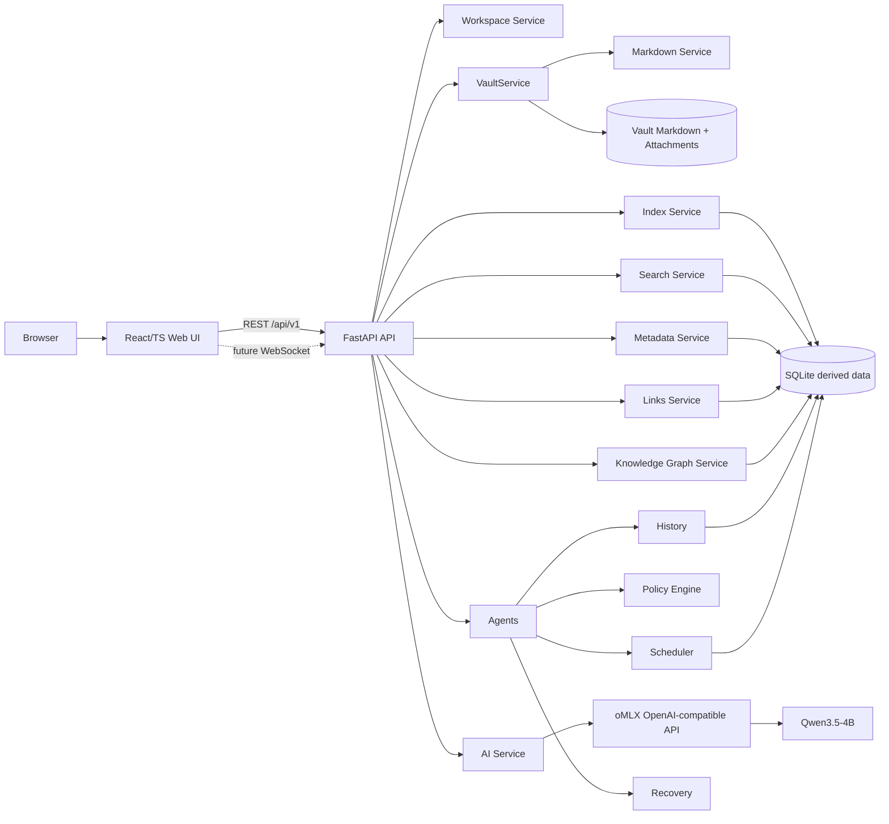
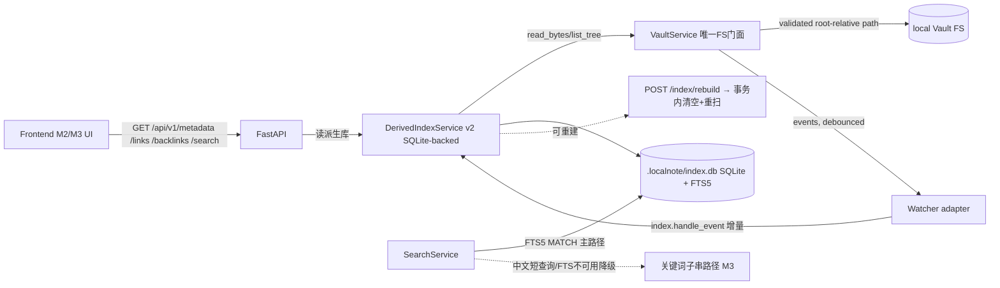

# LocalNote 架构

> 配套文档：`vault-spec.md`（Vault 兼容性规范）、
> `ai-architecture.md`（AI 边界）、`rag-architecture.md`（RAG）、
> `development-roadmap.md`（路线图）、`api-reference.md`（端点与环境变量）。
>
> **说明**：正文中提到的逐里程碑计划文档（`PLAN.md` / `PLAN-M*.md` /
> `PLAN-ATTACHMENTS.md` 等）属于内部过程文档，不随仓库发布。
> 本文档描述目标架构与当前实际落地范围（M0 Bootstrap + M1 Vault Core +
> M2 Web Workspace + M3 Metadata/Links/关键词搜索只读派生层 +
> M4 SQLite 派生库/FTS5/索引增量与重建/性能基准 +
> M5 Graph 派生与可视化 + M6 只读 AI（chat/context/结构化辅助）+
> M7 受控写路径：Policy Engine / Action Schema / Diff / Transaction /
> History / Undo / 有限 Agent workflow）。

## 1. 原则

1. **Markdown 是唯一事实源**。正文以普通 Markdown 文件保存；SQLite/FTS/
   Embedding/Graph/History 等一律是**可删除重建的派生数据**，永不反向成为
   事实源。
2. **本地优先**：数据与 AI（oMLX + Qwen3.5-4B）都在本机；默认只监听回环；
   局域网必须显式开启并自行承担暴露风险。
3. **故障隔离**：API 启动不依赖 AI/Vault/数据库；health 独立；AI 离线只
   影响 AI 状态；索引/搜索/图谱故障不得损坏正文或阻塞核心编辑。
4. **小模型 + 强约束**：以本地小模型为主；M7 已开放第一个**受控**写
   路径：强 Schema（extra=forbid）→ 纯程序 Policy → bytes 保真 Diff →
   Level 1 用户确认（或显式配置的 Level 2 tag-only 自动）→ 事务执行 →
   History / Undo。任何未受控的 AI 写、Agent loop、Scheduler 与删除/附件
   覆盖仍是 M8+ 边界。
5. **占位不冒充**：Phase 0 目录中凡未实现的模块必须标注 placeholder，不生成
   假 service、不返回虚假“成功”。

## 2. 长期逻辑架构



## 3. 模块职责、依赖与故障隔离

| 模块 | 职责 | 允许依赖 | 故障隔离 |
|---|---|---|---|
| Frontend | 展示状态、未来编辑与工作区交互；只能调用 API | protocol、UI/Editor/Markdown/Workspace/Graph 包 | API 不可用显示连接错误；不直接访问 FS/LLM |
| Backend/API | HTTP 生命周期、路由、DI、错误映射 | 配置、AI status；未来各领域服务 | 启动不依赖 AI/Vault/DB；health 独立 |
| VaultService | 未来所有 Vault 路径解析与安全访问唯一入口 | 配置、Markdown | 越界/symlink 一律拒绝；不可绕过访问 FS |
| Markdown | 解析/序列化，未知语法原样保留 | VaultService | 解析失败不覆盖原文；原文事实源 |
| Index | 可重建索引 | VaultService/Markdown、SQLite | 索引损坏可删重建 |
| Search | FTS/关键词/语义 | Index、SQLite、可选 Embedding | 索引不可用不影响核心编辑 |
| Metadata | frontmatter 读取与派生 | Markdown、Index | 未知字段保留 |
| Links | 双链/反向链接 | Markdown、Index | 单篇失败隔离为诊断 |
| Knowledge Graph | 派生图 | Links、Metadata、SQLite | 图可删重建、不反写正文 |
| AI Service | 配置/能力发现、未来受控推理 | httpx、schemas、adapters | oMLX offline 不影响 API；chat/embedding/rerank 拆分 |
| Qwen3.5-4B | 本地模型，经 oMLX 暴露 | 仅 OpenAI-compatible HTTP | 模型失败只影响 AI |
| Agents | 有限、可审计任务编排 | AI、Policy、History、Recovery、Tools | 预算/超时/审批，禁止无限自主循环 |
| Policies | 白名单/Schema/diff 规则 | protocol、History | 未过策略的写拒绝 |
| Scheduler | 本地定时维护 | Policies、History、Recovery | 停止不影响手动核心功能 |
| History | AI/任务事件记录 | SQLite（派生） | 记录失败不覆盖正文 |
| Recovery | 备份/回滚/崩溃恢复 | History、Vault、Policies | 恢复显式、可审计 |

## 4. 落地与数据流

Phase 0 实现了粗线部分：Web 首页、FastAPI、health、AI status 探测、配置与
文档。M1 在其上落地了 Vault Core 数据流（`PLAN-M1.md`），M2 在前端落地
Workspace → Vault REST → 原始 bytes 的编辑数据流：GET 内容与 sha256 建立 session，
CodeMirror 只维护源码字符串，预览是经过 sanitizer 的只读派生 HTML，PATCH 始终携带
expected_sha256；409 进入 conflict，reload 丢弃本地或 keep-local 停止自动保存。
M3 增加**纯读取的派生层**（`PLAN-M3.md`）：frontmatter/metadata 只读解析、
wikilink/双链反链、关键词子串搜索，基于可重建的派生索引。M4（`PLAN-M4.md`）
把索引存储引擎替换为 `.localnote/index.db` 的 **SQLite 派生库**（notes/tags/
properties/links/backlinks + FTS5 `notes_fts` + 版本表 migration），links/
backlinks/tags 查询改从 SQLite 读，搜索主路径切到 FTS5 MATCH（英文/数字/tag/
basename），中文（任意长度）/Emoji/非 ASCII/符号查询与 FTS 不可用/不可命中
时降级到 M3 关键词子串路径；watcher 事件增量与 `POST /index/rebuild`
（单事务清空+重扫）在同一把 RLock 下串行。契约/DTO/错误体不变，SQLite 永远
是派生数据（删 `.localnote/` 可重建，正文零改动）；索引故障仍只影响
metadata/links/search（503），永不损坏正文。M5（`PLAN-M5.md`）在 M4
之上增加**只读 Graph 派生层**：`server/graph` 请求时从 M4 的
notes/tags/links 构造 Note/Tag 节点与 link/tag 边（`GET /api/v1/graph`、
`/graph/local/{note}`、`/graph/tag/{tag}`），稳定 ID/排序/分页/截断，
broken 不伪造目标、ambiguous 保留 candidates；`packages/graph` 实现
Graphology + Sigma.js 可视化（动态导入 sigma，WebGL 不可用降级为可操作
列表/统计），Ribbon Graph 启用。图同样只读、可删重建、永不写正文。



只有 `VaultService` 可以触碰 Vault 文件系统；路由、前端与未来 LLM 永远
不得直接调用 `pathlib`/`open`/`os.rename` 等。

数据流（对应 PLAN.md 3.3）：

1. 浏览器请求 `GET /api/v1/health`；返回固定响应，不创建 AI client。
2. 浏览器请求 `GET /api/v1/ai/status`；API 读取 Settings（oMLX base URL、
   超时、匹配规则）。
3. 未配置 → `not_configured`（不发请求）。
4. 已配置 → adapter 以 httpx 异步请求 `{base_url}/models`，connect 0.5s /
   总超时 2s / 响应体上限。
5. 解析 OpenAI 风格 `{"data":[{"id":...}]}`；非法响应/HTTP 错误/超时 → 安全
   归类 `offline`，不泄漏堆栈/密钥/响应体。
6. 按折叠规则匹配 Qwen3.5-4B；chat 为核心能力；embedding/rerank optional。
7. Web 首页并行读取 health 与 AI status，显示明确降级状态；Vault 显示
   `Not configured`，不探测真实路径。

## 5. HTTP / 端口 / CORS

- 后端默认 `127.0.0.1:3780`；前端默认 `127.0.0.1:5173`。
- Vite proxy：`/api` → `http://127.0.0.1:3780`（可 `VITE_API_PROXY_TARGET`
  覆盖），开发免 CORS。
- 后端 CORS 默认显式白名单两个本地 origin，可用
  `LOCALNOTE_SERVER__CORS_ORIGINS`（JSON 数组）覆盖；**不默认
  `*` + credentials**。
- 状态类业务降级（AI offline 等）返回 HTTP 200 + 明确 schema；仅内部不可
  恢复错误返回 5xx 安全体 `{"detail":"internal server error"}`。

## 6. 配置模型

pydantic-settings，前缀 `LOCALNOTE_`，嵌套分隔 `__`；当前表达
server/vault/ai/scheduler/index 五组。`index` 组在 M3 只有内存限制项
（`note_text_cap`），M4 增加 SQLite/FTS 开关：`db_filename`（默认
`index.db`）、`fts_tokenizer`（默认 `unicode61`）、`journal_mode`（`WAL`）、
`synchronous`（`NORMAL`）、`busy_timeout_ms`，均可经 `LOCALNOTE_INDEX__*`
覆盖。M5 增加 `graph` 组（`LOCALNOTE_GRAPH__*`）：`default_limit`(500)/
`max_limit`(2000)/`default_depth`(1)/`max_depth`(3)/
`default_include_broken`(true)/`max_edges`(2000)，默认与原计划契约一致。缺失 Vault root 只是“未配置”；非法用户配置在构造时给出清晰错误；
文件不存在、oMLX 离线、scheduler 关闭都不会导致失败。

## 7. 边界约束（按里程碑）

已放行实现：M1 Vault 文件读写/扫描/Watcher/atomic write/路径解析
（`server/vault/*`、REST `/api/v1/vault`）；M2 Editor/Preview/Tabs/Split/
Workspace UI；M3 frontmatter/metadata 只读解析、wikilink/双链反链、关键词
子串搜索与只读派生索引；M4 SQLite 派生库 + FTS5 全文搜索 + 索引增量与全量
重建 + 性能基准（`server/index/{schema,db,service}.py`，REST 契约不变，
`server/{index,metadata,links,search}/*` 与
`server/markdown/{frontmatter,wikilinks}.py`，详见 README 与 PLAN-M4.md）；
M5 只读 Graph 派生与可视化（`server/graph/{schemas,service}.py` +
`server/api/routes/graph.py` + `server/index/service.py` 只读查询面；
`packages/protocol` Graph DTO 镜像、`packages/graph` Graphology/Sigma
渲染与 WebGL 降级、`packages/workspace` graph slice、web `GraphPanel`，
详见 README 与 PLAN-M5.md）；
M6 只读 AI（chat/context/结构化辅助：
`server/ai/workflows.py` 六个只读 workflow + `server/ai/context.py` /
`candidates.py` / `registry.py`（prompts 版本化）+ `server/ai/adapters/`
HTTP 边界，REST `/api/v1/ai/{chat,summarize,tags,related,extract_todos,
classify}`；只读辅助、无任何 AI 写路径，详见 README 与 PLAN-M6.md）；
M7 受控 Agent/写路径（Policy/Diff/History/Recovery/Undo：
`server/{agents,policies,actions,history,recovery}/*` 与 REST
`/api/v1/jobs|history`，Level1 确认/Level2 tag-only 关闭默认，详见
README 与 PLAN-M7.md）；
M8 本地 Scheduler/可靠性/部署（`server/scheduler/*`：
APScheduler 首选/asyncio 降级、静态 daily_organizer(23:00)/
weekly_review(周日 20:00)/可选 index_consistency，REST
`/api/v1/scheduler/{status,run/{task},runs,recovery/{run_id}}`；
run 审计记录、超时/幂等/清理、启动扫描只标 recovery_required、
显式 hash-guard 恢复、History retention（30 天/run≤1000）、局域网
0.0.0.0 显式告警 + CORS；定时/手动都走 M7 受控链、默认只生成 Level1
preview；详见 README 与 PLAN-M8.md）。

M9 用户直传附件（附件计划 v1.1：`server/vault/attachments.py` 命名/目标目录
纯函数 + `server/vault/atomic_write.py` 流式 no-overwrite 原语 +
`VaultService.upload_attachment_{bytes,stream}`/`open_resource` +
REST `POST /api/v1/vault/attachments`、`POST /api/v1/vault/attachments/multipart`、
`GET /api/v1/vault/resource`；前端四入口 = 工具栏/编辑器拖拽/粘贴/文件树目录
右键，落点由入口决定且目标目录必须已存在、不自动建月目录；引用为相对当前
笔记的 POSIX 路径；上传是用户直传旁路，不经过 PolicyEngine，
`attachment_write` 对 Agent 仍永久 deny；详见 README 与
PLAN-ATTACHMENTS.md v1.1）。

M10 文件重命名（文件树右键「重命名」/双击文件名，前端 `renameEntry`）：
复用既有 `POST /api/v1/vault/file/move` 做同目录移动，**未新增后端端点、未改
Vault 契约**；名字必须是单一路径段（拒绝 `/`、`\`、`.`、`..`、空名，错误码
`invalid_name`）；预期摘要取**磁盘当前 bytes**（而不是会话 baseSha256），
因此「有未保存修改的文件」也能改名且草稿不丢；目标已存在 → 409
`already_exists`，绝不覆盖；改名成功后打开的标签/会话重指到新路径。

M11 从 `[[wikilink]]` 创建嵌套笔记（Obsidian 式，纯前端 + 既有 Vault 写端点）：
预览把 `[[目标]]` 渲染成可点击元素（缺失目标标为待创建），点击或「引用链接」
面板的「创建」按钮调用 `openOrCreateLinkedNote`——先按**全库 basename** 解析
（与 `server/index/service.py::_resolve_ref` 同一规则），已存在则直接打开；
否则在**源笔记所在目录**创建（`[[子目录/名]]` 会按需逐级建目录，
`ensureFolder` 只逐级创建缺失层级）。`..`/绝对路径/URL/空名拒绝
（`invalid_name`）；行内代码与围栏内的 `[[...]]` 保持字面量；后端解析器、
索引与 Graph 行为均未修改。

M12 单栏实时预览（Live Preview，`packages/editor/src/livePreviewExt.ts`）：
在同一个 CodeMirror 实例里用装饰层渲染 Markdown——标题字号/字重、粗斜体、
行内代码、链接与 wikilink 可点击、图片替换为内联 widget、列表/引用/分隔线
呈现排版效果；**光标所在行保留原始语法**以便就地编辑。正文 bytes 不被改写，
保存仍走字节保真通道；原有「编辑 / 预览 / 分屏」三种视图全部保留，新增
`editorMode: "live"`。

AI 超时语义（2026-09 修复）：`/ai/status` 只请求 `/v1/models`，因此即便生成超时，
状态仍可能是 `connected`；`request_timeout_seconds` 是**生成**预算而非连接预算，
本地模型需要数十秒，默认值已从 `2.0` 放宽到 `60`（`LOCALNOTE_AI__REQUEST_TIMEOUT_SECONDS`，
上限 120）。症状是面板显示「AI：已连接」但每次调用返回 503 `ai_timeout`。

M13 任务清单点击切换（`packages/protocol` 纯函数 + 预览/实时两处渲染）：
`taskItems`/`toggleTaskInSource`/`markTaskCheckboxes` 定位 `- [ ]`/`- [x]` 标记
（跳过围栏代码块，文档顺序即 remark-gfm 的复选框顺序）；预览把标记替换为带
序号的 `span.task-toggle`，点击只改对应标记；「实时」模式用扫描结果生成
CodeMirror checkbox widget（不依赖语法树 TaskList 节点，未新增依赖），并阻止
mousedown 以免光标跳行导致 widget 重建。改动只落在正文文本，保存仍走
字节保真 + `expected_sha256` 通道。

尚未放行（保持禁止，不得“顺手”实现）：

- Graph 物化（独立 graph 表/迁移）与写路径；自动修复 broken/ambiguous；
  Heading/Block/Property 图节点；布局持久化；WebSocket 推送；
- frontmatter 写回 / properties 编辑 UI；Command Palette / Quick Open；
- Markdown parser/AST（`server/markdown/bytes.py` 只保留 bytes 边界；
  M3 新增模块只是最小语法扫描器，永不改 bytes.py）；
- AI embedding/rerank 真实端点（能力探测可见，调用仍返回
  `capability_unavailable`）、未受控 AI 写、Agent loop；
- 附件内容解析/转码/压缩/缩略/改写、附件全文索引、附件拖动移动/删除、
  批量上传、断点续传、Agent 写附件、自动创建附件月目录或中间目录、
  定时任务正文重写/删除/附件覆盖、自动恢复写入/未知冲突自动猜测、
  Level2 非 tag-only 自动执行（M8：默认 Level1 preview，Level2 需要
  显式 tag-only 白名单 + Policy allow）；
- 目录重命名/移动（后端 `move_file` 仅支持文件）、附件拖动移动、wikilink 自动重命名联动、多人协同、真正的富文本编辑器（Live Preview 仍是源码 + 装饰层，不引入 AST 写路径）；
- 云/NAS 同步、PostgreSQL/Redis/RabbitMQ/Kafka/Celery/Qdrant/Docker/
  Kubernetes/远程数据库/Electron/Obsidian 插件/外部云 AI、多进程
  分布式 Scheduler/分布式锁（单 uvicorn worker 部署，见 README 警告）、
  账号/认证/HTTPS；
- 真实用户 Vault 操作（测试 fixture 之外）；
- 硬编码完整 Qwen 模型 ID（只允许可配置匹配规则）。

## 8. 目录结构与代码约束

```
apps/web/            App.tsx 只做状态编排；不得 import Python/FS
packages/protocol/   只放协议类型（M3 DTO 镜像后端）
server/api/main.py   注册 health/ai/vault/metadata/links/search/index/graph 路由、DI、lifespan、安全错误处理
server/api/routes/vault.py    只做 HTTP 编排，不经手 FS Path
server/api/routes/{metadata,links,search,index}.py   M3 只读/重建编排
server/api/routes/graph.py                             M5 Graph 只读编排（/graph、/graph/local/{note}、/graph/tag/{tag}）
server/ai/schemas.py          Python 公共契约源
server/ai/adapters/           M6 唯一 HTTP 位置（omlx_client + openai_compatible）
server/ai/workflows.py        M6 只读 AI workflow（chat/context/结构化辅助；无写路径）
server/vault/                  M1 Vault Core（唯一 FS 门面）
server/markdown/bytes.py       bytes 边界（无 parser；不改）
server/markdown/{frontmatter,wikilinks}.py   M3 最小只读扫描器
server/index/                  M4 SQLite 派生索引（schema/db/service + DTO；M5 Graph 入口）
server/{metadata,links,search}/               M3 领域服务 + DTO（M4 底层读 SQLite；metadata 实时读 Vault）
server/graph/                  M5 只读 Graph 服务 + DTO（查询时从 M4 表计算，无写路径）
server/{agents,policies,actions,history,recovery}/  M7 受控 Agent/Policy/History/事务/Undo
server/scheduler/              M8 本地调度器（backend/runner/index_job/service；只调度不写业务）
server/api/routes/scheduler.py M8 scheduler HTTP 编排（status/run/runs/recovery）
packages/editor/src/livePreviewExt.ts  M12 单栏实时预览 + M13 任务复选框装饰层（不改 bytes、不改解析器）
```

详细目录见 PLAN.md 第 5 节与 README.md「目录概览」。

## 9. 可观测性与安全

- Python `logging` 标准库；记录 request method/path/status/duration 与 AI
  error 分类/耗时；**不记录** prompt/response/凭据。
- 端点回显剥离 userinfo 与 query；错误响应无 traceback。
- 文件路径一律经 `VaultService` resolve 后验证在 root 内，拒绝 `../`、
  绝对路径注入与 symlink escape（M1 已实现并作为阻断验收项，见
  `PLAN-M1.md` §4.2）。
- 未知 Markdown/Obsidian 语法未来必须原样保留；任何转换先 diff/备份。
