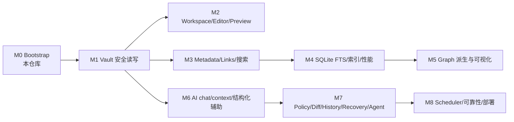

# LocalNote 开发路线图（M0–M12）

> 本文档给出各里程碑的入口、目标、依赖、验收门槛，以及**不可提前实现**
> 列表。当前阶段：**M9–M12 实现完成**（M9 用户直传附件已通过独立审计；
> M10 文件重命名、M11 从 wikilink 创建嵌套笔记、M12 单栏实时预览为本轮
> 新增）。边界保持封闭：无云/分布式队列/分布式锁、无自动恢复写入、
> 无 Level2 非 tag-only 自动执行、无认证/HTTPS 远程暴露默认开启。

## 总览

依赖要点：M2/M3/M6 都依赖 M1 的 Vault 安全读写；M5 依赖 M3/M4 的索引；
M7 依赖 M6 与 History；M8 依赖 M7。

## M0 — Bootstrap（本阶段，已完成目标）

- Monorepo（pnpm workspace + Python 3.12 pyproject）、版本约束、锁文件。
- FastAPI 最小骨架：`GET /api/v1/health`（`{"status":"ok"}`）、
  `GET /api/v1/ai/status`（oMLX 只读发现，not_configured/offline/connected）。
- React + TS + Vite 首页状态页（Server/Vault/AI 四行显示，从 API 读取）。
- `./scripts/dev.sh` 一键启动 + 优雅清理；`./scripts/check.sh` 本地门禁。
- pytest / Vitest 测试矩阵 + fixtures；README 与 architecture/vault-spec/
  ai-architecture 文档。
- 目录骨架：占位包与占位后端目录必须标注 Phase 0 placeholder。

验收：PLAN.md 第 1.2 节全部完成；M1+ 禁止项未实现。

## M1 — Vault 安全读写（已完成）

实施依据：`PLAN-M1.md`（本仓库已提交，M1 唯一实施依据）。

完成内容（对应 M1-01…M1-12）：

1. `VaultService`（唯一 FS 门面）+ `server/vault/path_safety.py`：词法拒绝 →
   resolve/containment → 逐级 lstat；拒绝 traversal、绝对路径、NUL、反斜杠、
   drive/UNC 与 **一切 symlink**（含指向 root 内者）；阻断验收通过并有
   实际 symlink 测试。
2. Markdown/附件原始 bytes 保真读写（无 parser，`content_base64` + SHA-256）；
   未知语法、BOM、LF/CRLF、非 UTF-8 round-trip（`server/markdown/bytes.py`）。
3. `.localnote/` 派生目录 + `state.json` 占位：可删重建，正文/附件 hash 不变；
   **无 SQLite/schema/FTS/正文副本**（`server/vault/derived.py`）。
4. Watcher（watchdog 锁定依赖 + 导入降级）：create/modify/delete/move 归一化、
   去抖合并、`.localnote` 过滤、`start/stop/flush` 生命周期；只发事件。
5. REST：`/api/v1/vault/{files,file,file/move}` 全矩阵 + 稳定错误体
   `{"error":{code,message,path}}` 与 HTTP 映射（400/404/409/413/503/500）。
6. 范围审计确认：未引入 Graph/Search/Agent/Editor/Preview/SQLite 等 M2+ 项。

验收门槛：后端 `pytest` 全绿（含路径安全、原子写/冲突、并发、FastAPI 集成
与 Phase 0 回归）；前端 typecheck/test/build 与 `python -m compileall server`
通过；受控 fixture smoke（create→read→patch→冲突→move→delete + sentinel 不变 +
`.localnote` 删重建）通过；测试只触碰 `tests/fixtures/vault` 与 `tmp_path`。

## M2 — Workspace / Editor / Preview / Tabs / Split Pane（已完成实现；审计口径以其自身验收为准）

- 入口：M1 可用后，打开/保存真实 Vault 笔记。
- 内容：文件树、CodeMirror 6 Markdown 源码编辑、remark/unified GFM + sanitize 只读预览、多标签、react-resizable-panels split、Zustand session 与 800ms expected-sha256 自动保存。
- 现状：实现与测试全绿（作为 M3 基线运行），M2 自身审计流程由独立审计负责，不在本文档重复宣称。

## M3 — Metadata / Properties / Links / 关键词搜索（开发完成，待独立审计）

- 实施依据：`PLAN-M3.md`（本仓库已提交，M3 唯一实施依据）。
- 已完成内容（对应 M3-01…M3-13）：
  1. `server/markdown/frontmatter.py` 只读 frontmatter 解析（BOM/CRLF、
     `---` 首行分隔、`yaml.safe_load`、未知字段逐字保留、tags 规范化 +
     casefold 键、结构化失败诊断）；`server/markdown/wikilinks.py`
     `[[...]]`/`![[...]]` 语法扫描（heading/block/alias/外链，跳过代码块）。
  2. `DerivedIndexService`：纯内存、可重建、RLock 线程安全；启动扫描构建、
     watcher 事件 create/modify/delete/move 增量更新；单篇失败隔离。
  3. Metadata/Links/Search 领域服务 + 5 个只读/重建端点
     （`GET /metadata|links|backlinks/{note}`、`GET /search?q=`、
     `POST /index/rebuild`）；错误体沿用 M1 契约；新增
     `index_unavailable`(503)。
  4. 前端：protocol DTO 镜像、client 5 方法、workspace store
     relations/search 状态与 action、Ribbon Search 启用、SearchPanel/
     NotesLinksPanel/LinkItem（broken/ambiguous 标记、resolved 可点击打开）。
  5. fixtures 与后端/前端测试矩阵全绿；`PyYAML>=6,<7` 锁定依赖。
- 验收：单篇解析失败隔离为诊断；索引故障不影响 health/AI/Vault 读写/编辑器；
  其余以 PLAN-M3 §1.2/§9 为准，独立审计负责复核。

## M4 — SQLite FTS、索引重建、性能（开发完成，待独立审计）

- 实施依据：`PLAN-M4.md`（本仓库已提交，M4 唯一实施依据）。
- 已完成内容（对应 M4-01…M4-15）：
  1. `server/index/schema.py`：`SCHEMA_VERSION=1`、notes/tags/properties/
     links/backlinks 单语句 DDL + `MIGRATIONS`（0→1 引导）；`db.py`：
     单连接 + RLock、PRAGMA（WAL/NORMAL/FK/busy_timeout=5000）、
     `transaction()`（BEGIN IMMEDIATE）、版本化 migration runner（未来
     版本/版本缺口/损坏 → 删库重建，派生数据允许）、FTS5 可用性探测与
     tokenizer 回退。
  2. `DerivedIndexService` SQLite-backed：`rebuild()`（单事务清空+重扫、
     失败回滚）、watcher 事件增量 upsert/delete/move（同锁串行）、
     entry/entries/outgoing/backlinks/tags 全从 SQLite 读；对外签名与
     DTO 不变（`IndexRebuildResponse` 等）；basename 解析保留
     （broken/ambiguous/candidates 语义与 M3 一致）。
  3. `server/vault/derived.py`（最小）：`derived_db_path` 暴露派生库路径，
     `initialize_derived` 仍只建目录 + `state.json`（M1 测试不变）；
     `lifecycle.py`/`main.py`：startup Vault → 打开/迁移 index.db →
     rebuild → watcher；shutdown 关闭 DB；IndexSettings 增 SQLite 开关
     （`LOCALNOTE_INDEX__*` 覆盖，默认向后兼容）。
  4. `server/search/service.py`：FTS5 MATCH 主路径（bm25 列权重
     title>basename>tags>body，引号短语 AND）+ M3 关键词子串降级
     （中文任意长度/Emoji/非 ASCII/符号、FTS 不可用或零命中）；DTO 不变，
     `degraded`/`skipped_notes` 语义保留。`links`/`metadata` 服务调用面
     不变（读底层已切 SQLite）。
  5. 派生可删除重建：删 `.localnote/`（含 index.db）→ 重建（进程内或重启）
     结果一致，fixture 正文/附件 SHA-256 前后全等；SQLite 非正文唯一数据源。
  6. 测试矩阵：schema/migration（v1→v2、未来版本、损坏、缺口、逐版本事务）、
     连接/PRAGMA/并发（watcher+请求线程）、rebuild 原子/单篇隔离、增量一致、
     查询 404/503、FTS 中英/Emoji/AND/tag/basename/降级、derived rebuild；
     仅用 `tests/fixtures/vault` 与 `tmp_path`。
  7. 性能基准（可选，`LOCALNOTE_RUN_PERF=1` + `pytest -m perf`）：
     10,000 笔记生成器 + rebuild/增量/查询 P50-P95/库大小/峰值内存报告。
- 验收：以 PLAN-M4 §1.2/§9 为准，独立审计负责复核；M4 门槛通过后才进入 M5。

## M5 — Graph 派生与可视化（开发完成，待独立审计）

实施依据：`PLAN-M5.md`（本仓库已提交，M5 唯一实施依据）。

完成内容（对应 M5-01…M5-12）：

1. `server/graph/{schemas,service}.py`：Note/Tag 两节点 + link/tag 边；
   查询时从 M4 SQLite（notes/tags/links）计算，无图表、无新 migration；
   稳定 ID（`note:`/`tag:` + UTF-8 百分号编码）、确定性排序、offset 分页
   与截断、broken→dangling（不伪造目标）、ambiguous 保留 candidates。
2. `server/index/service.py` 只读增补 `note_exists/note_title/note_tags/
   graph_snapshot/graph_totals`（同一 RLock 内一致快照），既有方法与写
   路径零改动；`schemas.py` 增加内部 `GraphSnapshot/GraphTotals`。
3. REST：`GET /api/v1/graph`、`/graph/local/{note}`、`/graph/tag/{tag}`
   （+ `?tag=` 别名）；错误沿用 M1 契约（404/400/503，无泄漏）；index
   不可用 503 `index_unavailable`，health/AI/Vault/editor 不受影响。
4. `packages/protocol` Graph DTO 镜像；`packages/graph` 从 placeholder 实现
   为 Graphology（0.26.0）+ Sigma（3.0.3）+ 布局（0.6.1/0.10.1）组件：
   DTO→图纯函数、样式 tokens/legend、WebGL 探测、Sigma 动态导入、unmount
   kill、构造失败/无 WebGL 降级为可操作列表/统计。
5. `packages/workspace` graph slice（idle/loading/ready/empty/error/
   unavailable + requestVersion 竞态守卫）；web API client 三方法；Ribbon
   Graph 启用（AI 仍禁）；`GraphControls/GraphPanel` 视图切换、深度/
   limit/过滤、点击联动（note 打开、tag 过滤）、truncated load-more。
6. 测试：后端新增 47 项（schemas/index-queries/service/api/derived/limits，
   含可选 perf smoke）、前端新增 27 项（GraphData/GraphStore/GraphView/
   GraphPanel + M3Matrix Ribbon 断言仅 Graph enabled）。保护文件与
   M1–M4 行为未改；`server/markdown/bytes.py` 仍为 bytes 边界。
- 验收：后端 `pytest` 全绿（347 passed + 2 skipped 可选 perf）、前端 Vitest
  （74 passed）、protocol/workspace/graph/web typecheck、web build、
  `compileall` 与 `./scripts/check.sh` 通过；图只读、不写正文、可删重建。

## M6 — AI chat / context / 结构化辅助（已实现，含审计修复轮）

- 入口：M1（AI 能力发现已有 Phase 0 基础），并依赖 M3/M4/M5 的只读候选。
- 目标：六个只读 workflow（chat、summarize、tags、related、extract_todos、
  classify），统一 ContextBuilder 限额与 prompt registry，OpenAI-compatible
  adapter 仅使用受控 MockTransport/fake 测试；related 先由 FTS/links/graph
  缩小候选（`server/ai/candidates.py` 的 fts_search 主路径 + substring 降级）。
  embedding/rerank 是 optional，缺失只报 `capability_unavailable`。
- 当前状态（修复轮后）：六 POST 路由 + `/ai/status` 已在后端/前端落地；
  PromptRegistry 真实正文/版本进入模型请求与响应 meta；chat citations 与
  related 输出均做路径 allow-list；chat 空上下文（无 note_path）不再被 Vault
  503 挡死（S4）；结构化错误携带 `meta: {prompt_version, model}`（S2）；
  `test_ai_m6_contracts.py` 为真实 422 schema-gate 断言，不再使用 xfail。
- 边界：仍是只读/辅助；不写 Markdown、frontmatter、SQLite、graph/history；
  任何写路径属于 M7。无流式、无 Agent/Policy/Diff/Undo/History/Recovery/
  Scheduler/WebSocket；embedding/rerank 真实端点未实现且不被伪装。
- 验收：强输出 Schema、非法 JSON/超时/offline/能力缺失降级、上下文上限与去重、
  候选 allow-list、前端全 fetch mock、read-only 隔离测试；AI 故障不影响手动
  编辑。修复轮实际数量：后端 463 passed + 2 perf-skip（0 xfail）；前端 91 passed
  （含 M6 新增前端测试 AIPanel 9 + AIIsolation 5 + AIClientContract 3 = 17 项），
  typecheck/build/ruff(M6 文件) 全绿。

## M7 — Policy、Diff、History、Recovery、受控 Agent（已实现）

- 入口：M6 + M1/M4 基线；实施依据 `PLAN-M7.md`。
- 内容：动作白名单/严格 Action Schema（policies/actions）、AI 任务事件
  记录（history，`.localnote/index.db` 派生表）、事务/逆序回滚/Undo
  （recovery）、有限可审计 Agent（agents：静态工具 registry + Daily
  Organizer/Weekly Review 各一次模型调用）。默认 Level 1 确认、Level 2
  关闭；所有写只经 VaultService；历史/页面详情/undo 通过 REST 暴露。
- 验收：未过 Policy 的写操作拒绝（403 policy_denied）；五成功一失败事务
  前五恢复；Undo 不调用模型且有 hash 冲突保护；无无限自主循环。

## M8 — Scheduler、可靠性强化与部署选项（实现完成，待独立审计）

- 入口：M7。实施依据：`PLAN-M8.md`（本仓库已提交，M8 唯一实施依据）。
- 内容与完成项（对应 M8-01…M8-14）：
  1. **Scheduler（只调度、不写业务）**：`server/scheduler/*`；APScheduler
     **3.11.3**（新增锁定依赖 `APScheduler>=3.10,<4`；缺失时降级为纯
     zoneinfo asyncio 回环，状态显示 degraded）。静态注册
     `daily_organizer`（默认每天 23:00）、`weekly_review`（默认周日 20:00）、
     可选只读 `index_consistency`（interval，默认关）；严格 cron/interval/
     timezone 校验；timezone-aware next-run；`max_instances=1`/coalesce/
     misfire_grace；start/stop 幂等，shutdown 有界（等待→取消→标记）。
  2. **接入 M7**：每次触发 = `AgentJobService.plan`（受控入口，绝不复制
     执行代码）→ Policy → Diff → History；默认 Level 1 preview
     （`awaiting_confirmation`）；Level 2 自动执行仅当 配置开关 + tag-only
     白名单 + Policy `allow` + 动作集 ⊆ 服务器白名单 时，经既有公开
     `accept` 提交；客户端 `auto_level2` 不能开开关；weekly `create_note`
     等永不 Level2 自动；AI offline/deny → failed 安全分类。
  3. **run 审计与可靠性**：`scheduler_runs`（index.db 派生表）记录
     trigger/status/error/started/finished/agent_job_id；每任务进程锁 +
     状态门控防重入；超时标记 `timed_out`→后续终态升级 `recovery_required`；
     陈旧 run 回收；不杀写线程（Vault/History hash guard 保护）。
  4. **崩溃恢复只诊断**：启动扫描（`recovery/scanner.py`）只把中断
     ai_jobs/scheduler_runs 标为 `recovery_required` + 固定原因
     `process_interrupted`；不自动写/不回滚/不调用模型。显式恢复
     （`POST /scheduler/recovery/{run_id}`）默认 `diagnose`；
     `rollback_if_safe` 逐 journal after-hash 校验，外部改动→409
     `recovery_not_safe` 不覆盖；`retry_preview` 生成新 run。
  5. **History retention**：默认 30 天 / run 上限 1000 / 24h 间隔守卫；
     只删终态过期 ai_jobs(+journal 级联)/scheduler_runs；保留
     awaiting/recovery/active 与每任务最新；删除后 Undo 明确不可用；
     不触 Vault（bytes/hash 不变）。
  6. **index consistency**：只读 Vault↔index 路径/hash 比对；mismatch
     报告或按 `index.auto_rebuild` 派生重建；unavailable → `index_check_failed`
     且不影响 health/Vault/editor。
  7. **REST**：`GET /scheduler/status`、`POST /scheduler/run/{task}`
     （三个稳定任务）、`GET /scheduler/runs`、`POST /scheduler/recovery/...`；
     稳定错误码（§6.2 全集）+ `{error,meta}` 不泄漏 root/正文/token/stack；
     lifespan 顺序：Vault/Index → History/Agent → recovery scan → scheduler
     start → yield → bounded stop；scheduler init 失败仅 degraded。
  8. **部署选项**：`LOCALNOTE_HOST` 默认 127.0.0.1；`0.0.0.0` →
     `network_exposure_warning=true`（日志 + status）+ 显式 CORS 白名单
     预检测试；无认证/HTTPS（README 告警）；不做分布式锁/多进程 worker。
  9. **前端**：protocol DTO 镜像 + client 4 方法（status/run/runs/recovery）；
     `SchedulerStatus` 卡片（enabled/running/stopped/degraded、next/last、
     recovery/局域网告警、Run now 复用调度链并跳转 M7 History/Diff/Confirm）；
     无前端定时器/自动写。
- 验收：后端 `pytest` 全绿（基线 606 → **681 passed + 3 skipped**，含 M8
  新增约 75 项：config 9 / backend 13 / runner 11 / m7_integration 10 /
  recovery 9 / retention 7 / index_consistency 6 / api 8 / isolation 3；
  3 skipped = 2 perf + 1 apscheduler 缺失环境降级）；前端 Vitest
  （基线 114 → **129 passed**，新增 SchedulerStatus 7 + M8ClientContract 5 +
  M8Isolation 3）；protocol/workspace/web typecheck、web build、compileall、
  ruff（M8 面）全绿；scheduler 停止后 health/Vault/search/metadata/AI/手动
  job 仍可用；局域网暴露有 status 告警与 CORS 约束。以独立审计口径为准。

## 不可提前实现清单（任何里程碑都不允许“顺手”实现）

Editor/Preview、Tabs/Split 与 Metadata/Properties 读取、Links 解析/反链、
关键词搜索（非 FTS）、内存派生索引、SQLite 派生库已分别按 M2/M3/M4 计划
落地；Graph 运行时（`packages/graph` 与 `server/graph`，M5 只读图）已按
M5 计划落地。**尚未到里程碑的实现仍禁止**：Agent loop（工具递归/无限自主循环）、
Scheduler/cron 执行、崩溃自动恢复 loop、AI embedding/rerank 真实端点、
未受控 AI 写、删除笔记/附件覆盖/递归清空、shell/subprocess/Python 执行、
任意 URL fetch、图物化表之外的 Graph 写路径、frontmatter 任意 key 写回 /
properties 编辑 UI、
Command Palette / Quick Open、把 SQLite 当正文唯一数据源（正文始终由
Vault 文件重建）、真实用户 Vault 操作（测试之外的读写）、
PostgreSQL/Redis/Celery/Docker/云 AI/远程数据库/Electron/Obsidian
插件/第三方中文分词依赖。M6 只读 chat/结构化建议（本里程碑范围）不属于
禁止清单。

## M9 — 用户直传附件（实现完成，独立审计通过）

- 实施依据：`PLAN-ATTACHMENTS.md` v1.1（含用户裁决：右键目录为真实落点）。
- 新增端点：`POST /api/v1/vault/attachments`（JSON ≤10 MiB）、
  `POST /api/v1/vault/attachments/multipart`（流式）、
  `GET/HEAD /api/v1/vault/resource?path=`（只读预览/下载）；既有 5 个 Vault
  端点语义未变。
- 四入口（工具栏/拖拽/粘贴/文件树目录右键），落点由入口决定，目标目录必须
  已存在；禁止覆盖（409 `already_exists`）、同名 `-2/-3` 去重、路径/symlink/
  隐藏段/`.localnote` 校验沿用 Vault 契约；用户直传不经 PolicyEngine，
  Agent 写附件仍被 `attachment_write` 永久拒绝。
- 门禁：`./scripts/check.sh` 全绿（后端 830 passed / 3 skipped，前端 30 文件
  233 passed），独立审计结论「通过」（3 项建议级发现）。

## M10 — 文件重命名（已实现）

- 复用 `POST /api/v1/vault/file/move` 做同目录移动，**未新增后端端点**。
- 入口：文件树右键「重命名」/ 双击文件名，行内输入（Enter 确认、Esc 取消）。
- 名字必须是单一路径段（拒绝 `/`、`\`、`.`、`..`、空名 → `invalid_name`）；
  预期摘要取磁盘当前 bytes（有未保存修改也能改名，草稿随标签迁移）；
  目标已存在 → 409，绝不覆盖。目录重命名不在范围内（后端 `move_file` 仅支持文件）。

## M11 — 从 `[[wikilink]]` 创建嵌套笔记（已实现）

- 预览把 `[[目标]]` 渲染为可点击元素，缺失目标标为待创建；点击或右侧
  「引用链接」面板的「创建」按钮即创建并打开。
- 解析顺序：先按全库 basename 匹配（与 `server/index/service.py::_resolve_ref`
  同一规则），命中则直接打开；未命中则落在**源笔记所在目录**，
  `[[子目录/名]]` 按需逐级建目录（`ensureFolder`）。
- 安全：`..`/绝对路径/URL/空名拒绝（`invalid_name`）；行内代码与围栏内
  `[[...]]` 保持字面量；后端解析器/索引/Graph 未修改。

## M12 — 单栏实时预览（Live Preview，已实现）

- `packages/editor/src/livePreviewExt.ts`：在同一个 CodeMirror 实例里用装饰层
  渲染标题/粗斜体/行内代码/链接与 wikilink/图片 widget/列表/引用/分隔线；
  **光标所在行保留原始语法**以便就地编辑。
- 视图切换新增「实时」，原有编辑/预览/分屏三种视图保留
  （`editorMode: "source" | "live" | "preview" | "split"`）。
- 正文 bytes 不被改写，保存仍走字节保真 + `expected_sha256` 通道。

## 变更与审计

- 每个里程碑开始前必须补充并审核详细计划（像 PLAN.md 这样）。
- 任何“看起来可行”的提前实现都应被审计拦下；占位目录必须保持 placeholder
  标注直到真实实现落地。
- 阶段间开发报告须如实记录偏差，不得静默改设计。
